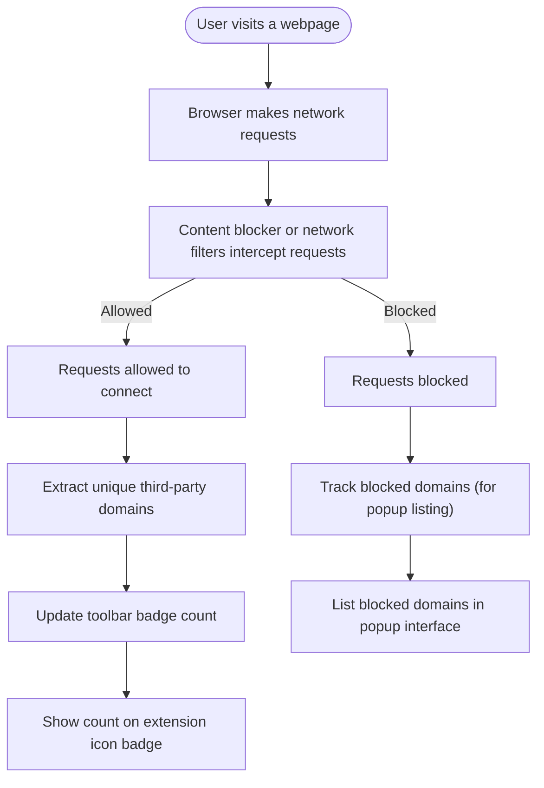

# How Should I Interpret the Badge Count?

Understanding the badge count displayed by uBO Scope is crucial to accurately assessing your browsing exposure to third-party remote servers. This guide explains why a lower badge count is better, what this count represents, and how to avoid common misinterpretations regarding blocked requests.

---

## 1. What Does the Badge Count Represent?

The badge count indicates the **number of distinct third-party remote servers** to which the active browser tab has established network connections. Each unique domain contacted by the webpage's network requests contributes to this count.

### Key Points:
- It **counts distinct domains**, not the total number of requests.
- Only domains involved in **allowed (not blocked)** network requests contribute to the badge.
- The count excludes first-party servers related to the site you are visiting.

### Why Focus on Distinct Third-Party Domains?
Third-party domains typically host analytics, advertisements, or content delivery networks (CDNs). A high number of distinct third-party domains means more external connections, potentially increasing privacy exposure and security risk.

---

## 2. Why Is a Lower Badge Count Preferable?

A lower badge count means your browser is connecting to fewer unique remote servers, which generally indicates:

- **Better privacy:** Fewer third-party trackers or content providers are active.
- **Reduced network exposure:** Less communication with potentially unwanted or unknown servers.
- **Potentially lighter network load:** Fewer external data transfers.

However, keep in mind that not all third-party domains are harmful; some, like CDNs, are necessary for webpage functionality.

---

## 3. How Does uBO Scope Determine Which Domains Count?

uBO Scope monitors **network requests made by the active tab** via browser `webRequest` APIs and classifies connection outcomes. It counts domains under the category **"allowed"** or "not blocked" — connections that succeeded or were not prevented by any content blocker.

The extension excludes:

- First-party domains (the primary website's hosts).
- Requests that were **blocked**, regardless of block reason.
- Requests that failed without being blocked (e.g., failed DNS lookups are not counted).

### Example Scenario:
If you visit example.com, and your browser loads resources from `cdn.example.com` (first-party) plus `analytics.thirdparty.com` and `ads.network.com` (third-party), and if your content blocker blocks `ads.network.com` but allows `analytics.thirdparty.com`:

- Badge count will show **1** (for `analytics.thirdparty.com`)
- `ads.network.com` is excluded because its requests were blocked.

---

## 4. Common Misconceptions About Badge Counts and Block Numbers

### Myth 1: "Higher block counts mean better blocking."

| **Reality:** A high block count can coincide with a high number of allowed third-party connections, indicating that users still connect to many domains. The badge focuses on allowed connections, not the block count.

### Myth 2: "Blocked requests should appear in the badge count."

| **Reality:** The badge shows only unique allowed third-party domains, not blocked or stealth-blocked ones.

### Myth 3: "The badge shows the total number of requests made."

| **Reality:** It reflects **unique domains**, not request volume.

Refer to our [Debunking Ad Blocker Badge and Test Myths](https://example.com/guides/practical-use-cases/debunking-myths) guide for detailed explanations.

---

## 5. How to Interpret the Badge Count in Context

- **Compare over time:** Watch how the count changes as you browse. Increasing counts may indicate more exposure.
- **Check popup domain lists:** The popup breaks down domains into *not blocked*, *blocked*, and *stealth-blocked*, helping you understand the badge number.
- **Remember the badge is a summary:** Use it as a starting point, not a complete privacy assessment.

---

## 6. Practical Tips for Users

- Regularly review the popup to identify which third-party domains are contacted.
- Use uBO Scope in conjunction with content blockers for comprehensive protection.
- If the badge count seems unexpectedly high, investigate the domains listed under "not blocked".
- Consult the [Making Sense of Badge Counts and Domain Listings](https://example.com/guides/getting-started/understanding-badge) guide for actionable insights.

---

## 7. Troubleshooting Badge Count Issues

<AccordionGroup title="Troubleshooting Badge Count Issues">
<Accordion title="Why does the badge count not update when I visit a new site?">
Ensure that:
- uBO Scope is enabled and has necessary permissions.
- You have refreshed the tab or opened a new one.
- The browser supports reporting of `webRequest` events properly.

Try restarting your browser or reinstalling the extension if problems persist.
</Accordion>
<Accordion title="Why do I see connections I didn't expect in the popup?">
uBO Scope shows all third-party domains contacted, including CDNs and essential external services. Not all are malicious or trackers; some are needed for website functionality.
</Accordion>
<Accordion title="Can the badge count be affected by stealth or DNS-based blocking?">
The badge counts connections that were allowed; stealth-blocked connections usually appear separately in the popup but do not add to the count.
</Accordion>
</AccordionGroup>

---

## 8. Visualizing the Badge Count Workflow

---

## 9. Next Steps and Related Documentation

- Review the **[Making Sense of Badge Counts and Domain Listings](https://example.com/guides/getting-started/understanding-badge)** guide for interpreting detailed popup data.
- Learn more about **uBO Scope's network connection categories** in the [Core Concepts and Terminology](/overview/product-intro-core-value/core-terms-and-concepts) page.
- For first-time users, the [Quickstart: See uBO Scope in Action](https://example.com/getting-started/usage-validation-troubleshooting/quickstart-usage) guide offers practical exploration.
- Explore **common misconceptions** on content blockers in the FAQ section [Extension Misconceptions](https://example.com/faq/getting-started-faq/extension-misconceptions).

---

<Tip>
Understanding and interpreting the badge count empowers you to make informed decisions about your privacy and security online. Use it as a concise, real-time indicator of third-party exposure while leveraging the detailed popup for deeper insights.
</Tip>

---