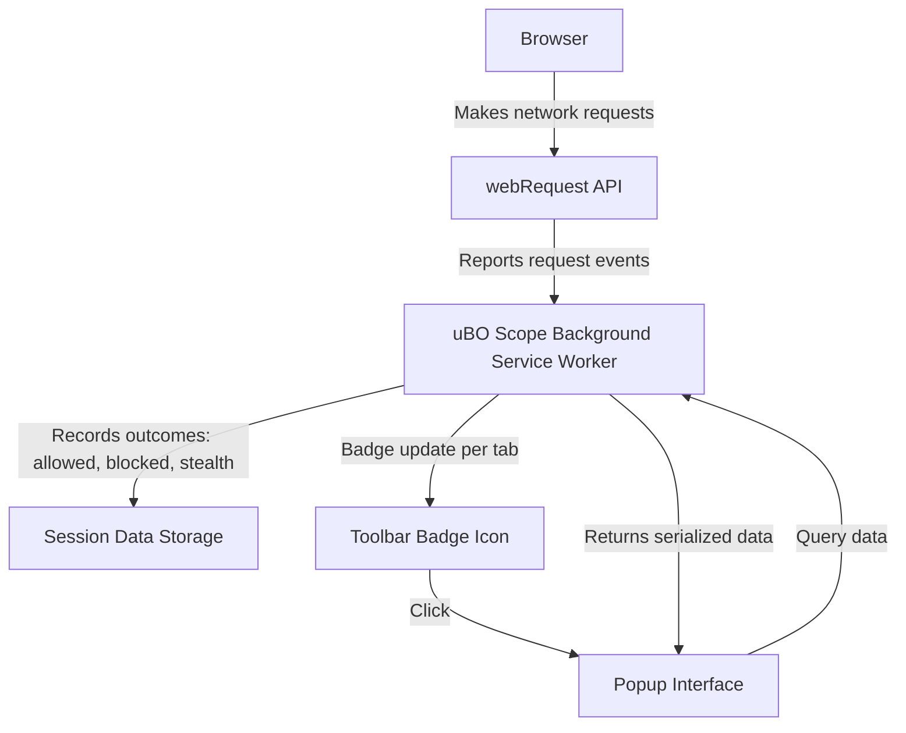

# What does uBO Scope actually measure?

uBO Scope is designed to provide you with complete and accurate insight into *all* network connections attempted or made by web pages in your browser. Unlike typical content blockers that focus on blocking unwanted content, uBO Scope focuses on measurement and transparency: it reveals exactly which remote servers your browser attempts to contact.

---

## Understanding uBO Scope's Measurement

### What uBO Scope Reveals

- **All connection attempts to remote servers:** Whether a network request succeeds, is blocked, or redirected stealthily, uBO Scope detects it if the browser reports it through its `webRequest` API.
- **Distinct third-party domains contacted:** uBO Scope aggregates connections by domain, emphasizing third-party remote servers (domains different from the site you are visiting).
- **Connection outcomes:** Each connection attempt is classified as:
  - **Allowed (Not Blocked):** Network requests that succeeded in fetching resources or making connections.
  - **Blocked:** Requests that failed because they were stopped by content blockers or other errors.
  - **Stealth-blocked:** Requests that the browser redirected or modified invisibly, often to bypass detection.

### How uBO Scope Is Different From Traditional Content Blockers

Unlike content blockers that primarily aim to block and hide unwanted resources, uBO Scope does not intervene or block connections. Instead, it passively records and reports what the browser tries to do:

- It works independently of any content blocking extension.
- It listens to the browser's network requests via the `webRequest` API.
- It can detect network requests blocked outside the browser, such as DNS-based blocking, as long as the browser reports the request events.
- It clarifies actual exposure to third-party domains, which is more meaningful than just seeing block counts.

<Tip>
Block counts on typical content blockers’ badges can be misleading. uBO Scope focuses on the *number of unique third-party domains your browser contacted*, which is a more accurate reflection of your exposure.
</Tip>

### What the Toolbar Badge Count Represents

The badge count displayed on uBO Scope's toolbar icon shows:

> The number of distinct third-party remote servers (domains) for which there was a connection attempt — either allowed, stealth-blocked, or blocked.

The key insight is:

- **Lower badge count = better for privacy.**
- Having fewer distinct third-party domains contacted typically means fewer potential trackers or unwanted connections.
- Not all third parties are malicious; content delivery networks (CDNs) and essential services usually involve a small, legitimate set of domains.

### How uBO Scope Categorizes Domains in the Popup

When you open uBO Scope's popup interface, it shows a breakdown for the active tab:

- **Not Blocked:** Domains from which requests were allowed successfully.
- **Stealth Blocked:** Domains involved in stealthy redirects or modifications (requests not fully visible to webpages).
- **Blocked:** Domains where requests were explicitly blocked.

This categorization helps you visualize your browsing connections in a simple way.

---

## Using uBO Scope to Understand Your Network Connections

### Step-by-Step Flow

<Steps>
<Step title="Open the uBO Scope popup">
Click the uBO Scope toolbar icon while browsing any active tab.
</Step>
<Step title="View the hostname and domain header">
The header shows the exact hostname of the site and the main registered domain being visited.
</Step>
<Step title="Check the domains connected count">
Look at the count summarizing how many distinct third-party domains the page contacted.
</Step>
<Step title="Explore categories of connection outcomes">
Review the "Not Blocked", "Stealth Blocked", and "Blocked" lists to see which domains fall in each category.
</Step>
</Steps>

### Real-World Scenario

Imagine visiting a news website:
- uBO Scope shows 7 third-party domains connected (badge count 7).
- These include well-known CDNs and analytics providers.
- You notice 2 blocked domains, which might be trackers or ads.
- The "stealth-blocked" category may reveal subtle redirections that some blockers perform to hide their presence.

With this insight, you have a clear picture of your exposure and the effectiveness of your content blockers.

---

## Important Considerations

- uBO Scope depends on browser reporting through the `webRequest` API; certain network requests made outside this scope (like some service workers or non-HTTP protocols) may not be measured.
- The badge count is an aggregate of unique domains, not raw network request counts.
- High block counts are *not* necessarily better; what matters is the final distinct third-party connections allowed.

<Warning>
The extension does not block connections itself—it measures. To influence connections, use a content blocker like uBlock Origin.
</Warning>

---

## Related Documentation

- [Making Sense of Badge Counts and Domain Listings](https://github.com/gorhill/uBO-Scope/blob/main/docs/guides/getting-started/understanding-badge.mdx)
- [Navigating the Popup Interface](https://github.com/gorhill/uBO-Scope/blob/main/docs/guides/getting-started/popup-tour.mdx)
- [Debunking Ad Blocker Badge and Test Myths](https://github.com/gorhill/uBO-Scope/blob/main/docs/guides/practical-use-cases/debunking-myths.mdx)

---

## Frequently Asked Questions

<AccordionGroup title="Common Questions About What uBO Scope Measures">
<Accordion title="Does uBO Scope block any connections?">
No. uBO Scope only reports on connection attempts; it does not interfere or block any network requests.
</Accordion>
<Accordion title="Why are some domains shown as stealth blocked?">
These are network requests redirected or modified stealthily by content blockers or browser internals, which are detected by uBO Scope despite being hidden from the page.
</Accordion>
<Accordion title="Is a higher badge count better or worse?">
A higher badge count means more third-party domains were contacted, which generally indicates greater tracking exposure. Lower counts are preferable.
</Accordion>
<Accordion title="Can uBO Scope see all network requests my browser makes?">
It sees all network requests reported via the browser's `webRequest` API on HTTP/HTTPS and WebSocket protocols. Requests outside this scope may not be visible.
</Accordion>
</AccordionGroup>

---

## Troubleshooting

- If uBO Scope shows no data, ensure the extension has required permissions and the browser supports the necessary APIs.
- The badge count updates per tab; make sure the active tab is fully loaded.
- For detailed troubleshooting, see the [Troubleshooting Common Installation Issues](https://github.com/gorhill/uBO-Scope/blob/main/docs/getting-started/usage-validation-troubleshooting/troubleshooting-install.mdx) guide.

---

## Summary

Understanding what uBO Scope measures helps you gain transparent insight into your browsing's network connections. Its visualizations and badge counts reflect the number of unique remote servers connected and categorize connection results, aiding privacy awareness and content blocker evaluation.

---

## Visual Data Flow (Simplified)

This flow highlights how the extension monitors and presents connection data to users.

---

For full onboarding, you may continue to the [First Launch & Configuration](https://github.com/gorhill/uBO-Scope/blob/main/docs/getting-started/setup-installation/first-run-setup.mdx) and [Quickstart: See uBO Scope in Action](https://github.com/gorhill/uBO-Scope/blob/main/docs/getting-started/usage-validation-troubleshooting/quickstart-usage.mdx) guides.

---

<Check>
Ensure your browser is one of the supported versions and you've granted uBO Scope all necessary permissions for full functionality.
</Check>

---

_This documentation answers foundational user questions to understand the core value and unique measurement approach of uBO Scope._