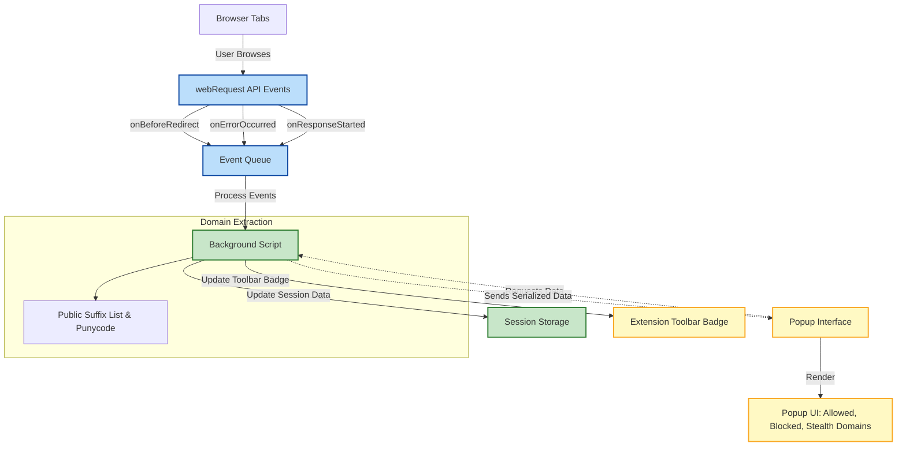

# How does uBO Scope detect and report connections?

Understanding how uBO Scope tracks and reports connections is key to appreciating its value as a transparent network monitoring tool. This page explains its detection approach, how it leverages browser capabilities, what data it captures, and the inherent limitations caused by browser architecture.

---

## 1. Overview of Connection Detection

uBO Scope is designed to reveal all network connections—whether allowed, blocked, or stealth-blocked—that originate from your browser tabs. Its core mechanism relies on browser permissions and the `webRequest` API, enabling real-time tracking of outgoing network requests affiliated with each tab.

### Key Points:
- **Monitors all network requests linked to the current tab**
- **Categorizes outcomes: allowed, blocked, stealth-blocked**
- **Reports distinct third-party domains contacted**

This empowers users to see precisely which remote servers their browser is connecting to and how content blocking affects those connections.

---

## 2. How Connections are Tracked Internally

### Browser Permissions & APIs
uBO Scope requires the following permissions to operate effectively:

- `activeTab`: To identify the currently active tab and associate network activities to it
- `webRequest`: To monitor web request lifecycle events (redirects, errors, responses)
- `storage`: To save session data and domain categorizations

By listening to events from the browser's `webRequest` API, uBO Scope observes network request outcomes in real-time.

### Network Request Event Listening
The extension’s background script registers event listeners for these key network events:

- **onBeforeRedirect**: Tracks requests that are redirected
- **onErrorOccurred**: Captures failed network requests
- **onResponseStarted**: Detects successfully initiated responses

Each network event is queued and processed to update the connection status associated with the tab.

### Association with Tabs
uBO Scope maintains a session map, associating tab IDs with detailed connection data.

- When a main_frame request is observed, it resets and initializes per-tab tracking
- Each request's hostname and domain are extracted and categorized
- Domains are classified under **allowed**, **blocked**, or **stealth-blocked** outcomes

Once processed, distinct domains are counted and updated as the toolbar badge number.

---

## 3. Categorizing Connection Outcomes

uBO Scope groups third-party network connections into three categories:

1. **Allowed**: Connections that successfully reached remote servers
2. **Blocked**: Connections that failed due to blocking or errors
3. **Stealth-blocked**: Connections that were redirected or stealth-blocked by content blockers

The popup interface presents these categories distinctly, enabling users to inspect domain-wise connection outcomes.

### Why Categorization Matters
Understanding which third parties are contacted and how (allowed or blocked) gives users clear insight into privacy exposure and blocker effectiveness.

---

## 4. Extracting Domain and Hostname Information

Since a single hostname may map to a broader domain, uBO Scope uses the Public Suffix List (PSL) to correctly identify the registrable domain of each hostname.

- The PSL is loaded and cached to ensure up-to-date domain extraction
- Hostnames are decoded to Unicode for accurate and readable display using `punycode` conversion

This allows uBO Scope to aggregate network connections meaningfully, grouping related hostnames under their parent domains.

---

## 5. Limitations and Invisible Requests

While uBO Scope strives to monitor all relevant network requests, some limitations inherent to browser architecture affect its visibility:

- Requests made outside the `webRequest` API (e.g., certain service worker or DNS-based filtering) are **not visible** to the extension
- Stealth blocking by some content blockers can cause requests to be omitted or redirected outside normal detection
- Requests from non-traditional sources or embedded contexts may lack association to tab IDs

These factors may result in missing or incomplete data for particular requests.

---

## 6. User Workflow: From Detection to Display

### Real-time Tracking and Popup Rendering
- When you activate uBO Scope via its toolbar icon, the popup requests current connection data for the active tab
- The background script serializes the session data per tab and sends it to the popup
- The popup script decodes and renders the connection data in categorized lists with domain names and counts

### Toolbar Badge
- The badge number reflects the count of **distinct third-party domains successfully connected** during the current tab session
- This number updates dynamically as you browse and network events are processed

---

## 7. Practical Tips for Users

- **Interpret the badge as a privacy indicator:** A fewer number of allowed domains means fewer third-party connections.
- **Use the popup to inspect details:** See which domains are allowed, blocked, or stealth-blocked and their connection counts.
- **Remember invisible requests exist:** Some network activity might not be captured due to browser or extension limitations.
- **Combine with other tooling:** Use this insight along with your content blocker to better understand your browsing privacy.

---

## 8. Troubleshooting Common Questions

<AccordionGroup title="Connection Tracking FAQs">
<Accordion title="Why am I seeing fewer or more connections than expected?">
Connection counts depend on detected webRequest events. Some stealth-blocked or browser-invisible requests may not appear, affecting totals. Also, legitimate CDNs can cause higher allowed counts.
</Accordion>
<Accordion title="Does uBO Scope block requests itself?">
No, it only monitors network requests and outcomes. Blocking is handled by your content blockers or browser settings.
</Accordion>
<Accordion title="Why does the badge show a number different from my content blocker's count?">
uBO Scope reports distinct third-party domains successfully connected, not the number of blocked requests. This reflects effective exposure rather than raw blocking statistics.
</Accordion>
<Accordion title="How often is connection data updated?">
Network requests are queued and processed roughly every second to keep data reasonably real-time without overloading performance.
</Accordion>
</AccordionGroup>

---

## 9. Diagram: High-Level Data Flow of Connection Detection

---

## 10. Additional Resources

- [What is uBO Scope?](/overview/product-introduction-and-value/what-is-ubo-scope) — Understand the extension's core purpose
- [Core Concepts & Terminology](/overview/how-it-works-architecture/core-concepts-and-terminology) — Definitions of key terms like stealth-blocked
- [Navigating the Popup and Interface](/guides/getting-started/explore-popup) — How to use the UI for inspecting connections
- [Troubleshooting Data & Understanding Limitations](/guides/advanced-tips/troubleshooting) — Help with missing or unexpected data
- [uBO Scope GitHub Repository](https://github.com/gorhill/uBO-Scope) — For source code and contributions

---

This page aims to empower you with clear insight into uBO Scope’s inner workings, helping you fully leverage its network connection visibility and privacy diagnostic value.