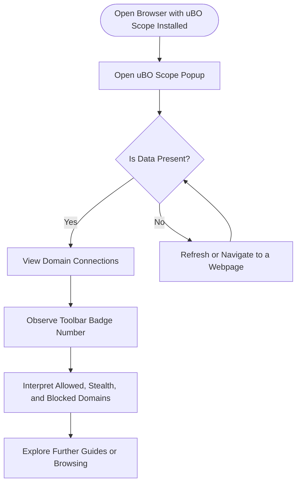

# Getting Started: Your First Analysis

Welcome to your first analysis with **uBO Scope**, the extension designed to give you instant, transparent insight into the third-party connections your browser attempts when visiting any webpage. This guide will walk you through opening the extension, refreshing a webpage to capture connection attempts, and understanding how the badge count and popup display reveal critical details about network activity at a glance.

---

## 1. Open the uBO Scope Popup

The popup is your main interface to explore detailed connection information for the active browser tab.

1. Locate the uBO Scope extension icon on your browser toolbar. This icon often appears near the address bar.

2. Click the icon to open the popup interface. It may show "NO DATA" initially if no network data has been collected yet for the current tab.

3. The popup window features a summary header and three key sections that categorize connections:

   - **Not Blocked (Allowed)**: Connections permitted by the browser or content blockers.
   - **Stealth-Blocked**: Connections blocked in a way that attempts to be stealthy, making detection harder.
   - **Blocked**: Connections explicitly denied.

<Tip>
If the popup shows "NO DATA", continue to the next step to load a webpage and populate these categories.
</Tip>

---

## 2. Refresh or Navigate to a Webpage

To trigger uBO Scope to start capturing connections, load or refresh any webpage in the active tab.

1. Press the browser's refresh button or navigate to a website of your choice.

2. uBO Scope listens to network requests made by the page and records which remote servers were contacted and their connection outcomes.

3. Within moments, the extension badge (on the toolbar icon) updates to show a number, representing the count of distinct third-party domains contacted.

4. Open the popup again if it is closed. You'll now see domains categorized under "not blocked," "stealth-blocked," and "blocked," each showing a list of domains and the number of requests for each.

<Note>
The badge count reflects the number of distinct third-party remote servers your browser connected to - fewer is generally better, as it means less third-party exposure.
</Note>

---

## 3. Understanding the Badge Count

uBO Scope's toolbar icon badge displays a single number. Here's what it means:

- **Number Meaning**: It shows how many *distinct* third-party remote domains had active successful connections in the current tab.

- **Why This Matters**: Instead of focusing on how many requests were blocked or allowed, uBO Scope highlights *unique domains* connected, driving your focus toward the third-party exposure footprint.

- **Lower is Better**: A lower badge count generally signals fewer third parties being contacted, which often correlates with better privacy.

<Tip>
Keep in mind that a high block count does not inherently mean better blocking — the crucial factor is the actual number of distinct third-party domains your browser connects to.
</Tip>

---

## 4. Interpreting the Popup Interface

Once the popup lists domains, here is how to navigate and interpret the information:

### Sections:

- **Not Blocked (Allowed):** Domains that the browser connected to successfully. These are active third parties your browser reached.

- **Stealth-Blocked:** Domains for which network requests were blocked in a stealthy manner, possibly to prevent detection or webpage breakage.

- **Blocked:** Domains explicitly blocked by rules or browser policies.

### Domain Rows:

Each domain entry shows:

- The domain name (in Unicode for internationalized domain names).

- A count badge showing how many requests were made to that domain.

### Header Display:

At the top, the popup shows the hostname of the current tab alongside its main domain, helping you relate observed connections to the visited site.

<Note>
If the page's hostname is the same as its domain, only the domain is displayed prominently.
</Note>

---

## 5. Practical Tips & Best Practices

- **Use on Privacy-Critical Sites:** Observe which third-party domains connect when visiting sites with sensitive data.

- **Refresh to Update:** Reload pages often to get current data, as network connections vary per visit.

- **Compare Browsing Sessions:** Note differences in badge counts across different browsing scenarios to evaluate exposure.

- **Recognize Legitimate Third Parties:** Not all third-party connections are undesirable, e.g., content delivery networks (CDNs) often provide essential resources.

- **Watch for Unexpected Domains:** Large, unknown third-party domains appearing frequently can be a red flag.

---

## 6. Troubleshooting Common Issues

<AccordionGroup title="Troubleshooting Your First Analysis">
<Accordion title="Popup Shows NO DATA Even After Refresh">
If the popup still shows "NO DATA" after refreshing, try the following:

- Confirm uBO Scope is installed and enabled properly for your browser.
- Check if you have navigated to an HTTPS or HTTP webpage (uBO Scope listens to these).
- Reload the popup after a few seconds to allow data collection.
- Try a different website to test.
</Accordion>
<Accordion title="Badge Count Is Zero Despite Network Activity">

- Ensure you have granted the extension the necessary permissions during installation.
- Content blockers or DNS-level filters might hide some network requests from uBO Scope.
- Try pausing other content blockers temporarily to verify.
</Accordion>
<Accordion title="Domains List Remains Empty or Sparse">

- The page might not generate external connections.
- Some connections happen outside browser context and are not reported by uBO Scope.
- Try visiting different websites with richer third-party content.
</Accordion>
</AccordionGroup>

---

## 7. What’s Next?

After successfully viewing your first analysis:

- Explore understanding badge counts and domain categories in detail with the [Interpreting Badge Counts and Domains List](./understanding-badge-counts) guide.

- Learn about installing uBO Scope across different browsers through the [Installation Instructions](./installing-ubo-scope).

- Troubleshoot installation and usage issues with the [Troubleshooting Installation & Setup](./troubleshooting-installation) page.

- Advance your knowledge with the broader [Quick Feature Tour](../../overview/features-at-a-glance/quick-feature-tour) to master the popup and its data categories.

---

## Summary Diagram of User Flow

---

Thank you for starting your journey with uBO Scope. This tool empowers your browsing awareness by showing you the true picture of third-party connections happening behind the scenes. Happy analyzing!