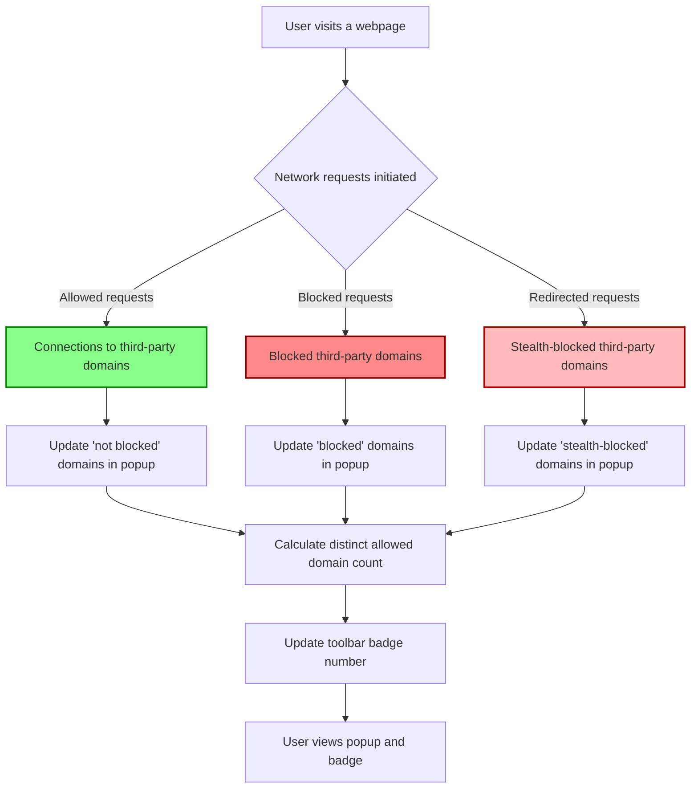

# Your First Analysis: Interpreting Results

Welcome to your first deep dive with uBO Scope! This guide will help you understand how to use the extension’s badge and popup interface to analyze network connections on the webpages you visit. You'll learn how to interpret what the toolbar badge number means and how to review the domains your browser connects to, empowering you to validate blocking effectiveness and recognize allowed versus blocked requests.

---

## 1. Understanding the Toolbar Badge

The toolbar badge is your immediate status indicator for the active browser tab:

- **What the badge shows:** The number represents the count of *distinct third-party remote servers* your current webpage has connected to or attempted to connect to.
- **Why fewer is better:** Fewer third-party connections generally mean less external tracking or fewer resources loaded from outside sources, which aligns with stronger privacy and better content filtering.

### What Counts as a Third-Party Remote Server?

A third-party remote server is any distinct domain different from the website you are visiting. This includes CDNs, ad servers, analytics providers, and other external services.

<Info>
The badge does *not* count every individual resource request but uniquely counts domains, helping you focus on the breadth of remote connections rather than raw request volume.
</Info>

## 2. Opening the Popup Interface for Details

Click the uBO Scope extension icon in your browser toolbar to open the popup panel. The popup breaks down remote connections into three categories:

- **Not Blocked (allowed):** Domains from which the browser successfully fetched resources.
- **Stealth-Blocked:** Connections that were redirected stealthily (e.g., silently intercepted or rerouted) but ultimately not blocked outright.
- **Blocked:** Domains from which connection attempts were actively blocked by content blocking rules or network errors.

### What You See Inside the Popup

Each section categorizes domains and shows:

- The *domain name* in Unicode for easy reading.
- The *count* of network requests made to or attempted for each domain.

### Domain Presentation

Domains are sorted alphabetically for quick scanning, letting you easily identify major third-party connections in each category.

<Check>
If any category section is empty, it will not be displayed, helping you focus on relevant outcomes only.
</Check>

## 3. Analyzing Your First Results

Follow these steps to interpret your first network connection analysis:

<Steps>
<Step title="Check the badge count on the active tab">
Look at the numeric badge on the toolbar icon. This is the count of unique third-party domains connected or attempted. A low number usually means stricter content blocking or fewer third-party resources.
</Step>

<Step title="Open the popup and review the 'not blocked' domains">
Focus on the domains listed under the 'not blocked' section to see exactly which remote servers the page fetched resources from successfully.
</Step>

<Step title="Review the 'blocked' section">
Identify which domains have been blocked. This confirms that the extension (or any active filters) is preventing connections to these domains.
</Step>

<Step title="Examine the 'stealth-blocked' section">
Understand these are requests that were redirected or stealthily handled. They indicate subtler network activity that might bypass straightforward blocking.
</Step>
</Steps>

## 4. Why Focus on Domains, Not Raw Block Counts

Many users mistake a high block count as a sign of better blocking. uBO Scope shows a different truth:

- A higher block count may reflect more individual requests but a *greater number of distinct domains allowed*, meaning more third-party connections actually succeed.
- The badge count tracks *distinct domains*, a better metric for privacy impact because each domain is a separate potential tracker or resource source.

## 5. Practical Tips

- **Use the badge as a quick privacy check**: If you notice a sudden spike in badge count, inspect the popup to understand which external domains the page is reaching out to.
- **Validate filters without guesswork**: Confirm your content blocker’s effectiveness by verifying the domains listed under 'blocked'.
- **Be cautious with 'ad blocker test' pages**: Such pages can be deceiving and do not reflect real-world browsing scenarios.

## 6. Common Pitfalls & Troubleshooting

<AccordionGroup title="Interpreting Common Confusions">
<Accordion title="Why does the badge count sometimes not update immediately?">
The extension batches network requests with a short delay for efficiency—wait a moment after loading a page to see the current badge count.
</Accordion>
<Accordion title="Some domains appear under 'stealth-blocked'; what does this mean?">
These are network requests that get redirected or altered subtly by the content blocker or network stack. They indicate more sophisticated filtering tactics.
</Accordion>
<Accordion title="Why is the active tab's domain not counted in the badge?">
uBO Scope focuses on third-party domains only, excluding the main site’s own domain to highlight external connections.
</Accordion>
</AccordionGroup>

## 7. Example Walkthrough

Imagine visiting example.com and seeing a badge with count '5'. Clicking the icon reveals:

- **Not blocked:** cdn.example.net, fonts.gstatic.com
- **Stealth-blocked:** tracking.redirector.com
- **Blocked:** ads.tracker.net, analytics.badads.com

You learn that example.com loads resources from two allowed third-party servers but also attempts connections to five others—two redirected stealthily and two blocked. This transparency helps you grasp actual network behavior in real time.

---

## 8. Next Steps

- Visit the [Understanding the Extension Interface](getting-started/basic-usage-config/understanding-extension-ui) page to deepen your knowledge of UI elements.
- Explore [Understanding Domain Connectivity and Badge Counts](guides/interpreting-results/understanding-results) for detailed interpretation techniques.
- Consult the [Troubleshooting & Frequently Asked Questions](getting-started/basic-usage-config/troubleshooting-install) guide if you encounter issues.

---

## 9. Further Reading & Resources

- [Why Use uBO Scope?](overview/introduction-value/value-proposition) — Understand the value behind monitoring remote connections.
- [Core Concepts & Terminology](overview/architecture-core-concepts/core-terminology) — Learn foundational terms and definitions.
- GitHub repository: [https://github.com/gorhill/uBO-Scope](https://github.com/gorhill/uBO-Scope) for source code and issue tracking.

---

# Visual Diagram of Data Flow in Your First Analysis

---

This flow helps you understand how uBO Scope categorizes and presents connection information from real browsing activity.

---