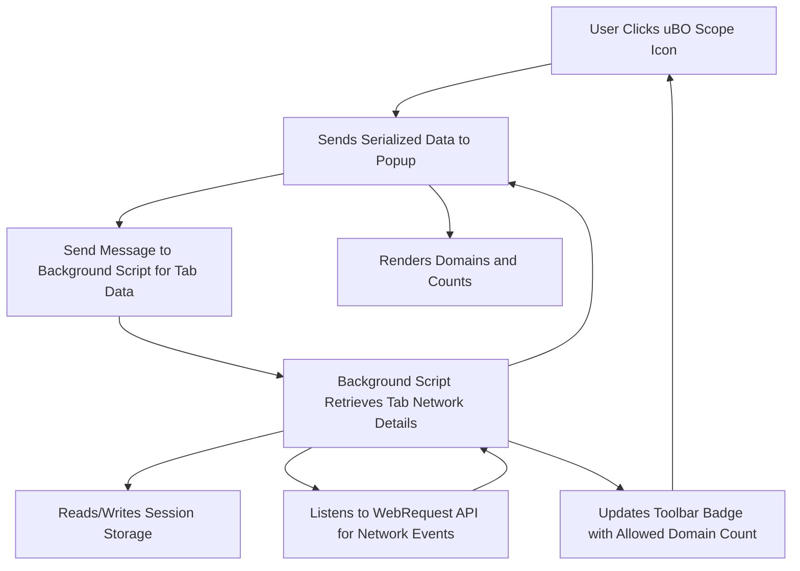

# Understanding the Extension Interface

The uBO Scope extension provides you with a transparent, real-time view into all network connections your browser attempts or successfully establishes. This page introduces the key interface elements—the popup panel, the toolbar badge, and basic controls—explaining how each reflects connections to third-party servers and what they reveal about your privacy and tracking exposure.

---

## 1. Popup Panel: Your Connection Dashboard

When you click the uBO Scope toolbar icon, the popup panel opens. This panel serves as a detailed dashboard showing the distinct third-party domains your current browser tab successfully connected to, stealth-blocked, or blocked outright.

### Key Sections of the Popup Panel

- **Tab Hostname Display:** At the top, you’ll see the hostname of the active browser tab split into two parts:
  - The subdomain portion (if any).
  - The registrable domain (the main domain including public suffix).
  
  This breakdown helps you recognize what origin is currently under analysis.

- **Summary of Connected Domains:** Below the hostname, there’s a summary count showing the number of distinct domains connected to (not blocked). A lower number here typically indicates better privacy.

- **Connection Outcome Panels:** The popup divides results into three categories:
  - **Not Blocked (Allowed):** Domains from which network requests succeeded.
  - **Stealth-Blocked (Stealth):** Domains behind requests that were redirected or blocked transparently, possibly to avoid detection.
  - **Blocked:** Domains whose requests were actively blocked, resulting in errors.

### How Domain Counts Work

- Each domain entry lists the domain name (converted from punycode if needed) along with a count representing the number of network requests involving that domain.
- This allows you to quickly see not just which domains were contacted but also their relative frequency.

### Practical Example

Imagine you visit a news page. The popup might show:
- 3 allowed domains (your news site and two CDNs).
- 1 stealth-blocked domain (an ad server silently blocked before loading).
- 2 blocked domains (trackers your content blocker prevented).

This immediate breakdown helps you understand what connections your browser made and how effectively trackers were blocked.

---

## 2. Toolbar Badge: At-a-Glance Privacy Indicator

The badge number displayed on the uBO Scope icon in your browser toolbar reflects the number of distinct third-party remote server domains to which your current tab connected successfully.

### What the Badge Number Tells You

- **Lower is better:** Fewer distinct third-party domains means fewer external connections, reducing third-party tracking surface.
- **Dynamic:** The badge count updates as your page loads and additional network requests complete.
- **Reflects Success:** Only domains with successful connections contribute to the count, not blocked or failed attempts.

### Badge Behavior

- **Empty badge:** If the count is zero, the badge will typically be hidden, signaling no third-party connections detected.
- **Updates per tab:** The badge updates separately for each browser tab.

### Why This Matters

By monitoring this badge, you gain quick visual feedback on your exposure to third-party servers without needing to open the popup.

---

## 3. Basic Controls and Interaction

- **Opening the Popup:** Click the uBO Scope icon to reveal detailed connection info for the active tab.
- **Refreshing Data:** The panel updates automatically; no manual refresh is needed.

### Additional Notes

- The interface reflects real network requests tracked by the browser's `webRequest` API, capturing all attempted or successful remote server communications relevant to your current tab.
- Not all network failures are shown as blocked—only those detectable via the API are reported.

---

## 4. Understanding What You See: Making Sense of the Data

- **Allowed Domains:** These domains delivered content or resources to your browser.
- **Stealth Blocking:** Some requests may be silently redirected or blocked in a way that’s designed to avoid detection by the webpage.
- **Blocked Domains:** These represent outright blocking actions, usually tracker or ad-related domains prevented from loading.
- **Badge Count vs. Block Count:** Remember, uBO Scope’s badge shows distinct domains connected successfully, not the number of blocked requests.

---

## 5. Best Practices

- Use the popup panel regularly while browsing privacy-sensitive sites to see how many third-party connections occur.
- Monitor the badge for quick awareness of increasing third-party connections on any tab.
- Combine uBO Scope with quality content blockers to evaluate how many third parties still get through.

---

## 6. Common Pitfalls

- **Empty Data:** If the popup shows 'NO DATA,' it may mean the page has not yet initiated requests, or the extension cannot detect network requests from the tab.
- **Badge Not Updating:** Sometimes, the badge might lag due to browser or extension delays. Try refreshing the tab.
- **Third-Party Recognition:** Distinguishing between first-party and third-party domains depends on the domain parsing logic and the public suffix list, which is built into the extension.

---

## 7. Troubleshooting Tips

- Ensure uBO Scope is installed and enabled correctly (see installation guide).
- Confirm you are viewing the active tab where you expect network activity.
- Reload the page to trigger network event capture.
- If the badge or popup data appears inconsistent, check browser compatibility and permissions.

---

## Related Documentation

- [Why Use uBO Scope?](../introduction-value/value-proposition) - Understand the value in monitoring connections.
- [Core Concepts & Terminology](../../overview/architecture-core-concepts/core-terminology) - Learn key terms backing the extension's logic.
- [First Run & Validation](../../getting-started/installation-setup/first-run-validation) - Confirm your installation is working.
- [Your First Analysis: Interpreting Results](../basic-usage-config/first-analysis) - How to analyze and act on popup data.

---

Explore these sections to deepen your mastery of the extension interface and how to leverage uBO Scope’s unique visibility into web connections.

---

## Visual Diagram: Basic Data Flow in Extension Interface

This illustrates how interaction with the interface triggers communication between the popup UI and the background script, leveraging browser APIs and storage to present real-time connection data.

---

By understanding each interface component and its function, you gain immediate, actionable insights into your browser's remote interactions—empowering effective privacy and security research with uBO Scope.
