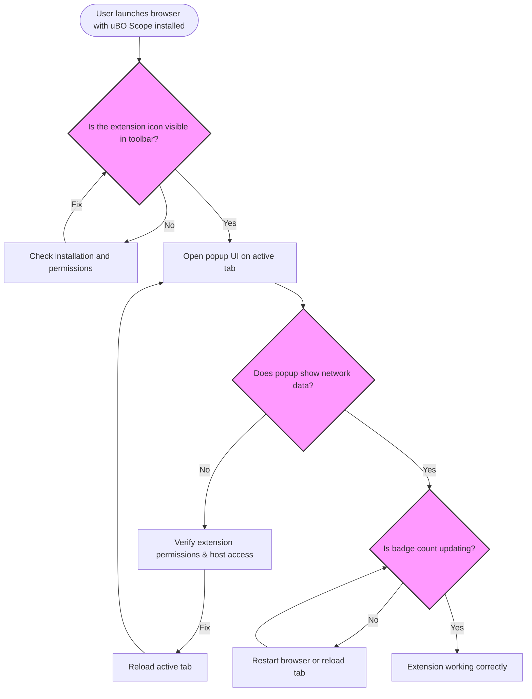

# Troubleshooting Common Issues

uBO Scope provides valuable insights into all remote server connections your browser makes during web navigation. Occasionally, you might encounter setup problems such as a missing extension icon, no data being collected, or unexpected or blank UI behavior. This guide helps you swiftly diagnose and resolve these frequent issues by linking visible symptoms to their likely underlying causes.

---

## 1. Extension Icon Missing or Not Visible

The uBO Scope extension icon should appear in your browser's toolbar right after installation, allowing you quick access to its popup UI and real-time data.

### Causes & Solutions

- **Extension not installed correctly**
  - **Action:** Verify installation via your browser’s extension manager.
  - **How to Check:** 
    - In Chrome, navigate to `chrome://extensions/` and confirm that uBO Scope is enabled.
    - In Firefox, go to `about:addons` and check your extensions.
  - **Tip:** If missing, reinstall uBO Scope from the official store:
    - [Chrome Web Store](https://chromewebstore.google.com/detail/ubo-scope/bbdpgcaljkaaigfcomhidmneffjjjfgp)
    - [Firefox Add-ons](https://addons.mozilla.org/firefox/addon/ubo-scope/)

- **Browser toolbar is overcrowded or icon hidden**
  - **Action:** Customize your toolbar to ensure uBO Scope's icon is visible.
  - **Example:** In Chrome, click the puzzle-piece icon and pin uBO Scope.

- **Browser compatibility or version issues**
  - **Action:** Verify your browser meets the minimum supported version:
    - Chrome 122+
    - Firefox 128+
    - Safari 18.5+
  - **Next Steps:** Upgrade your browser if outdated.

<Warning>
If the icon remains missing after verifying the above, try restarting your browser or reinstalling the extension.
</Warning>

---

## 2. Popup Shows 'NO DATA' or Blank Interface

Opening the popup without seeing real-time connection information can mean that uBO Scope isn't properly capturing network requests.

### Common Causes & How to Fix

- **Extension permissions not granted or incomplete**
  - uBO Scope requires permissions such as `webRequest` and appropriate `host_permissions` to monitor traffic.
  - **Action:**
    1. Open your browser’s extension management page.
    2. Check that uBO Scope has permissions for sites you visit.
    3. Re-enable or grant permissions if needed.

- **Browser or extension in a restrictive mode**
  - Some browsers or security settings may impair extension APIs.
  - **Tip:** Disable strict privacy or content-blocking features temporarily to test.

- **Extension background process inactive or delayed**
  - Extensions relying on background scripts might sometimes take a moment after browser startup to begin operation.
  - **Action:** Refresh the tab you want to monitor after launching the browser and uBO Scope.

- **No network activity on the current tab**
  - uBO Scope tracks connections per tab basis.
  - **Action:** Navigate to a site with known third-party resources (e.g., a news website) to test live data.

---

## 3. Badge Count Not Updating or Always Empty

The toolbar icon badge dynamically indicates the count of distinct third-party domains connected on the active tab.

### Reasons & Remedies

- **No third-party connections on active tab**
  - Some web pages have minimal or no third-party requests.
  - **Tip:** Try a more complex webpage with external assets.

- **Extension service worker or background script crashed or stopped**
  - Most Chromium-based setups use a service worker, which can unload due to inactivity.
  - **Action:** Reload the browser tab or restart the browser.

- **Network requests made outside webRequest API scope**
  - Some browser internal requests or newer API calls might not be captured.
  - **Resolution:** This is a known limitation; ensure you are testing with standard browsing traffic.

---

## 4. Unexpected or Erratic UI Behavior

If the popup UI is not behaving as expected (e.g., partial lists, incorrect counts):

- **Browser zoom or viewport size affecting UI layout**
  - The extension adapts to viewport but extreme zoom can distort display.
  - **Action:** Reset zoom to 100% and try again.

- **Corrupted stored data**
  - The extension stores session data to maintain request history.
  - **Action:**
    1. Remove stored extension data manually if needed.
    2. Clear browser storage or reset the extension.

- **Extension version mismatch or bugs**
  - Check for updates and install the latest version.
  - **Tip:** Visit the GitHub repo for any reported issues or fixes: [uBO Scope GitHub](https://github.com/gorhill/uBO-Scope)

---

## 5. Quick Validation Diagnostic Steps

Use these fast checks to pinpoint issues:

1. **Confirm Icon Visibility**
   - Does the uBO Scope icon appear in the toolbar?
2. **Open Popup on Active Tab**
   - Is the popup UI loading without 'NO DATA'?
3. **Visit a Known Complex Site**
   - Navigate to a site with several third-party resources (e.g., https://www.nytimes.com) and check if badge counts increase.
4. **Refresh the Tab**
   - After install or after fixing issues, reload the active tab to ensure network data is gathered.
5. **Restart Browser**
   - Sometimes a simple restart resolves background script inactivity.

---

## 6. When Problems Persist

- Review the [Installing uBO Scope](../../getting-started/installation-and-setup/installing-ubo-scope) and [First Run & Extension Verification](../../getting-started/installation-and-setup/first-run-and-verification) guides to confirm installation and basic operation.
- Consult [Extension Configuration](../configuration-and-troubleshooting/extension-configuration) to verify permissions and settings.
- Explore advanced troubleshooting in [Understanding the Popup](../../guides/core-workflows/understanding-the-popup) and [Badge Counts Explanation](../../guides/core-workflows/badge-counts-and-what-they-mean).

<Tip>
If none of the above resolves your issue, consider clearing your browser’s cache and extension storage or reinstalling the browser.
</Tip>

---

## Additional Resources

- [Official uBO Scope GitHub Repository](https://github.com/gorhill/uBO-Scope)
- Browser extension install pages:
  - [Chrome Web Store](https://chromewebstore.google.com/detail/ubo-scope/bbdpgcaljkaaigfcomhidmneffjjjfgp)
  - [Firefox Add-ons](https://addons.mozilla.org/firefox/addon/ubo-scope/)

For detailed understanding of how uBO Scope captures connections and displays data, refer to the [Core Concepts & Terminology](../../overview/core-concepts-and-architecture/core-concepts-terminology) and [Architecture Overview](../../overview/core-concepts-and-architecture/system-architecture-overview).

---

By following this troubleshooting guide, you will quickly diagnose common setup problems and enjoy a reliable, insightful visibility into your web browsing’s third-party network exposure.

---

## Summary Diagram of Common Issues

