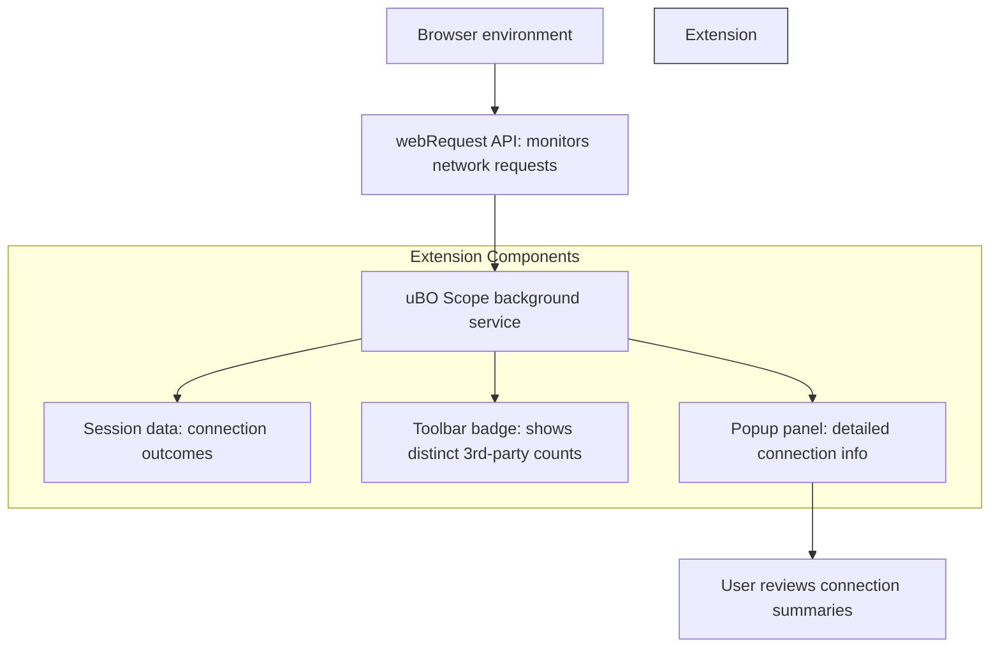

# What is uBO Scope?

uBO Scope is a lightweight browser extension designed to provide transparent insight into the network connections initiated by your web browser. Its core purpose is to reveal **every connection attempt—whether successful or blocked—to remote third-party servers** made by visited websites, helping you understand your actual privacy exposure and the effectiveness of your content blockers.

---

## Why uBO Scope Matters

Modern websites often connect to many third-party servers for resources, analytics, advertisements, or tracking. Content blockers claim to block unwanted connections, but it can be difficult to verify their real-world impact. uBO Scope fills this gap by **surfacing the true picture** of what your browser is attempting to connect to, regardless of the blockers in place.

It empowers you to:

- **See distinct third-party remote servers your browser communicates with**
- **Assess how many connections are allowed, blocked, or stealth-blocked** (where blocking is hidden or occurs without visible page changes)
- **Evaluate the reliability and effectiveness of any content blocker you use**
- **Identify unexpected or excessive third-party requests that might impact your privacy or performance**

### Real-World Value

While a content blocker may show a high block count, it doesn't necessarily mean better blocking. uBO Scope instead counts unique third-party servers your browser connects to after blocking, providing a clearer indicator of actual privacy exposure. This helps debunk common myths about ad blocker performance and unreliable "ad blocker test" sites.

---

## Core Value and Functionality

### How uBO Scope Works

- It uses the browser's `webRequest` API to monitor **all network requests** initiated by webpages.
- It tracks outcomes for each request, categorizing them as **allowed**, **blocked**, or **stealth-blocked**.
- The extension then counts **distinct remote domains** contacted and displays this count as a badge on the toolbar icon.
- A popup panel details these connections, grouping them by outcome to present an at-a-glance summary.

### What You See

- **Toolbar Badge:** Shows a number representing the distinct third-party servers successfully connected.
- **Popup Panel:** Breaking down connection outcomes into:
  - *Not Blocked*: Remote servers contacted successfully.
  - *Stealth-Blocked*: Requests blocked stealthily without typical page disruption.
  - *Blocked*: Requests explicitly blocked by your content blocking tools.

---

## When and Why to Use uBO Scope

- To **audit your browser’s network activity** during everyday browsing or research sessions.
- To **verify if content blockers actually reduce third-party exposure** in real-world conditions.
- To **compare different content blocking solutions** based on actual third-party connection counts instead of just block logs.
- To aid **filter list maintainers** by highlighting domain access patterns, helping improve blocking strategies.

---

## How uBO Scope Fits Alongside Ad and Content Blockers

uBO Scope complements your content blocker without replacing it. It’s a transparency tool—**it doesn’t block itself** but reports what is and isn’t being blocked. This provides users a **neutral, accurate lens** to judge any blocker’s impact rather than relying on self-reported statistics or unreliable tests.

---

## Practical Example

Imagine visiting a popular news site. Your content blocker claims to block many requests, but how can you verify it? When you click uBO Scope’s icon, the toolbar badge shows a count "5", indicating only five distinct third-party servers were contacted despite the page trying to connect to many more.

Opening the popup panel shows:
- 5 domains under "not blocked", confirming these actual active third-party connections.
- 3 domains under "blocked", those successfully prevented.
- Some entries under "stealth-blocked", representing subtle block events.

This confirms the blocker’s effectiveness beyond just block counts and helps you audit your privacy exposure.

---

## Next Steps

- **Install uBO Scope** in your browser from the official stores (Chrome Web Store, Firefox Add-ons).
- **Explore the Popup Panel** to see connection summaries in detail.
- **Monitor the Toolbar Badge** while browsing to get real-time feedback on third-party connections.
- Consult related guides for deeper insights:
  - [Installation Guide](../../getting-started/essentials/installation)
  - [Understanding the Popup Panel](../../guides/getting-started/understanding-the-popup-panel)
  - [Interpreting the Badge Count](../../guides/getting-started/connection-badge-interpreting)
  - [Auditing Third-Party Connections](../../guides/use-cases-and-patterns/auditing-third-party-connections)
  - [Debunking Ad Block Myths](../../guides/use-cases-and-patterns/debunking-common-ad-block-myths)

---

## Additional Resources & Repository

- Official GitHub Repository: [uBO-Scope on GitHub](https://github.com/gorhill/uBO-Scope)

---

<Tip>
Always remember: a **lower toolbar badge count is better**, reflecting fewer third-party connections, which typically means less tracking and better privacy.
</Tip>

<Note>
uBO Scope works across Chromium, Firefox, and Safari browsers, leveraging their respective `webRequest` APIs to report network activity.
</Note>

<Warning>
The extension depends on browser-reported network events and **cannot detect requests sent outside the browser’s webRequest API scope** (for example, some background OS processes or VPN-filtered connections).
</Warning>

---

### Summary Diagram: uBO Scope in Action

This diagram illustrates how uBO Scope integrates with the browser and processes network events to deliver actionable insights for you.

---

# Congratulations! You now understand the purpose, value, and key user benefits of uBO Scope. Start exploring your browser’s network activity today to take control of your privacy.

---