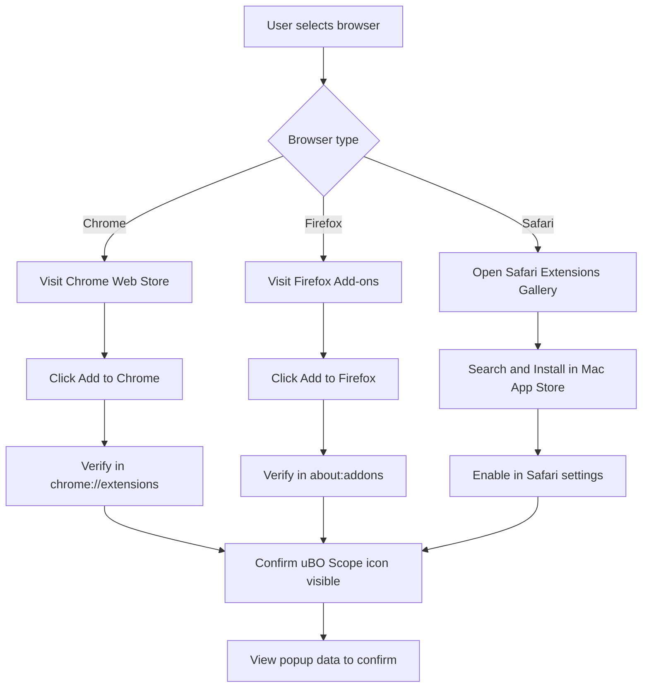

# Installation on Chrome, Firefox, and Safari

This guide walks you through installing the uBO Scope extension on the three major supported browsers: **Chrome**, **Firefox**, and **Safari**. Each section provides direct links to the official extension stores and clear instructions on verifying that the installation was successful.

---

## Supported Browsers & Version Requirements

- **Google Chrome (Chromium-based browsers)**: Version 122.0 or higher
- **Mozilla Firefox**: Version 128.0 or higher
- **Apple Safari**: Version 18.5 or higher

Make sure your browser is updated to meet these minimum versions. Older versions may not support the necessary WebExtension APIs, particularly the `webRequest` API critical for uBO Scope’s functionality.

---

## 1. Installing on Google Chrome

### Step 1: Go to Chrome Web Store

Visit the uBO Scope extension page directly:

[https://chromewebstore.google.com/detail/ubo-scope/bbdpgcaljkaaigfcomhidmneffjjjfgp](https://chromewebstore.google.com/detail/ubo-scope/bbdpgcaljkaaigfcomhidmneffjjjfgp)

### Step 2: Add the Extension

- Click the blue **Add to Chrome** button.
- Confirm by clicking **Add extension** in the popup.

### Step 3: Wait for Installation

Chrome will download and install the extension; you will see the uBO Scope icon in the toolbar.

### Step 4: Verify Installation

- Navigate to `chrome://extensions` in the address bar.
- Scroll through to confirm **uBO Scope** is listed and enabled.
- Make sure the version matches or exceeds **1.0.1**.

### Troubleshooting Tips

- If you don’t see the uBO Scope icon in the toolbar, click the puzzle icon (Extensions) and pin uBO Scope for quick access.
- If installation fails, ensure your Chrome version is 122 or above.

<Note>
For Chrome, uBO Scope requires permissions including `activeTab`, `storage`, and `webRequest` to monitor network requests effectively.
</Note>

---

## 2. Installing on Mozilla Firefox

### Step 1: Visit Firefox Add-ons Marketplace

Go directly to the uBO Scope listing:

[https://addons.mozilla.org/firefox/addon/ubo-scope/](https://addons.mozilla.org/firefox/addon/ubo-scope/)

### Step 2: Install the Extension

- Click **+ Add to Firefox**.
- Confirm any prompts to grant permissions and allow installation.

### Step 3: Confirm Installation

- The uBO Scope icon appears on the toolbar.
- Navigate to `about:addons` and ensure uBO Scope is present and enabled.
- Version should be 1.0.1 or newer.

### Step 4: Pin the Extension (Optional but Recommended)

- Click the puzzle icon.
- Pin uBO Scope for easy access.

### Troubleshooting Tips

- If uBO Scope doesn’t appear or stops working after install, check Firefox version is 128 or above.
- Review addon permissions especially `webRequest` capability.

<Note>
Firefox version 128+ is critical as earlier versions lack certain manifest v3 APIs required by uBO Scope.
</Note>

---

## 3. Installing on Apple Safari

### Step 1: Open Safari Extensions Gallery

On macOS with Safari 18.5 or newer:

- Open Safari and select **Safari > Settings (Preferences) > Extensions**.
- Click **More Extensions** to open the Mac App Store.

### Step 2: Search for uBO Scope

- Use the search bar and type "uBO Scope".
- Select the extension.

### Step 3: Install the Extension

- Click **Install** to download and install uBO Scope.

### Step 4: Enable the Extension

- Go back to Safari > Settings > Extensions.
- Find uBO Scope and check the box to enable it.

### Step 5: Verify Installation

- Look for the uBO Scope icon in the Safari toolbar.
- Ensure the extension is enabled and the listed version is 1.0.1 or higher.

### Important Note

Safari’s extension system works differently and may require enabling WebExtension support manually in some macOS versions.

### Troubleshooting Tips

- If the extension does not appear, check macOS and Safari are updated to minimum version 18.5.
- Restart Safari after installation to ensure full activation.

<Warning>
Safari currently supports fewer WebExtension API features and only allows monitoring for HTTP(S) traffic, so some advanced network requests (like WebSocket monitoring) may have limitations.
</Warning>

---

## How to Confirm the Extension is Working

After installation on any browser:

1. Click the uBO Scope toolbar icon.
2. The popup will display domains connected, categorizing them as "allowed", "stealth-blocked", or "blocked".
3. The badge count on the icon will show the count of distinct third-party remote servers.

If you see this data updating upon browsing, the extension is installed and functioning properly.

<Check>
If no data appears, try refreshing the active tab or restarting your browser.
</Check>

---

## Summary

You have installed uBO Scope on your preferred browser, enabling transparent analysis of your network connections during web browsing. Proper installation lets you leverage the full capabilities of this extension to get actionable insights into third-party network activity.

Next, explore the [First Launch and Quick Validation guide](/getting-started/essentials/first-run) to understand how to use uBO Scope effectively right after installation.

---

## Additional Resources

- [System Requirements & Prerequisites](/getting-started/essentials/prerequisites)
- [Basic Configuration and Permissions](/getting-started/setup-and-troubleshooting/basic-configuration)
- [Troubleshooting Common Setup Issues](/getting-started/setup-and-troubleshooting/troubleshooting)

---

## Feedback & Support

For issues beyond this guide, refer to the [uBO Scope GitHub repository](https://github.com/gorhill/uBO-Scope) to report bugs or view the source code.

---

### Visual Summary of Installation Steps

This flowchart outlines the practical steps based on browser type to help you complete installation and verify success.
