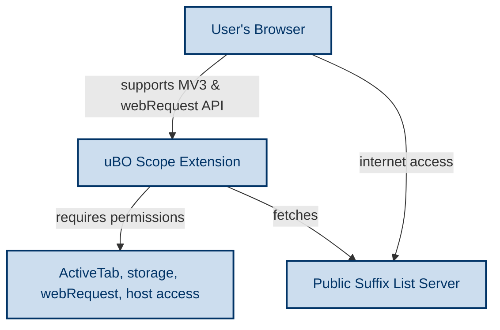

# System Requirements & Prerequisites for uBO Scope

Welcome to the first step of your journey with uBO Scope. This page ensures you start on solid ground by outlining the exact system and browser environment needed, clarifying permissions required, and highlighting key prerequisites. Preparing your system correctly avoids common pitfalls and guarantees a smooth installation and usage experience.

---

## 1. Supported Browsers and Minimum Versions

uBO Scope is designed as a browser extension compatible with major browsers that support Manifest Version 3 extensions and the `webRequest` API. Below are the specifics:

| Browser  | Minimum Version | Notes |
|----------|-----------------|-------|
| Chromium-based browsers (e.g., Chrome, Edge) | 122.0 and above | Supports full host permissions including HTTP(S) and WebSocket protocols.
| Firefox  | 128.0 and above  | Requires strict minimum version 128 due to Manifest V3 compatibility.
| Safari   | 18.5 and above   | Support for Safari's Manifest V3 flavor with required permissions.


> **Note:** Browsers below these versions may not support all extension APIs or permissions uBO Scope relies on.

---

## 2. Operating System Compatibility

uBO Scope functions within any operating system that supports the above browser versions:

- Windows
- macOS
- Linux distributions
- macOS derivatives supporting Safari 18.5+
- Mobile versions of Firefox on Android (subject to browser version constraints)


## 3. Required Permissions and Access

To deliver transparent reporting on network connections, uBO Scope requires specific browser extension permissions. These permissions are granted during extension installation:

- **Active Tab Access**: To monitor network requests on the current tab.
- **Storage**: To keep session data and public suffix list cached locally for performance and persistence.
- **WebRequest API Access**: To listen to network requests and their outcomes including redirect, success, and error events.
- **Host Permissions**: 
  - `http://*/*`, `https://*/*`
  - `ws://*/*`, `wss://*/*` (except in Safari where WebSocket URLs are not included)


> These permissions are essential for capturing and categorizing all third-party connections your browser makes.

---

## 4. Network Requirements

- **Internet Access**: Required to install the extension from your browser’s official add-on marketplace.
- **Access to Public Suffix List**: The extension fetches and caches the latest public suffix list to correctly determine domain registries. This requires HTTPS connectivity to `https://publicsuffix.org/` for updates.


## 5. Prerequisites Checklist

Before proceeding to install and run uBO Scope, ensure the following:

- [ ] You are using one of the supported browsers listed above.
- [ ] Your browser version meets or exceeds the stated minimum.
- [ ] You have sufficient permissions to install extensions.
- [ ] Your network environment allows the extension to fetch data and monitor requests.
- [ ] No corporate or browser policy disables extension permissions or the `webRequest` API.


<Tip>
If you encounter permission denials or missing APIs after installation, verify your browser version and any active security policies or management settings that could block extension features.
</Tip>

---

## 6. Common Pitfalls and How to Avoid Them

### Using Outdated Browsers

Attempting to install uBO Scope on browsers below the minimum versions will either block installation or cause the extension to malfunction silently.

### Restricted Extension Permissions

Some environments may restrict the `webRequest` API or host permissions. This will limit uBO Scope’s effectiveness.

### Network Restrictions

Firewalls or network proxies might interfere with fetching the public suffix list or real-time data, causing incomplete or stale information.

### Safari’s WebSocket Limitation

Safari's host permissions do not currently support WebSocket URLs, limiting monitoring of these connections.

> For best results, use the latest browser releases with default security settings.

---

## 7. What’s Next?

With your system prepared and prerequisites met, the next step is to proceed with the installation of uBO Scope tailored to your browser choice.

- Visit [Installation Across Browsers](/getting-started/essentials/installation) to find detailed installation steps.
- After installing, refer to [First-Time Configuration & Extension Access](/getting-started/essentials/configuration-basics) to configure permissions and access.

Following these steps ensures a seamless setup to start gaining insightful visibility into your browser's network activity.

---

## Appendix: Permissions Overview from Manifest

For transparency, the extension's manifest defines these permissions (example for Chromium):

```json
{
  "permissions": [
    "activeTab",
    "storage",
    "webRequest"
  ],
  "host_permissions": [
    "https://*/*",
    "http://*/*",
    "wss://*/*",
    "ws://*/*"
  ]
}
```

This ensures uBO Scope can observe, analyze, and report the full spectrum of network connections initiated by your browser.

---

## Additional Resources

- [What is uBO Scope?](/overview/getting-started/what-is-ubo-scope) — Understand the product's purpose and value.
- [Core Concepts and Terminology](/overview/getting-started/core-concepts-terminology) — Learn key terms to interpret network activity meaningfully.
- [Troubleshooting Common Issues](/getting-started/essentials/troubleshooting) — Resolve common setup challenges.


---

<u>Ready to move forward? Proceed to the [Installation Across Browsers](/getting-started/essentials/installation) guide.</u>


---

# FAQ

**Q: Can I use uBO Scope on outdated browsers or unsupported platforms?**  
A: No, it requires recent versions of the browsers specified above due to dependencies on Manifest V3 APIs.

**Q: What if I decline extension permissions?**  
A: uBO Scope needs the specified permissions to monitor network activity accurately; declining will limit functionality.

**Q: Does uBO Scope work offline?**  
A: uBO Scope requires internet access initially to fetch and cache the public suffix list but can function offline afterward with cached data.

**Q: Are there known issues on Safari?**  
A: Safari limits host permissions for WebSocket connections, so telemetry there will not include websocket URLs.


---

# Summary Diagram of Prerequisite Components



This flowchart illustrates your environment’s essential components and interactions when getting ready to run uBO Scope.
