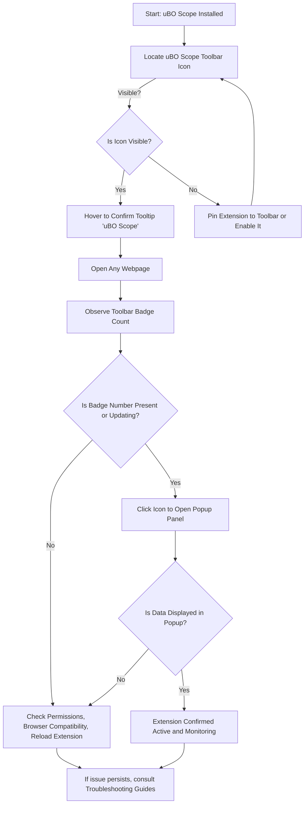

# Launching & Validating Extension Activation

Ensure your uBO Scope extension is correctly installed, active, and monitoring network connections as expected. This guide walks you through recognizing the toolbar icon, interpreting the badge indicator, and verifying that uBO Scope is operational in your browser.

---

## 1. Confirm uBO Scope Installation and Toolbar Icon Presence

The first step after installation is to verify that uBO Scope is installed and its toolbar icon is visible and accessible.

### Step-by-Step:

1. **Locate the uBO Scope Toolbar Icon:**
   - Look to the browser's toolbar area, typically near the address bar.
   - The icon consists of the uBO Scope logo representing the extension.

2. **Verify Icon Visibility:**
   - If the icon is not immediately visible:
     - For Chromium-based browsers, click the extension puzzle piece icon, then pin uBO Scope for quick access.
     - For Firefox, ensure the icon is enabled in the add-ons bar.
     - For Safari, check the extensions settings to toggle visibility.

3. **Tooltip Confirmation:**
   - Hover your mouse over the icon.
   - A tooltip labeled 'uBO Scope' should appear, confirming the correct extension.

<Check>
Always ensure the icon shows the proper logo and tooltip to confirm you’re interacting with the genuine uBO Scope extension.
</Check>

---

## 2. Understanding and Interpreting the Badge Indicator

uBO Scope provides a **badge count overlay** on its toolbar icon. This badge displays the number of distinct third-party remote servers your active webpage connects to.

### What the Badge Number Means:

- **Badge Count = Number of Unique Allowed Third-Party Domains**
- A **lower badge count** indicates fewer third-party connections, which typically suggests better privacy.
- If the badge is empty, no distinct third-party connections have been detected for the current tab.

### Step-by-Step:

1. **Open a Webpage in a New Tab:**
   - Navigate to any website.

2. **Observe the Badge Number:**
   - The number overlays the uBO Scope toolbar icon.
   - This number updates dynamically as the page loads and network connections are observed.

3. **Badge Appearance Variations:**
   - If the badge shows **no number**, it means no allowed third-party networks have been detected yet or the page is still loading.
   - The badge updates live as connections are discovered.

<Info>
Remember, the badge represents third-party remote servers **allowed** through network connections, not the count of blocked requests.
</Info>

---

## 3. Accessing the uBO Scope Popup Panel for Live Data

The popup panel gives you a concise report of your current tab’s network connections, organized by outcome category.

### Step-by-Step:

1. **Click the uBO Scope Toolbar Icon:**
   - This opens the popup panel showing detailed network outcomes.

2. **Understand the Popup Sections:**
   - **Domains Connected:** Displays the total count of distinct third-party domains connected.
   - **Not Blocked:** Domains that successfully connected.
   - **Stealth-Blocked:** Domains whose connections were redirected or stealth-blocked.
   - **Blocked:** Domains with connections that were actively blocked.

3. **Review Domain Lists:**
   - Each section lists domains with connection counts.
   - Domains are sorted alphabetically and show how often connections occurred.

4. **Interpret the Hostname and Domain Display:**
   - The popup header shows the current tab’s hostname and its main domain for context.

<Tip>
Use this panel to monitor your real-time privacy exposure as you browse. It helps you visualize exactly which third parties connect from each webpage.
</Tip>

---

## 4. Verifying Extension Activation via Badge and Popup

After confirming icon presence and understanding the badge and popup, verify the extension is actively monitoring.

### Step-by-Step:

1. **Navigate to a Well-Known Website:**
   - Visit a common site with multiple third-party content, such as https://www.nytimes.com or any popular news site.

2. **Observe Badge Count Increase:**
   - Watch the badge number change as network requests complete.

3. **Open uBO Scope Popup:**
   - Click the toolbar icon.
   - Check that domains populate under each outcome category.

4. **Reload the Page:**
   - Observe badge updates and popup domain list refresh.

5. **Confirm Badge Reflects Third-Party Connections:**
   - The badge number should reflect the distinct third-party domains successfully connected.

<Check>
If the badge does not update or the popup shows 'NO DATA' or remains empty on sites with active network connections, the extension may not be active.
</Check>

---

## 5. Troubleshooting Common Activation Issues

### Issue: Badge Does Not Appear or Update

- **Verify permissions:** The extension requires permissions (`webRequest`, `activeTab`, `storage`) which are granted during installation. Confirm in your browser’s extension settings.
- **Browser version compatibility:** Confirm your browser version meets the minimum requirement (Chrome 122+, Firefox 128+, Safari 18.5+).
- **Re-enable or reload the extension:** Disable and re-enable the extension or restart your browser.

### Issue: Popup Panel Shows No Data

- **Ensure you have a current active tab selected:** The popup queries active tab data.
- **Reload the web page:** Sometimes data populates after the page starts loading.
- **Check for browser restrictions:** Some browser modes (e.g., private browsing) or security settings may restrict extensions from accessing network data.

<Tip>
If issues persist, consult the Troubleshooting guides under Getting Started > Setup Troubleshooting for detailed resolutions.
</Tip>

---

## 6. Summary and Next Steps

You have now successfully:

- Located and identified the uBO Scope toolbar icon.
- Understood the meaning of the badge count indicator.
- Accessed and interpreted the popup panel showing third-party network outcomes.
- Verified that the extension is actively monitoring and reporting connections.

For further exploration:

- Proceed to **Configuring Core Settings** to customize your monitoring experience.
- Explore **Your First Look: Interpreting the Popup Panel** to maximize the insights you gain from the extension.
- Consult **Validating Network Monitoring & Badge Counts** if you need deeper verification of network request tracking.

---

## Additional Resources

- [Installing uBO Scope](https://docs.example.com/getting-started/installation-overview/installation-instructions)
- [Prerequisites & System Compatibility](https://docs.example.com/getting-started/installation-overview/prerequisites-system-compatibility)
- [Understanding the Badge Count & Popup Panel](https://docs.example.com/guides/getting-started-essentials/interpreting-badge-popup)

---

*This page is part of the Getting Started guide to help you confidently launch and validate uBO Scope’s extension activation in your browser.*

---

## Visual Diagram: User Flow to Activate and Validate uBO Scope

