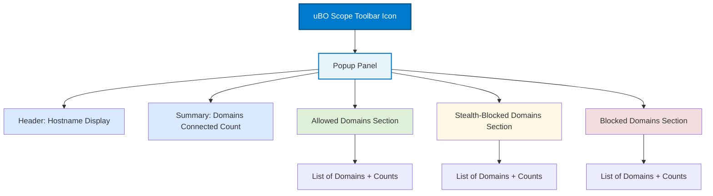

# Your First Look: Interpreting the uBO Scope Popup Panel

Welcome to your initial exploration of uBO Scope's popup panel. This guide walks you through opening the popup for the first time, understanding its primary sections, and interpreting the data it presents. By the end, you'll confidently read the lists of allowed, stealth-blocked, and blocked domains to grasp your browsing privacy exposure instantly.

---

## 1. Opening the Popup Panel for the First Time

1. **Locate the uBO Scope Toolbar Icon:**
   - After installing uBO Scope, find its icon (a small shield with "uBO" text) on your browser’s toolbar.
   - If the icon is not visible, check your browser’s extension area or pin it for easy access.

2. **Click the Icon to Open the Popup:**
   - Click the icon once to open the popup panel.
   - The panel loads your current active tab’s network connection data, if available.

3. **Wait Momentarily:**
   - The panel may show a loading state briefly while fetching data.
   - If this takes unusually long, confirm you have an active tab with network activity.

<Check>
If the popup indicates "NO DATA," ensure you are on a fully loaded webpage and try refreshing the page, then reopen the popup.
</Check>

---

## 2. Understanding the Popup Panel Layout

The popup is divided into several key sections, designed to give you an actionable overview of your network exposures per browser tab.

### 2.1 Header: Hostname Display

- Shows the main website’s hostname at the top.
- The domain part (e.g., `example.com`) is displayed prominently.
- Any subdomain portion appears just before the domain (e.g., `blog.` in `blog.example.com`).

### 2.2 Summary Section

- Displays the total count of distinct third-party domains connected during the page load.
- This count represents the "true privacy exposure" — a critical privacy metric.

### 2.3 Outcome Blocks

There are three outcome categories displayed, each with a section listing related domains and how often they connected:

- **Not Blocked (Allowed):**
  - Domains for which network requests were allowed and completed.
  - These third-party connections contribute to your privacy exposure.

- **Stealth-Blocked:**
  - Domains where network requests were blocked in a stealthy manner.
  - These are connections that the browser or content blockers prevented, often without notifying the requesting site.

- **Blocked:**
  - Domains explicitly blocked (failed or denied connections).
  - These reflect the domains your blockers have effectively stopped.

### 2.4 Domain Rows

- Each domain appears with a badge indicating how many requests were made to that domain.
- Sorting is alphabetical by domain name.

---

## 3. Step-by-Step Example: Making Sense of the Data

Imagine you visit a news website and open the popup. Here’s how you interpret the data:

1. **Header shows:** `www.newswebsite.com`
2. **Summary shows:** `12` connected domains.
3. **In "Not Blocked" section:** Domains like `cdn.newswebsite.com` (the site's CDN), `ads.adnetwork.com` (advertisement servers), and `analytics.site.com` appear, each with respective counts.
4. **In "Stealth-Blocked" section:** Domains like `tracker.thirdparty.com` are listed, meaning these trackers were silently blocked.
5. **In "Blocked" section:** A small list of domains failed connections, perhaps due to network errors or strict blocking.

> **Outcome:** You see exactly which third-party domains your browser connected to, which were blocked quietly, and which were explicitly blocked. This real-world insight clarifies your true exposure and the effectiveness of your blockers.

---

## 4. Practical Tips to Maximize Value

- **Refresh the page before opening the popup** to ensure data is up to date.
- **Use the popup alongside your content blocker** to verify which domains are truly allowed or blocked.
- **Watch badge counts on the toolbar icon** for a quick privacy exposure estimate before opening the popup.
- **Focus on third-party domains:** uBO Scope highlights these to reveal hidden tracking and external connections.

<Warning>
Remember that not all third-party connections are malicious; some are essential for website functionality (e.g., CDNs). Lower counts generally indicate better privacy but assess according to your browsing habits.
</Warning>

---

## 5. Troubleshooting Common Display Issues

| Issue                                 | Solution                                                               |
|---------------------------------------|------------------------------------------------------------------------|
| Popup shows "NO DATA"                 | - Reload the current webpage and try again.
- Confirm uBO Scope is active and permissions are granted.
|
| Domain lists are empty or incomplete   | - Ensure you browsed a site with network activity.
- Check for conflicting extensions that may block webRequest interception.
|
| Badge count doesn’t update             | - Refresh the tab.
- Restart the browser if issues persist.
|

If problems continue, consult the [Launching & Validating Extension Activation](getting-started/first-run-and-configuration/launch-validate-extension) page.

---

## 6. Next Steps

- Explore configuring core settings to tailor monitoring to your preferences: [Configuring Core Settings](getting-started/first-run-and-configuration/configuring-extension-basics).
- Learn more about interpreting badge counts and their meaning: [Understanding the Badge Count & Popup Panel](guides/getting-started-essentials/interpreting-badge-popup).
- Dive deeper by performing analytical tasks based on these insights: [Performing a Basic Connection Analysis](guides/getting-started-essentials/basic-connection-analysis).

---

## Summary
This popup panel is your window into the invisible world of network connections your browser makes. Understanding it empowers you to verify your content blockers, assess privacy exposure, and make informed decisions about your browsing security.

---

_Last updated for uBO Scope version 1.0.1._

---

For full API details or internals, see the [GitHub repository](https://github.com/gorhill/uBO-Scope).


---

### Example of Popup Structure

```html
<h2 id="tabHostname"><span></span><span>www.example.com</span></h2>
<section id="summary">domains connected: <span>15</span></section>
<section class="outcome allowed">
  <h3>not blocked</h3>
  <div class="domains">
    <div class="row"><span class="domain">cdn.example.com</span><span class="count badge">10</span></div>
    <div class="row"><span class="domain">analytics.tracker.com</span><span class="count badge">4</span></div>
  </div>
</section>
<section class="outcome stealth">
  <h3>stealth-blocked</h3>
  <div class="domains">
    <div class="row"><span class="domain">ads.blockedpartner.com</span><span class="count badge">3</span></div>
  </div>
</section>
<section class="outcome blocked">
  <h3>blocked</h3>
  <div class="domains">
    <div class="row"><span class="domain">tracker.blocked.com</span><span class="count badge">1</span></div>
  </div>
</section>
```

This structure represents the key data users will see and interpret.

---

### Visual Diagram: Popup Panel Layout



This diagram illustrates how the user flows from clicking the toolbar icon to exploring distinct sections inside the popup.
