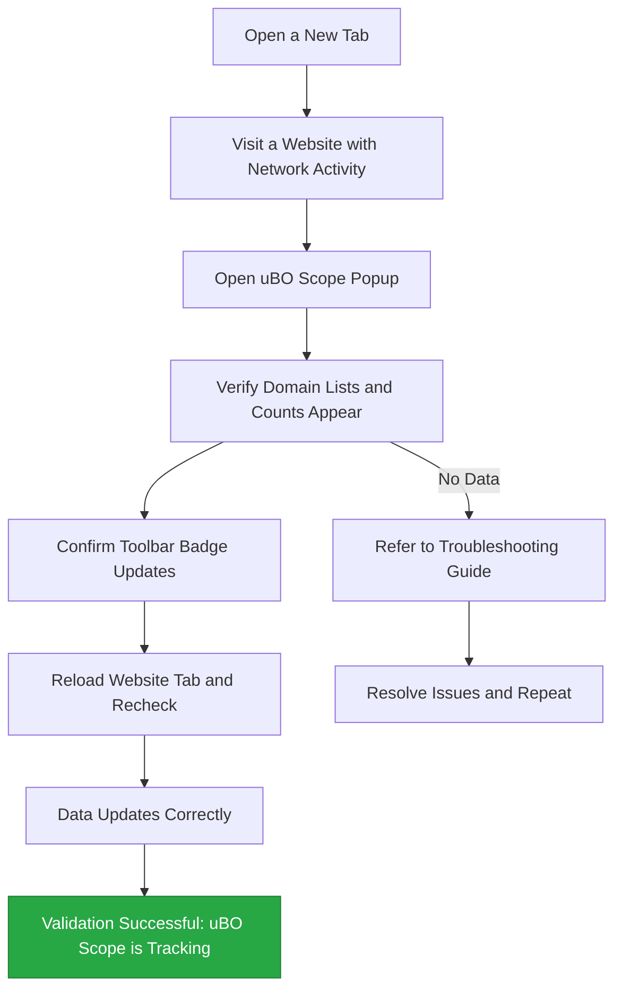

# Quick Validation Checklist

Ensure uBO Scope is actively monitoring and tracking your browser's network requests by following this practical checklist. This hands-on guide helps you confirm that uBO Scope is functioning correctly immediately after installation, giving you confidence that your browsing connections are being analyzed and reported.

---

## 1. Open a New Browser Tab

Start fresh to avoid any cached or stale data that might affect results.

1. Open a new tab in your browser where uBO Scope is installed.
2. Confirm the tab is blank or displays your browser's default new tab page.

## 2. Load a Website with Network Activity

Choose a site that makes multiple third-party requests to test uBO Scope’s real-time tracking effectively.

1. Enter a popular website URL into the address bar (e.g., `https://www.example.com`).
2. Wait for the site to fully load, allowing all network requests to complete.

> **Tip:** Sites with embedded videos, ads, or social media plugins typically generate more network requests, making them ideal for validation.

## 3. Open the uBO Scope Popup

The popup interface displays domains that were contacted by the page and how uBO Scope classified them.

1. Click the uBO Scope icon in your browser toolbar to open the popup.
2. Observe the panel titled with the current tab’s hostname.

## 4. Verify Domain Connection Data Appears

Check that the popup shows lists of domains under the categories "not blocked", "stealth-blocked", and "blocked".

- Confirm the "domains connected" count updates to a number greater than zero.
- Scroll through each category's domain list to see entries with their respective counts.

> **Note:** A blank popup or "NO DATA" label means no tracking data is available for the active tab, which indicates monitoring is not working.

## 5. Confirm Toolbar Badge Updates

The toolbar icon badge reflects the number of unique allowed third-party domains contacted by the current tab.

- Visually check that a numeric badge appears on the uBO Scope icon after website load.
- The badge should show a number matching or related to the domain count in the popup’s "not blocked" section.

## 6. Refresh and Re-Check

To ensure stability and consistent tracking:

1. Reload the website tab.
2. Open the popup again.
3. Verify the domain lists and badge update accordingly.

## 7. Troubleshoot if Data Is Missing or Incorrect

If no data appears or the badge never updates, try these steps:

- Ensure the extension is enabled and not disabled by the browser.
- Confirm that uBO Scope has the necessary permissions (activeTab, webRequest).
- Try visiting a different website with known network activity.
- Restart the browser and retry the validation.

For detailed troubleshooting steps, see the [Troubleshooting Installation Guide](/getting-started/installation-basics/troubleshooting-install).

---

## Understanding Results

- **Domain Count:** Represents distinct third-party domains contacted by the site.
- **Allowed (Not Blocked):** Domains for which network requests succeeded.
- **Blocked:** Domains with requests that failed or were explicitly blocked.
- **Stealth-blocked:** Domains where redirects or stealth blocking occurred.

This categorization helps you understand your browsing footprint and which external servers your browser communicates with.

---

## Summary

By following this checklist, you will have concrete proof that uBO Scope is actively monitoring network connections on your browser tabs. This foundational step is essential before diving deeper into domain analysis or assessing blocking behaviors.

---

## Additional Resources

- [Opening the uBO Scope Popup](/getting-started/first-run-experience/opening-popup)
- [Understanding the Badge and Popup](/getting-started/first-run-experience/understanding-badge-popup)
- [Interpreting Badge Counts](/guides/getting-started-essentials/badge-counts-meaning)
- [Troubleshooting Installation](/getting-started/installation-basics/troubleshooting-install)
- [Core Concepts & Terminology](/overview/about-ubo-scope/core-concepts-terminology)

---

## Quick Validation Workflow Diagram

---