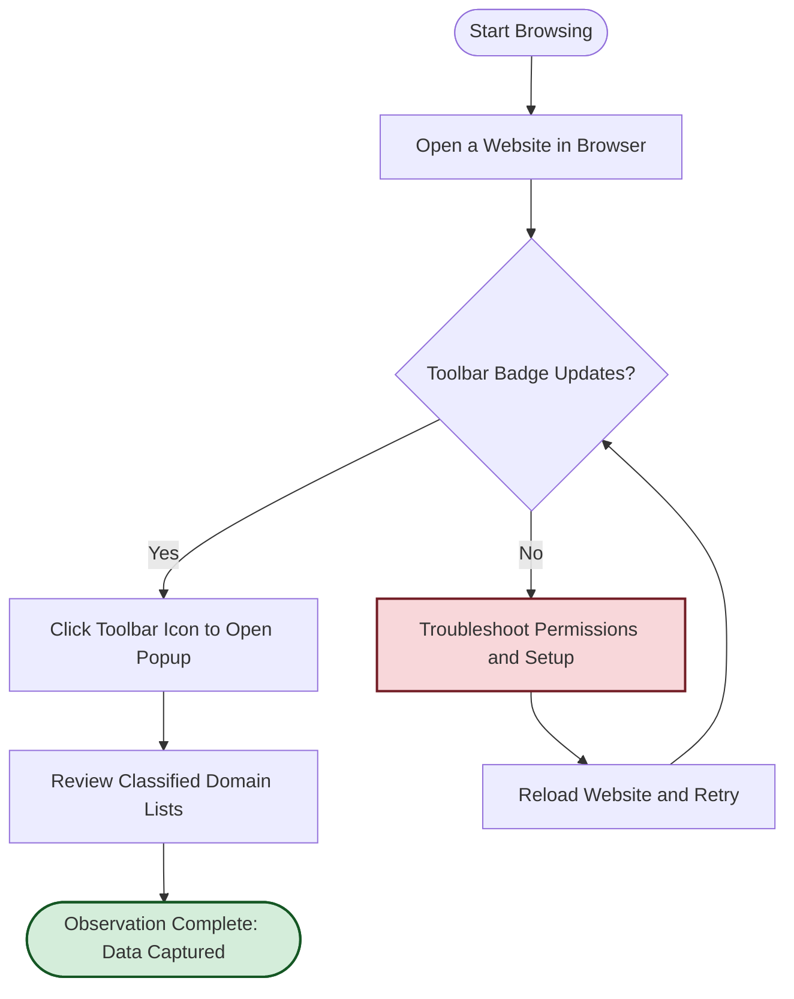

# Your First Network Observation

Welcome to your initial experience with uBO Scope! This guide takes you step-by-step through using uBO Scope immediately after installation. You'll learn how to interpret the toolbar badge, open the popup interface, and understand the classified domain connection lists. By the end, you'll complete a simple workflow visiting a website and confirming that uBO Scope actively captures and displays network connection data.

---

## 1. Understanding the Toolbar Badge

Once installed, uBO Scope adds an icon to your browser's toolbar. This icon serves as your primary indicator of network activity.

- **Badge Number Meaning**: The number shown on the badge represents the count of distinct third-party remote servers to which the current webpage has connected successfully.
- **Lower Is Better**: A lower count typically means fewer network connections to external servers, which can be desirable for privacy.
- **Badge May Be Empty**: If the badge shows no number, it means that no third-party network connections have yet been observed or allowed on the active tab.

### Practical Tip
Monitor the badge as you navigate websites to gain a quick overview of the network connections your browsing session triggers.

---

## 2. Opening the Popup Interface

To get detailed information about network connections:

1. Click the **uBO Scope toolbar icon** in your browser.
2. The extension's popup window will open, showing categorized domain connection lists.

### What You Will See

- **Header**: Displays the hostname of the active tab.
- **Connections Summary**: Shows the total number of distinct domains connected.
- **Sections**:
  - **Not Blocked (Allowed)**: Domains for which connections successfully completed.
  - **Stealth-blocked**: Domains where connections were redirected or intercepted stealthily.
  - **Blocked**: Domains where network requests were blocked outright.

Each section lists connected domains along with the number of connection attempts.

---

## 3. Understanding Classified Domain Lists

uBO Scope classifies domains connected by webpages into three categories:

- **Allowed (Not Blocked)**:
  - These are domains with successful network connections.
  - Typically includes first-party and legitimate third-party resources.

- **Stealth-blocked**:
  - Domains for which connection attempts were redirected or stealthily blocked.
  - This classification helps highlight subtle filtering or redirects unseen by webpages.

- **Blocked**:
  - Domains where network requests resulted in errors or were explicitly blocked.

### How to Interpret Counts

- The counts next to each domain indicate how many requests were made to that domain during the page load.
- The badge count aggregates the count of distinct allowed domains, providing a quick summary.

### Best Practice
Regularly check these lists to understand your privacy exposure and the behavior of content blockers.

---

## 4. Your First Observation Workflow

Follow this simple workflow to verify uBO Scope is up and running:

<Steps>
  <Step title="Open a Website of Your Choice">
  Navigate to any website you want to analyze. It can be your favorite news site, social media platform, or an online store.
  </Step>
  <Step title="Look at the Toolbar Badge">
  Observe the uBO Scope badge on the toolbar. It should display a number representing distinct third-party connections.
  </Step>
  <Step title="Click the Toolbar Icon to Open the Popup">
  Click the uBO Scope toolbar icon to open the popup window.
  </Step>
  <Step title="Review Domain Connection Categories">
  Check the "not blocked", "stealth-blocked", and "blocked" sections. You should see domains listed based on their network request outcomes.
  </Step>
  <Step title="Confirm Active Monitoring">
  If the popup shows domain names and counts, uBO Scope is actively capturing connection data for your active tab.
  </Step>
</Steps>

### Success Indicator
You have successfully completed your first network observation when domain lists populate in the popup, and the badge updates correctly with a number.

---

## 5. Troubleshooting Common First-Run Issues

If you do NOT see domain information or badge updates, consider the following:

- **The Badge Is Empty Ever After Browsing**:
  - Verify your browser version meets minimum requirements (Chrome 122+, Firefox 128+, Safari 18.5+).
  - Confirm uBO Scope permissions are granted, especially the `webRequest` and `activeTab` permissions.
  - Ensure the extension icon is active and not disabled.

- **Popup Shows 'NO DATA' or Blank Content**:
  - Try refreshing the webpage to trigger new network requests.
  - Make sure your browser does not block extension popups.
  - Check if other content blockers interfere; some may affect extension functionality.

- **Domain Lists Do Not Update After Page Reloads**:
  - Restart your browser to clear any transient issues.
  - Confirm network is active and page resources are loading.

<Tip>
If problems persist, consult the "Quick Validation & Troubleshooting" guide in this documentation for detailed diagnostic steps.
</Tip>

---

## 6. Next Steps

Now that you have completed your first observation:

- Explore [Navigating the uBO Scope Interface](/overview/core-concepts-architecture/navigating-ubo-scope-ui) to deepen your understanding of the UI details.
- Review [Understanding and Interpreting the Badge Count](/guides/using-ubo-scope/interpreting-badge) for advanced badge analytics.
- Continue with [Quick Validation & Troubleshooting](/getting-started/first-run-experience/quick-validation-and-troubleshooting) if you encounter any issues.

By regularly using uBO Scope, you empower yourself to uncover and monitor all network connections your browser initiates, enhancing your web transparency and privacy awareness.

---

## References

- [Installation & Setup Guides](/getting-started/installation-setup)
- [First Configuration: Getting Ready to Observe](/getting-started/installation-setup/first-configuration)
- [Core Concepts & Architecture Overview](/overview/core-concepts-architecture/how-it-works-architecture)

---

## Visual Flow of First Network Observation

