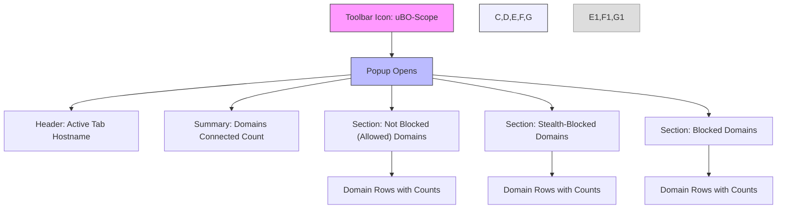

# Launching the Extension

Welcome to your first step with uBO-Scope. This guide will help you quickly access uBO-Scope from your browser toolbar, introduce you to the popup interface, and explain how to immediately start seeing live data about the remote server connections your browser is making. By the end of this guide, you will confidently open uBO-Scope and understand the main sections of its popup interface, enabling you to begin monitoring network connections on your current webpage.

---

## 1. Opening uBO-Scope from the Browser Toolbar

uBO-Scope installs as a browser extension and places an icon directly in your browser’s toolbar. This icon is your portal to viewing live connection data.

### Steps to Open uBO-Scope:

1. **Locate the uBO-Scope Icon:**
   - After installation, find the uBO-Scope icon on your browser’s toolbar. The icon looks like the application's logo and is labeled "uBO Scope" on hover.

2. **Click the Icon:**
   - Simply click the toolbar icon. This opens the uBO-Scope popup interface immediately.

3. **Pin the Icon (Optional but Recommended):**
   - To keep uBO-Scope readily accessible, pin the icon to your toolbar:
     - In Chromium-based browsers, click the puzzle (extensions) icon, then click the pin icon next to uBO-Scope.
     - In Firefox, drag the icon to the main toolbar.
     - In Safari, ensure the extension appears in the toolbar from Safari’s Extensions preferences.

<Tip>
Pinning uBO-Scope ensures it is always visible and easy to access while you browse, reducing friction during your monitoring.
</Tip>

---

## 2. Understanding the Popup Interface

When you click the uBO-Scope icon, a popup appears. This popup is your dashboard for at-a-glance visibility into the sophisticated network monitoring uBO-Scope performs.

### Popup Layout Overview:

- **Tab Hostname Header:**
  - At the top, you'll see the hostname of the current active tab followed by the main domain, helping you confirm which site’s connections are being reported.

- **Summary Section:**
  - Displays the total number of distinct domains connected from the active tab. This is the count of unique third-party remote servers observed.

- **Outcome Sections:**
  The core of the popup is divided into three distinct sections showing connection outcomes:

  1. **Not Blocked (Allowed):**
     - Lists domains your browser connected to without blocking.

  2. **Stealth-Blocked:**
     - Shows domains where connections were stealth-blocked, meaning blocked in a way that often avoids detection by sites.

  3. **Blocked:**
     - Displays domains that have been outright blocked by your content blocker.

- **Domain Rows:**
  - Under each section are domain rows showing each domain and the number of requests made to it.

### What You See Initially:

- If no data is available (e.g., immediately after opening the browser or on a new tab), you will see a "NO DATA" placeholder indicating uBO-Scope is awaiting network activity.

- As you navigate websites, this area updates live with domains and connection counts.

---

## 3. What Happens on First Click

The moment you open the popup, uBO-Scope performs the following:

- **Identifies the Active Tab:**
  - It retrieves the active tab's URL to understand which site is being monitored.

- **Fetches Connection Data:**
  - Requests stored network connection data specifically linked to the active tab.

- **Renders the Data:**
  - Displays the hostname and domains categorized by allowed, stealth-blocked, and blocked connections.

- **Adjusts Viewport Fit:**
  - Automatically fits the popup's layout to your screen width for better readability.

---

## 4. Tips for Effective Initial Use

- **Browse Some Websites:**
  - To populate the popup meaningfully, visit various sites to see real-time connection data.

- **Understand the Badge Count:**
  - The number displayed on the toolbar icon indicates how many distinct third-party domains your browser connected to. A lower number usually means fewer third-party connections, which is often desirable for privacy.

- **Reload the Popup:**
  - Each time you click the icon, the popup refreshes and shows live information as your browsing session progresses.

---

## 5. Troubleshooting Popup Launch Issues

If clicking the icon does not open the popup:

- Verify uBO-Scope is installed and enabled in your browser’s extensions/settings.

- Restart the browser to refresh extension loading.

- Confirm the browser version meets minimum requirements (Chrome 122+, Firefox 128+, Safari 18.5+).

- Check for conflicting extensions that might affect popup behavior.

---

## 6. Visual Guide: Popup Interface Layout

---

## 7. Next Steps

Now that you know how to launch and interpret the uBO-Scope popup interface, proceed to:

- **Understanding Badge Counts & Domain Data:** Learn how to interpret the different domain counts and what they indicate about your browsing privacy.

- **Quick Validation & First Insights:** Explore how to validate your content blocker’s effectiveness using uBO-Scope’s live data.

---

For a smooth start, refer to the Installation and Prerequisite guides if you haven’t installed uBO-Scope yet.

---

## Additional Resources

- [Installing uBO-Scope](https://github.com/gorhill/uBO-Scope/blob/main/README.md) — where to get and install the extension
- [Understanding Badge Counts & Domain Data](../interpreting-badge) — detailed explanation of badge numbers and domain categories
- [Troubleshooting Installation & Permissions](../install-troubleshooting) — resolve common setup issues

---

Your browser’s toolbar icon is the key to unlocking real-time visibility into your connection footprint. Opening the uBO-Scope popup is your gateway to understanding and controlling what your browser talks to online — start exploring now!