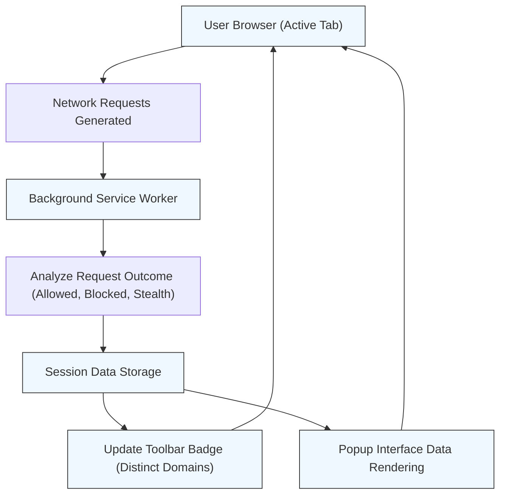

# Verifying Operation and Understanding the Badge

This guide helps you quickly verify that **uBO Scope** is working correctly by running a simple test and understanding how the toolbar badge and popup user interface reflect real-time network activity. By following these steps, you will confirm the extension is tracking third-party remote server connections as intended.

---

## 1. What to Expect from the Badge

After installing and activating uBO Scope, the toolbar icon displays a **badge count**. This count represents the **number of distinct third-party remote servers** your browser connected to on the current active tab.

- A **lower count** is better, indicating fewer third-party connections.
- The badge updates **in real time** as you browse, reflecting new connections.
- The count excludes first-party domains but includes all third-party domains that your browser accessed, regardless of whether your content blocker blocked or allowed those requests.

<Tip>
Remember, the badge reflects distinct third-party domains contacted, not the number of blocked requests. This is the most reliable metric for assessing your browsing exposure.
</Tip>

---

## 2. Running a Quick Verification Test

Follow these steps to verify uBO Scope is actively reporting network connections and updating the badge:

<Steps>
  <Step title="Open a New Browser Tab">
    Start by opening a new tab in your browser.
  </Step>
  <Step title="Navigate to a Popular Website">
    Visit a well-known website such as https://www.wikipedia.org.

    This site typically loads resources from a small number of third-party domains.
  </Step>
  <Step title="Observe the Toolbar Badge Count">
    Look at the uBO Scope toolbar icon badge. It should display a number corresponding to the distinct third-party domains contacted during page load.

    - If the badge is empty or missing, ensure the extension is enabled and your browser supports the required permissions.
  </Step>
  <Step title="Open the Extension Popup">
    Click the uBO Scope icon to open its popup interface.

    You should see:
    - The hostname and domain of the active tab displayed at the top.
    - Three distinct outcome sections: **not blocked**, **stealth-blocked**, and **blocked**.
    - Lists of third-party domains under each outcome with connection counts.
  </Step>
  <Step title="Confirm Consistency">
    Verify that the number shown next to **domains connected** in the popup matches the badge count.

    This confirms the data reflects the current tab’s third-party connections correctly.
  </Step>
</Steps>

<Note>
If the popup shows “NO DATA” or empty sections despite loading pages with third-party content, the extension may not have proper permissions or might be affected by browser restrictions on the webRequest API.
</Note>

---

## 3. Understanding the Popup Interface

The popup UI breaks down remote server connections by their outcome:

- **Not Blocked (Allowed)**: Third-party domains your browser successfully connected to without blocking.
- **Stealth-Blocked**: Domains for connections that were redirected or blocked stealthily (not always visible to all blockers or requests).
- **Blocked**: Domains where network requests were explicitly blocked or failed.

Each section lists domains along with a count showing how many connection attempts were made to them.

This detailed breakdown helps you understand your browsing exposure at a glance.

---

## 4. Best Practices for Verification

- Refresh the active tab to see the badge and popup update dynamically.
- Test multiple sites with varying degrees of third-party resources to observe changes.
- Avoid ad blocker test pages; real-world browsing sites provide more accurate third-party profiles.

---

## 5. Troubleshooting If Badge or Data Isn’t Updating

<AccordionGroup title="Common Issues and Fixes">
  <Accordion title='Extension Not Showing Badge or Data'>
    <ul>
      <li>Ensure the extension is enabled in your browser.</li>
      <li>Confirm the browser version meets minimum requirements (Chromium 122+, Firefox 128+, Safari 18.5+).</li>
      <li>Verify that permissions for `webRequest` and active tab access are granted.</li>
      <li>Try reloading the page or restarting the browser.</li>
    </ul>
  </Accordion>
  <Accordion title='Popup Shows "NO DATA" or Empty Lists'>
    <ul>
      <li>The extension may have limited access due to browser privacy settings or restrictive content blocking.</li>
      <li>Some sites restrict or obscure network requests, limiting visibility.</li>
      <li>Confirm tab is active and properly selected in the browser.</li>
      <li>Try visiting a different site known to load third-party content.</li>
    </ul>
  </Accordion>
  <Accordion title='Badge Count Seems Too High or Low'>
    <ul>
      <li>Badge shows distinct third-party domains, not total requests.</li>
      <li>Understand that some legitimate CDNs or services increase count but are generally safe.</li>
      <li>If uncertain, cross-check network requests via developer tools for verification.</li>
    </ul>
  </Accordion>
</AccordionGroup>

<Warning>
Due to browser API limitations, uBO Scope cannot track network requests that do not go through the browser’s `webRequest` API.
</Warning>

---

## 6. Next Steps After Verification

- Explore other documentation pages on how to interpret stealth and blocked requests.
- Learn how to use uBO Scope for practical monitoring of third-party connections per site.
- See guides on comparing content blockers using uBO Scope’s metrics.

---

## 7. Summary Diagram: Data Flow for Badge and Popup Updates

This diagram illustrates how network requests from the active tab flow through the extension’s background worker, get recorded and analyzed, and update both the badge count and popup interface.

---