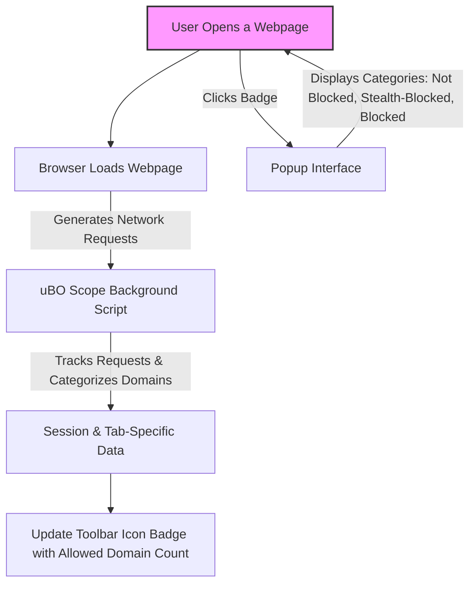

# Quick Validation: Is uBO Scope Working?

Welcome to a rapid and straightforward check to confirm that uBO Scope is installed, active, and functioning as expected in your browser. This verification will guide you through a concise sequence of actions so you can confidently see your first live results and verify the extension's operational status.

---

## 1. Prerequisites for Validation

Before proceeding, ensure:
- You have already installed uBO Scope for your browser (Chrome 122+, Firefox 128+, or Safari 18.5+).
- You have granted the required permissions (activeTab, storage, webRequest).
- The extension icon is visible on your browser toolbar.

If you need installation instructions or permission details, please refer to the appropriate guides:
- [Installing uBO Scope](https://github.com/gorhill/uBO-Scope#getting-started-installing-extension)
- [Basic Configuration and Permissions](https://github.com/gorhill/uBO-Scope#getting-started-basic-configuration)

---

## 2. Step-by-Step Quick Validation

Follow these exact steps to verify that uBO Scope is running correctly:

<Steps>
<Step title="Visit a Popular Website">
Open a new browser tab and navigate to a well-known site, such as https://www.wikipedia.org or https://www.google.com.

These sites typically generate enough network activity to provide meaningful data for uBO Scope to observe.
</Step>

<Step title="Observe the Browser Toolbar Icon Badge">
Look at the uBO Scope icon in your browser toolbar. It should display a **numeric badge** indicating the number of distinct third-party domains allowed on the active tab.

- If you see a non-empty badge (e.g., "3", "5", etc.), this means uBO Scope is actively tracking network connections.
- If the badge is blank or missing, the extension may not be running properly.

<Tip>
Badge numbers reflect distinct allowed domains making network connections from the current webpage.
</Tip>
</Step>

<Step title="Open the uBO Scope Popup Interface">
Click the uBO Scope toolbar icon to open its popup panel.

In this popup, check the following:
- The main hostname (top heading) matches the website you visited.
- The **domains connected** count updates dynamically with the number of distinct third-party domains.
- The three sections labeled **not blocked**, **stealth-blocked**, and **blocked** show domain names accordingly.

You should see actual domain names listed in at least one of these sections. This confirms uBO Scope is intercepting and categorizing network activity correctly.

<Note>
If you see "NO DATA" or all sections empty, refresh the page and wait a few seconds before reopening the popup.
</Note>
</Step>

<Step title="Verify Domain Count Matches Badge">
Compare the numeric badge on the toolbar icon with the **domains connected** number in the popup's top summary.

These should align or be very close, confirming data consistency between the badge count and the popup content.

<Warning>
Discrepancies might indicate temporary delays in data processing; try refreshing the page or restarting the browser.
</Warning>
</Step>

<Step title="Refresh and Repeat">
Refresh the webpage and observe that the badge and popup data update accordingly.

You should see a live reflection of third-party domains connecting and categorized dynamically by uBO Scope.

<Tip>
Refreshing helps trigger new network requests that uBO Scope records.
</Tip>
</Step>
</Steps>

---

## 3. Understanding Your First Insights

- **Badge Number**: Represents the count of distinct third-party domains allowed to connect on the active tab.
- **Popup Sections**:
  - **Not Blocked**: Domains successfully contacted without interference.
  - **Stealth-Blocked**: Domains where a redirect occurred, indicating some interception.
  - **Blocked**: Domains where network requests failed or were blocked.

This breakdown helps you immediately see how network connections behave from the webpage you visit.

---

## 4. Troubleshooting Common Issues

<AccordionGroup title="Common Quick Validation Issues">
<Accordion title="No Badge on Toolbar Icon">
- Ensure the extension is enabled in your browser’s extensions/settings page.
- Confirm you are on a supported browser version.
- Check that the proper permissions are granted.
- Reload the browser after installation if you haven't done so.
</Accordion>

<Accordion title="Popup Shows NO DATA or Is Empty">
- The page might not have loaded enough network requests; refresh the tab.
- Ensure you clicked the popup for the active tab.
- Some sites have minimal external connections; try a different popular site.
- Restart your browser if the problem persists.
</Accordion>

<Accordion title="Badge Count Does Not Update">
- Wait a few seconds for data to process; some delay is normal.
- Refresh the page to trigger new requests.
- Check your browser’s console for errors related to the extension.
- Consult the [Troubleshooting Initial Setup](https://github.com/gorhill/uBO-Scope#getting-started-troubleshooting-setup) guide.
</Accordion>
</AccordionGroup>

---

## 5. Next Steps

Once you confirm uBO Scope is working:
- Explore [First Use: Launching uBO Scope](https://github.com/gorhill/uBO-Scope#getting-started-your-first-run) to understand reading and interpreting the popup interface.
- Review the [Basic Configuration and Permissions](https://github.com/gorhill/uBO-Scope#getting-started-basic-configuration) for customization.
- Investigate real-world use cases with guides like [Interpreting Badge Counts](https://github.com/gorhill/uBO-Scope#guides-interpret-badge) or [Filter List Maintenance](https://github.com/gorhill/uBO-Scope#guides-filter-list-maintainers).
- Visit the GitHub repository for source, issues, and support: [https://github.com/gorhill/uBO-Scope](https://github.com/gorhill/uBO-Scope)

---

# Visual Reference: How uBO Scope Badge and Popup Work

This diagram summarizes the key steps for real-time tracking and displaying of third-party domain connections by uBO Scope.

---

**You have successfully completed the Quick Validation of uBO Scope!**

For more detailed exploration, continue with the full Getting Started guides and enjoy enhanced insight into your web browsing privacy.