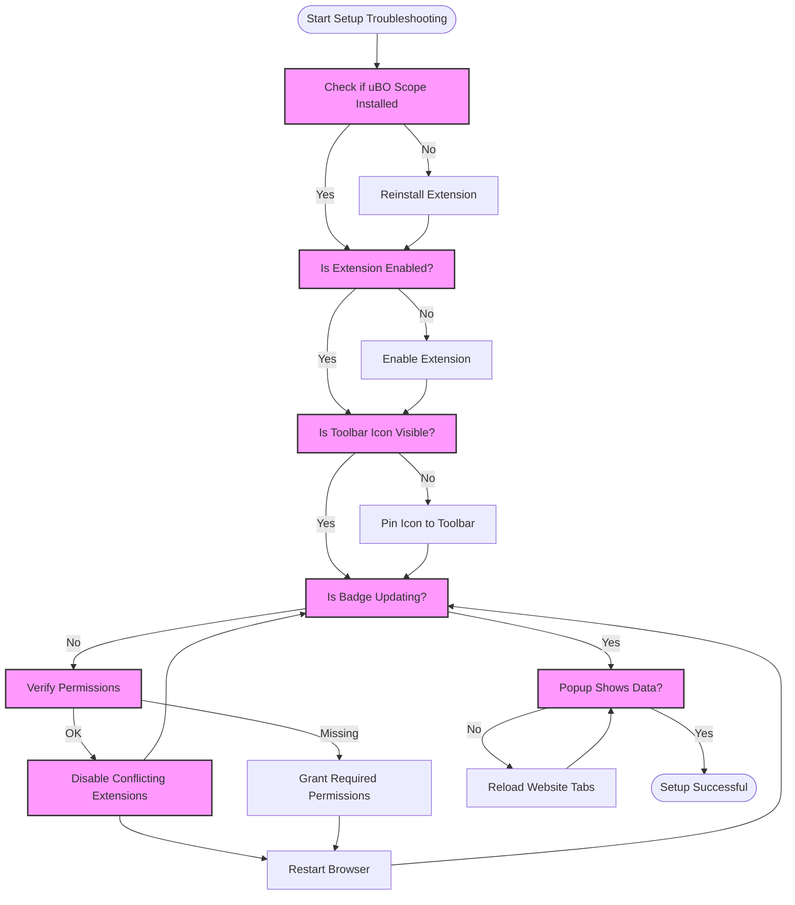

# Troubleshooting Common Setup Issues

This page helps you diagnose and resolve frequent issues encountered during the installation and initial configuration of uBO Scope. Whether the extension doesn't appear, the badge count isn't updating, or permissions seem missing, these steps guide you swiftly to proven solutions so you can start monitoring third-party connections without delay.

---

## 1. Extension Not Appearing in Browser Toolbar

### Possible Causes
- Extension installation incomplete or failed
- Browser has disabled the extension
- Toolbar icon hidden or removed

### How to Fix
1. **Verify Extension Installation:**
   - Open your browser's extensions page:
     - **Chrome:** `chrome://extensions`
     - **Firefox:** `about:addons`
     - **Safari:** `Safari > Preferences > Extensions`
   - Confirm that **uBO Scope** is listed and enabled.

2. **Enable or Re-enable the Extension:**
   - If disabled, toggle the extension to enable it.

3. **Show the Toolbar Icon:**
   - Some browsers hide extension icons by default. Locate the puzzle or extensions icon on the toolbar and pin uBO Scope to the toolbar.

4. **Reinstall if Needed:**
   - If the extension is missing, reinstall it from the official store:
     - [Chrome Web Store](https://chromewebstore.google.com/detail/ubo-scope/bbdpgcaljkaaigfcomhidmneffjjjfgp)
     - [Firefox Add-ons](https://addons.mozilla.org/firefox/addon/ubo-scope/)
     - For Safari, follow the Safari installation instructions in the Installation Guide.

<Tip>
Always install uBO Scope from official browser extension stores to ensure security and proper updates.
</Tip>

---

## 2. Badge Count Not Updating or Showing Zero

### Possible Causes
- Extension lacks necessary permissions
- Browser restrictions or conflicts
- No network activity detected yet or filtered incorrectly

### Step-by-Step Resolution

<Steps>
<Step title="Check Required Permissions">
Verify uBO Scope has the following permissions enabled:
- `webRequest`
- `activeTab`
- `storage`

**How to check:**
- In the extension details page, ensure these permissions are granted.
- Reinstall or re-enable permissions if missing.
</Step>
<Step title="Confirm Browser Version Supports uBO Scope">
- Ensure your browser meets minimum version requirements for uBO Scope:
  - Chromium-based browsers: version 122 or later
  - Firefox: version 128 or later
  - Safari: version 18.5 or later
</Step>
<Step title="Browse to Popular Websites">
Open common websites to stimulate network activity such as news sites or well-known portals. Observe the badge for changes.
</Step>
<Step title="Check for Conflicting Extensions">
- Disable other extensions that might interfere with `webRequest` API.
- Restart browser and verify if badge updates.
</Step>
<Step title="Reload or Restart Browser">
- Sometimes a browser restart is needed after installation.
- Reload the extension or browser if the badge remains inactive.
</Step>
</Steps>

<Warning>
Sites without third-party connections will cause the badge to remain empty or zero — this can be normal behavior.
</Warning>

---

## 3. Missing Permissions or Errors in Browser Console

### How to Identify
- Open browser’s developer console for extensions:
  - **Chrome:** `chrome://extensions/` > Developer mode > Inspect views > service worker
  - **Firefox:** `about:debugging` > This Firefox > Inspect

- Look for errors mentioning permission denial or API blocked.

### Fixing Permissions
1. Confirm the extension manifest includes these permissions for your browser (they should be set by default):
    - `webRequest`
    - `activeTab`
    - `storage`

2. If your browser blocks or modifies permission granting (e.g., some corporate policies), adjust settings or ask your administrator.

3. Clear your browser cache and restart the browser if permissions change.

---

## 4. Extension Toolbar Popup Shows "NO DATA" or Empty Results

### Explanation
"NO DATA" means uBO Scope hasn't received data about current tab's network connections yet.

### What to Do
1. Reload or open a new tab and navigate to a website.
2. Make sure there is network activity from the page (third-party connections).
3. Wait a few seconds for data to populate.
4. Inspect the badge count—if it remains zero, see above badge troubleshooting steps.

<Tip>
Opening developer tools for the extension popup can provide clues if data fails to load—look for messaging or data parsing errors.
</Tip>

---

## 5. Extension Not Monitoring on Some Websites

### Possible Causes
- Browser privacy mode restrictions
- Site-specific permissions or policies
- Secure connection restrictions

### Suggestions
- Test uBO Scope on multiple sites with known third-party resources.
- Avoid using the extension in strict incognito or private tabs unless explicitly enabled.
- Verify your browser allows extensions to run in incognito/private mode (adjust in permissions).

---

## 6. Summary Checklist for Quick Issue Resolution

<AccordionGroup title="Quick Troubleshooting Checklist">
<Accordion title="Extension Icon Missing">
- Confirm installation and enable extension.
- Pin icon to toolbar.
- Reinstall if missing.
</Accordion>
<Accordion title="Badge Not Updating">
- Verify permissions `webRequest`, `activeTab`, `storage`.
- Ensure browser version compatibility.
- Disable conflicting extensions.
- Restart browser.
</Accordion>
<Accordion title="Popup Displays No Data">
- Reload current tab.
- Browse to site with external content.
- Wait a few seconds for data collection.
</Accordion>
<Accordion title="Permissions Error in Console">
- Review console for permission denials.
- Adjust browser or policy settings.
- Reload extension after changes.
</Accordion>
<Accordion title="No Monitoring in Private/Incognito Mode">
- Enable extension permissions for private browsing if desired.
- Test on normal browsing sessions.
</Accordion>
</AccordionGroup>

---

## 7. Additional Resources

- [Installation on Supported Browsers](/getting-started/installation-and-setup/installation-on-supported-browsers)
- [Initial Configuration & Permissions](/getting-started/installation-and-setup/initial-configuration)
- [Making Your First Run](/getting-started/first-steps-and-validation/making-your-first-run)
- [Quick Validation Checklist](/getting-started/first-steps-and-validation/quick-validation)
- [Interpreting the Badge and Popup Panel](/guides/getting-started-usage/interpreting-badge-popup)

<Note>
For persistent issues, refer to the browser's extension debugging tools and consult common browser-specific extension troubleshooting guides.
</Note>

---

## 8. Troubleshooting Diagram: User's Journey to Resolve Setup Issues

---

By following these troubleshooting steps, you will quickly overcome common installation and setup hurdles, enabling uBO Scope to provide clear, real-time visibility into your browser's third-party connections.

---