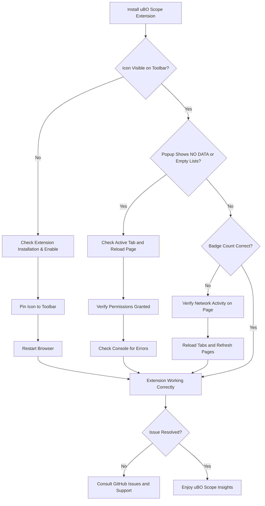

# Troubleshooting Installation & Setup Issues

This guide helps you quickly diagnose and resolve the most common problems encountered during the installation or first use of uBO Scope. Whether the extension's popup UI is missing, data is not appearing as expected, or permission errors occur, follow these practical steps to restore full functionality and understand when to seek further help.

---

## 1. Extension Not Visible or Toolbar Icon Missing

If you do not see the uBO Scope icon in your browser toolbar after installation, or it disappears suddenly, perform the following checks:

### Steps to Resolve

1. **Verify Installation**
   - Open your browser’s extensions page:
     - Chrome: `chrome://extensions` 
     - Firefox: `about:addons`
     - Safari: Safari menu > Preferences > Extensions
   - Confirm that uBO Scope appears and is enabled.

2. **Pin or Show the Toolbar Icon**
   - The icon may be hidden behind the extensions menu (puzzle piece icon).
   - Pin it to the toolbar by clicking the puzzle icon and selecting the pin for uBO Scope.

3. **Restart the Browser**
   - Close and reopen your browser to refresh the extension and UI.

4. **Check Browser Version Compatibility**
   - Ensure your browser meets the minimum version requirements:
     - Chrome-based browsers: Version 122.0 or higher
     - Firefox: Version 128.0 or higher
     - Safari: Version 18.5 or higher
   - Update your browser if necessary.

5. **Disable Conflicting Extensions**
   - Content blockers or extensions modifying the UI may hide uBO Scope.
   - Temporarily disable other extensions to see if the icon reappears.

---

## 2. Popup UI Shows 'NO DATA' or No Domains Listed

If the popup opens but shows 'NO DATA', or domain lists remain empty, follow these steps:

### Steps to Diagnose and Fix

1. **Check Active Tab Focus**
   - uBO Scope reports connections based on your currently active tab.
   - Switch to a different tab with a loaded webpage and reopen the popup.

2. **Reload the Page**
   - The extension captures network requests during page load.
   - Refresh the page and then open the popup to see updated data.

3. **Verify Permissions Are Granted**
   - The extension requires permissions to monitor network requests and tab activity.
   - After installation, ensure it has been granted access (some browsers prompt for this).
   - See [First-Time Configuration and Permissions](../first-steps-and-validation/initial-configuration) for details.

4. **Check for Browser Restrictions**
   - Private/incognito modes or profiles with strict settings may restrict network event reporting.
   - Try disabling private mode or testing on a standard profile.

5. **Inspect Console for Errors**
   - Open Developer Tools (F12 or Ctrl+Shift+I)
   - Check the console in the extension’s popup window for error messages.
     - Example errors may indicate resource loading failures or permission denials.

6. **Reset the Extension**
   - If state corruption is suspected, disabling and re-enabling the extension can clear stored session data.

---

## 3. Toolbar Badge Count Not Updating or Incorrect

The badge should reflect the number of distinct third-party domains connected. If it remains empty or inaccurate:

### Troubleshooting Steps

1. **Confirm Extension Is Enabled**
   - See section above for verifying installation and enabling.

2. **Verify Network Connectivity and Requests**
   - uBO Scope counts connections to remote servers by monitoring web requests.
   - On pages with minimal network requests or heavy caching, counts may be low or zero.

3. **Check for Conflicting Blockers**
   - Other content blockers with aggressive filtering or network restrictions might prevent requests from reaching uBO Scope’s listeners.

4. **Reload Tabs and Refresh Pages**
   - Badge updates with new network activity. Reload tabs after enabling or updating the extension to trigger updates.

5. **Check Browser Console for Service Worker Logs**
   - Open the browser's extension debug page and review logs from the background service worker (`background.js`).
   - Errors here could explain failure to update badge.

6. **Clear Stored Session Data**
   - Corrupt or stale session data may prevent updates.
   - Disable and re-enable the extension to clear data.

---

## 4. Permission Errors or Network Data Not Captured

If you encounter errors related to permissions or missing data for secure protocols:

### Action Items

1. **Check Declared Permissions**
   - uBO Scope requires:
     - `activeTab`
     - `storage`
     - `webRequest`
     - `host_permissions` for all HTTP, HTTPS, WS, and WSS URLs
   - Ensure these permissions are granted during the install process.

2. **Browser-Specific Checks**
   - Firefox and Chrome support `webRequest` for WebSocket connections.
   - Safari permissions may be stricter; confirm the extension version and browser meet requirements.

3. **Verify Manifest Permissions**
   - Confirm the extension manifests (`manifest.json`) include the necessary hosts and permissions.
   - Refer to the respective manifests for Chrome, Firefox, or Safari.

4. **Disable Privacy Settings Restricting Monitoring**
   - Some browsers or OS privacy features may limit extension permissions.

---

## 5. Common Pitfalls and Best Practices

- **Don’t use ad blocker test pages** for validating network connections; uBO Scope observes real-world requests.
- Always **reload pages** after installation or configuration changes to trigger data collection.
- **Avoid incognito or restricted modes** unless explicitly enabled.
- **Keep the extension updated** to the latest version.

---

## 6. Escalation Paths and Getting Help

If after following all steps you still experience issues:

1. **Check the official GitHub repository for issues:**
   - [https://github.com/gorhill/uBO-Scope/issues](https://github.com/gorhill/uBO-Scope/issues)
   - Search for existing reports or open a new detailed issue.

2. **Review relevant documentation:**
   - Installation Instructions: [Installing uBO Scope](../introduction-and-setup/installation-instructions)
   - Initial Permission Configuration: [First-Time Configuration and Permissions](../first-steps-and-validation/initial-configuration)
   - Popup Usage and Interpretation: [Interpreting the Popup](../first-steps-and-validation/using-ubo-scope-popup)

3. **Include diagnostic data:**
   - Browser version and platform
   - Steps already taken
   - Screenshots of the popup or console errors

4. **Community and Support Forums:**
   - Engage with uBO and privacy-focused forums for peer assistance.

---

## Appendix: Quick Verification Commands

You can verify the extension's state using browser internal pages:

- **Chrome:**
  - `chrome://extensions/` to check extension enabled state
  - `chrome://serviceworker-internals/` for service worker logs

- **Firefox:**
  - `about:addons` for extension state
  - `about:debugging#/runtime/this-firefox` to inspect background scripts

- **Safari:**
  - Safari Extensions preferences
  - Web Inspector for extension debugging

---

## Summary of Troubleshooting Flow

