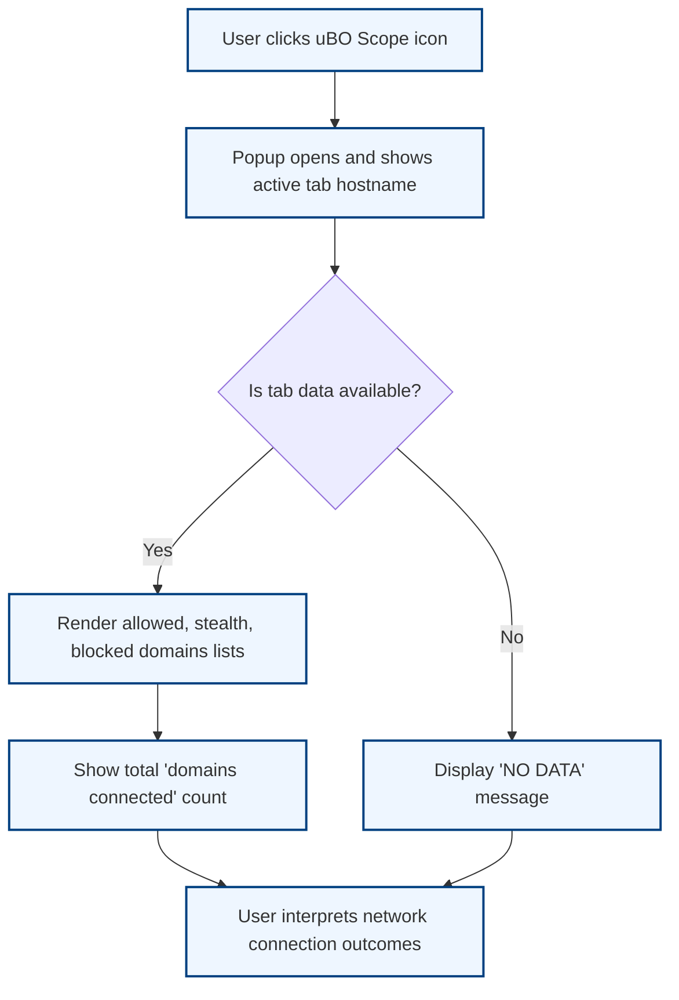

# Interpreting the Popup: Your First Scan

Welcome to your first hands-on experience with uBO Scope’s extension popup. This guide walks you through launching the extension popup, understanding its core display elements—including allowed, blocked, and stealth domains—and reading the badge count on the toolbar icon. By the end, you'll confidently validate that your installation is working correctly and grasp the basic health of the extension at a glance.

---

## 1. Launching the uBO Scope Popup

To begin reviewing network connections for the active browser tab:

1. Locate the uBO Scope extension icon in your browser toolbar. It usually contains a badge with a numeric count.
2. Click on this icon to open the extension popup. This popup is your primary interface for real-time network connection insights.

<Tip>
If you do not see the icon, ensure the extension is installed and enabled. Refer to the [Installing uBO Scope](../introduction-and-setup/installation-instructions) guide for setup steps.
</Tip>

## 2. Understanding the Popup Display

Once the popup is open, it breaks down domain connections into three clear categories:

### a. Header: Active Tab Hostname

- At the top, you'll see the hostname of the current active tab. This shows where your connection data is collected.
- The hostname is split into two spans:
  - The subdomain part (if any).
  - The base domain (using Unicode where applicable).

### b. Domains Connected Summary

- Below the header is a summary section indicating the total number of distinct domains connected during the active browsing session.
- This number directly reflects the count of third-party remote servers contacted.

### c. Domain Outcome Sections

The popup divides domains into three outcome categories, each with their own section:

| Section        | Meaning                                    |
|----------------|--------------------------------------------|
| **Not Blocked** (Allowed) | Remote servers your browser successfully connected to without interference. These are domains where requests completed successfully. |
| **Stealth-Blocked**       | Requests that were redirected or bypassed stealthily by the extension or underlying content blocker but are not fully blocked. These servers attempted connection but were not directly blocked. |
| **Blocked**               | Domains where connection attempts failed due to blocking. These represent domains your content blocker or network restrictions prevented connections from reaching. |

Each section lists all relevant domains with two key details:

- The domain name, displayed in human-readable Unicode format.
- A count badge indicating how many times this domain was contacted during the current browsing session.

### d. Badge Count Explained

- The number shown on the extension icon badge corresponds to the count of *distinct allowed domains* connected.
- A lower badge count generally indicates fewer third-party connections and potentially better privacy.

<Note>
The badge count does not total all domains across all categories; it focuses on allowed (not blocked) connections only.
</Note>

## 3. Validating Your Installation and Extension Health

To confirm that uBO Scope is operating effectively:

<Steps>
<Step title="Open any website in your browser">
Navigate to a page you'd like to analyze. Popular web pages with multiple third-party resources are great test cases.
</Step>
<Step title="Click on the uBO Scope icon to open the popup">
You should see the hostname of your active tab appear at the top.
</Step>
<Step title="Review the ‘domains connected’ count">
This number updates based on network requests in the tab. If it shows a non-zero value, the extension is correctly monitoring connections.
</Step>
<Step title="Check the Allowed, Stealth, and Blocked domain lists">
You should see domains populate under these sections corresponding to the network requests made.
</Step>
</Steps>

<Tip>
An empty popup or badge count that never updates indicates a problem. Try refreshing the page or reinstalling the extension.
</Tip>

## 4. Common Scenarios to Understand

- **Higher allowed counts** typically occur on content-rich pages with many third-party assets, such as scripts or media files.
- **Blocked domains** suggest your content blocker or network settings are actively stopping connections.
- **Stealth-blocked domains** reflect subtle interception or redirection handled behind the scenes, which may not always be visible in standard block lists.

## 5. Troubleshooting Common Issues

<AccordionGroup title="Popup Interpretation Issues">
<Accordion title="No data shown in popup">
Check if you're opening the popup on a new tab or a page with no third-party requests. Navigate to a regular website with external connections.
</Accordion>
<Accordion title="Badge count remains zero despite browsing">
Verify extension is enabled and has necessary permissions. Restart the browser to reload extension services.
</Accordion>
<Accordion title="Domain lists do not update when navigating tabs">
The popup reflects the currently active tab. Switch tabs and reopen the popup to see different connection data.
</Accordion>
</AccordionGroup>

## 6. Best Practices for Using the Popup

- Use the popup regularly while browsing to monitor ongoing third-party connections in real-time.
- Interpret the domain counts as signals — a rising number of allowed third-party connections may indicate increased tracking exposure.
- Correlate allowed, stealth, and blocked domains with your content blocker's settings to tune privacy controls.

## 7. Next Steps

Having understood how to open and interpret the popup interface, you are ready to:

- Explore advanced guides on [Reviewing Third-Party Connections with the Popup](/guides/getting-started-essentials/review-connections-popup) for deeper analysis techniques.
- Learn about the significance and calculation of the badge number in [Understanding and Interpreting the Toolbar Badge Count](/guides/getting-started-essentials/understanding-badge-count).
- Diagnose issues if network request data does not appear as expected by visiting [Troubleshooting Installation & Setup Issues](/getting-started/first-steps-and-validation/troubleshooting-setup).

---

For more foundational knowledge on uBO Scope’s purpose, visit the [Product Purpose & Value Proposition](/overview/introduction/product-purpose) page.

---

### Visual Summary of the Popup Workflow

---