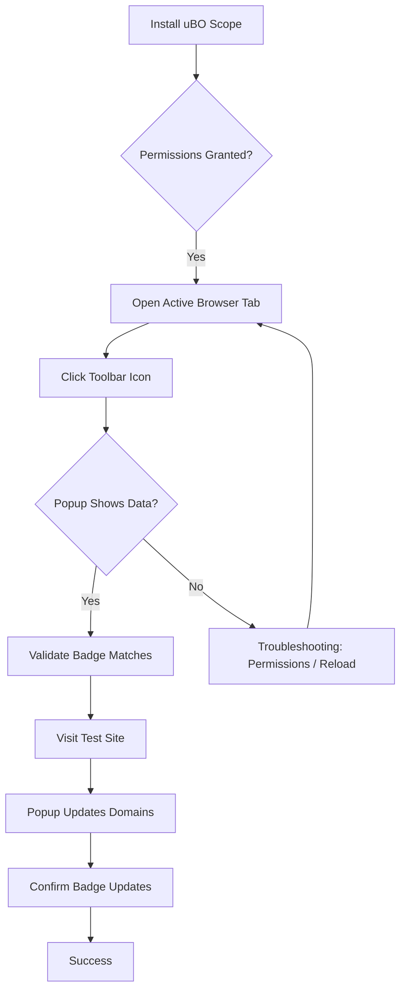

# Validation & Troubleshooting

Ensure your uBO Scope extension is working as expected by following this quick validation checklist. If you encounter common issues—such as missing popup data, permission prompts, or the toolbar icon being unresponsive—use the troubleshooting tips provided here to resolve them efficiently.

---

## 1. Validation Checklist: Confirm Proper Operation

Follow these actionable steps to make sure uBO Scope is functioning correctly immediately after installation or update.

### Step 1: Confirm Extension Icon and Badge (Toolbar)
- Look for the uBO Scope icon on your browser's toolbar.
- Check if the badge number is visible and updates as you browse. The badge reflects the **number of distinct third-party domains connected**.

### Step 2: Open the Popup Interface
- Click the uBO Scope icon to open the popup.
- Verify the popup displays three sections: **not blocked**, **stealth-blocked**, and **blocked** domains.
- Check that the “domains connected” summary reflects the count of distinct domains.

### Step 3: Visit a Test Website
- Navigate to a well-known website with third-party content (e.g., news or social media sites).
- Reopen the popup and verify that domains are listed in the correct categories based on connection outcomes.
  - Domains should appear under the right headings based on their allowed, stealth, or blocked status.

### Step 4: Verify Badge Number Updates
- Reload the active tab or open a new tab with a different site.
- Confirm the badge count changes reflecting the third-party domains for the active page.

### Step 5: Check Permissions
- If the popup shows "NO DATA" or does not update:
  - Confirm the extension has required permissions (`activeTab` and `webRequest`).
  - Check your browser prompts and accept all permissions related to uBO Scope.

<Tip>
The badge count shows distinct third-party *domains*, not total requests or blocked counts. Lower badge counts indicate fewer third-party connections.
</Tip>

---

## 2. Troubleshooting Common Issues

Address these frequent problems encountered during installation or usage.

### Issue 1: Popup Shows 'NO DATA' or is Empty
**Cause:** The extension may lack permissions or data is not captured yet.

**Resolution:**
- Reload the active tab or open a new tab with an active page.
- Check that you approved all permission prompts when installing the extension.
- Ensure your browser version supports the required `webRequest` API (see system requirements).
- Restart the browser to refresh extension permissions.

### Issue 2: Permission Prompts Keep Appearing
**Cause:** Browser did not fully accept or remember extension permissions.

**Resolution:**
- Manually check extension settings and confirm permissions are granted.
- Disable and re-enable the extension to trigger permission requests anew.
- Look for browser-specific policies or security settings blocking extension permissions.

### Issue 3: Toolbar Icon is Unresponsive or Badge Does Not Appear
**Cause:** Service worker or background scripts may have encountered issues.

**Resolution:**
- Restart the browser to reload the extension.
- Disable other conflicting extensions that might interfere with `webRequest` listeners.
- Ensure your browser is updated to a version supported by uBO Scope (e.g., Chromium 122+, Firefox 128+, Safari 18.5+).

### Issue 4: Domains Not Updating or Not Reflecting Traffic
**Cause:** Network requests outside visible scope or browser webRequest API limitations.

**Resolution:**
- Verify you are browsing HTTP/HTTPS or WebSocket URLs (uBO Scope filters these).
- Some browser configurations or privacy settings may limit webRequest API visibility.
- Confirm no other extension or system firewall is blocking or altering network events.

<Note>
uBO Scope relies on the browser's `webRequest` API which may not capture network requests made outside normal web traffic (e.g., OS-level requests, some WebSocket frames).
</Note>

---

## 3. Advanced Validation Tips

These tips help confirm deeper aspects of uBO Scope’s operation.

- **Tab-Specific Data:** The popup shows data only for the currently active tab.
- **Badge Number Meaning:** Reflects distinct allowed third-party domains only—not stealth or blocked counts.
- **Data Persistence:** Data persists per browsing session but resets when tabs are closed.

If you want to inspect stored data more thoroughly, browser developer tools or the extension's background script logs might provide insights, but such steps are usually unnecessary for typical use.

---

## 4. Getting Support

If issues remain unresolved:

- Consult related documentation:
  - [Launching and Basic Configuration](/getting-started/first-steps-usage-validation/running-and-configuring)
  - [Your First Measurement](/getting-started/first-steps-usage-validation/first-successful-run)
  - [How uBO Scope Works](/overview/architecture-features/how-ubo-scope-works)
- Report issues or seek help in the [GitHub repository](https://github.com/gorhill/uBO-Scope)

---

## 5. Summary

Validation and troubleshooting empower you to confirm uBO Scope is correctly capturing and reporting network connection data. Following the checklist ensures your installation is configured and operating as intended. Troubleshoot swiftly by addressing permission issues, popup data visibility, and badge updates.

---

## Appendix: Quick Reference Commands

These steps assume you have already installed and enabled the extension as per installation guides.

```shell
# Reload active tab (shortcut or manual)
# Open popup by clicking toolbar icon
# Verify domains and badge update
```

No special commands or manual configuration required. For troubleshooting, restart your browser or inspect extension permissions.

---

## Visual Overview of Validation Flow



---

For a more detailed understanding of instrumented network requests and data reporting, please refer to 'How uBO Scope Works' and 'Understanding the Popup: Domains and Connection Statuses'.


---

# Additional Resources
- uBO Scope GitHub: https://github.com/gorhill/uBO-Scope
- Public Suffix List: https://publicsuffix.org
- Browser compatibility info: See system requirements.

---

_Last updated: 2024-06_

---