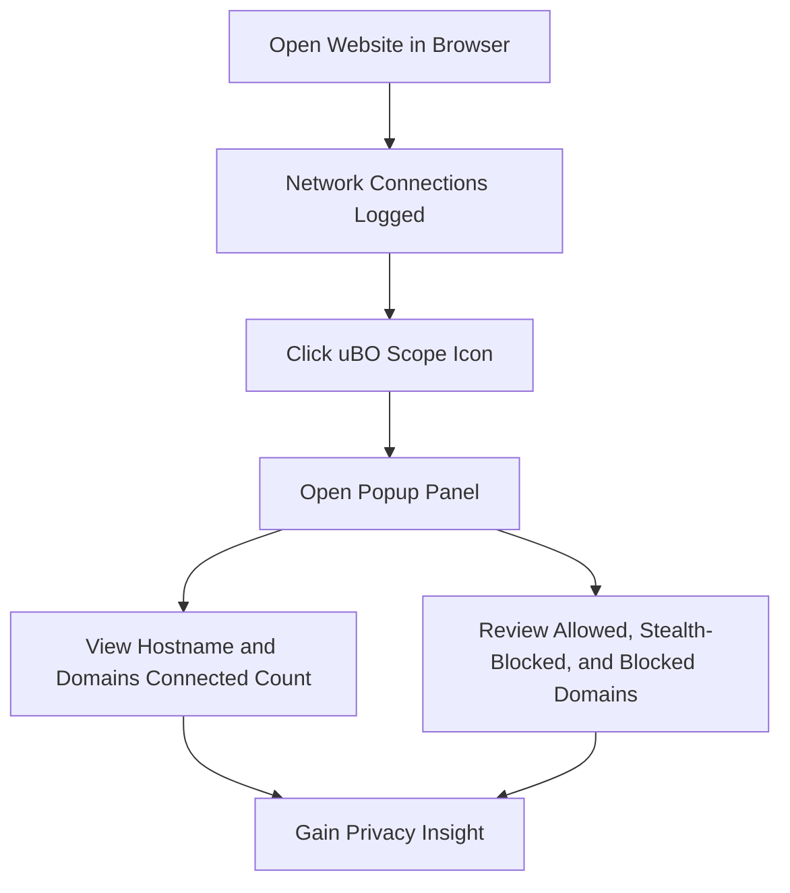

# Your First Run with uBO Scope

Welcome to your first hands-on experience with uBO Scope. This guide walks you through using uBO Scope to open a website, open the extension popup, and understand what you’re seeing — specifically the count of distinct third-party remote servers your browser connects to. By the end, you’ll know how to gain your first immediate, actionable insight about your browsing privacy and security.

---

## 1. Open a Website to Monitor

You start by navigating to any website you want to inspect. For example:

- Open your browser and go to `https://example.com`

uBO Scope tracks every network connection attempt your browser makes from this webpage, regardless of content blockers or network layers.

<Check>
Make sure uBO Scope is already installed and enabled in your browser. See [Installing uBO Scope](/getting-started/installation-setup/installing-extension) for detailed instructions.
</Check>

---

## 2. Open uBO Scope’s Popup Panel

1. Locate the uBO Scope icon on your browser’s toolbar. It should appear after installation near the extension area.
2. Click the uBO Scope icon to open the popup panel. This panel displays a summary of network connections detected on the active tab.

<Warning>
If the popup shows 'NO DATA', refresh the page or check that the extension is enabled and has necessary permissions as described in the [Configuration After Installation](/getting-started/installation-setup/initial-configuration) guide.
</Warning>

---

## 3. Understanding the Popup Panel

The popup panel has several key sections designed to give you clear and actionable telemetry about your current browsing session.

### 3.1 Current Hostname Display

The large header on top shows the:
- **Top-level hostname** of the active tab (e.g., `example.com`).
- If applicable, the subdomain part (e.g., `blog.` in `blog.example.com`).

This clarifies exactly which site you’re inspecting.

### 3.2 Domains Connected Count

The summary displays:

- The total **number of distinct third-party remote server domains** your browser connected to from this webpage.

The badge count on the toolbar icon reflects this number as well.

<Tip>
Fewer distinct third-party domains generally indicate a cleaner, more privacy-respecting page. A high count may suggest extensive third-party tracking or content delivery.
</Tip>

### 3.3 Connection Outcome Sections

Below the summary, domains are categorized into three groups:

- **Not Blocked**: Domains your browser successfully connected to.
- **Stealth-blocked**: Domains where the connection was redirected stealthily by content blockers.
- **Blocked**: Domains where the connection attempt resulted in error or was explicitly blocked.

Each domain listed shows how many times requests were made.

<Info>
This categorization empowers you to differentiate between allowed connections, those silently blocked, and those outright blocked — providing greater insight into your content blocker’s effectiveness.
</Info>

---

## 4. Walkthrough: Your First Insight

Follow this example scenario to understand data interpretation:

1. Visit `https://example.com`
2. Click the uBO Scope icon.
3. See the hostname displayed and the domains connected count, for example, “5”.
4. Scroll down to view detailed domains by category.

You discover that besides `example.com`, your browser connected to:
- 2 allowed third-party domains (e.g., `cdn.examplecdn.com`, `analytics.service.net`)
- 1 stealth-blocked domain
- 2 blocked domains

This reveals:

- How many third-party services are active.
- Which connections your blockers are preventing.
- Which stealth blocking prevents silent connections.

<Note>
If you are new to uBO Scope, focus first on understanding what each domain and outcome means. Do not jump to conclusions on blocking performance without context.
</Note>

---

## 5. Tips for Effective Use

- **Refresh the page** if the popup shows no data; network events accumulate per page load.
- Explore multiple websites to observe varying privacy exposures.
- Compare the badge count and popup lists before and after enabling/disabling other content blockers.
- Use the domain counts as a baseline to assess your exposure over time.

<Warning>
Remember that all network requests captured are those the browser reports via its internal API; some browser features or external DNS-based blocking may not be fully reflected.
</Warning>

---

## 6. Troubleshooting Your First Run

| Issue                         | Possible Cause                                              | Solution                                                                      |
|-------------------------------|-------------------------------------------------------------|-------------------------------------------------------------------------------|
| Popup shows 'NO DATA'          | Extension not enabled or page not fully loaded              | Refresh page; check extension is enabled; review permissions in settings     |
| Badge count stays empty        | No detected connections or page has no network activity     | Open different site; verify installation properly                            |
| Domains count does not update  | Browser caching or delayed network events                    | Wait a few seconds; reload page; restart browser if needed                   |
| Discrepancies in expected data| Network requests outside webRequest API scope                | Understand limitations in [Core Concepts & Terminology](/overview/concepts-architecture/core-concepts-terminology) |

<Accordion title="For more troubleshooting guidance, see: Common Installation Problems & Fixes and Extension Not Showing Data? pages."> 
Visit the troubleshooting section in the documentation for deeper problem-solving insights.
</Accordion>

---

## 7. Next Steps

- After familiarizing yourself, explore [Interpreting the Toolbar Badge and Popup](/getting-started/first-steps-usage/interpreting-results) to understand detailed analysis techniques.
- Experiment with monitoring various domains to develop a better sense of typical versus suspicious connection patterns.
- Proceed to [Quick Validation Checklist](/getting-started/first-steps-usage/quick-validation-steps) to verify your setup’s accuracy.

By consistently using uBO Scope’s popup insights, you gain unrivaled visibility into your browser’s network activity, a powerful step toward understanding and enhancing your browsing privacy and security.

---

## 8. Visual Overview of Your First Run Flow

---

**Enjoy your first run with uBO Scope!** Feel empowered knowing you have a transparent window into your browser’s network connections.
