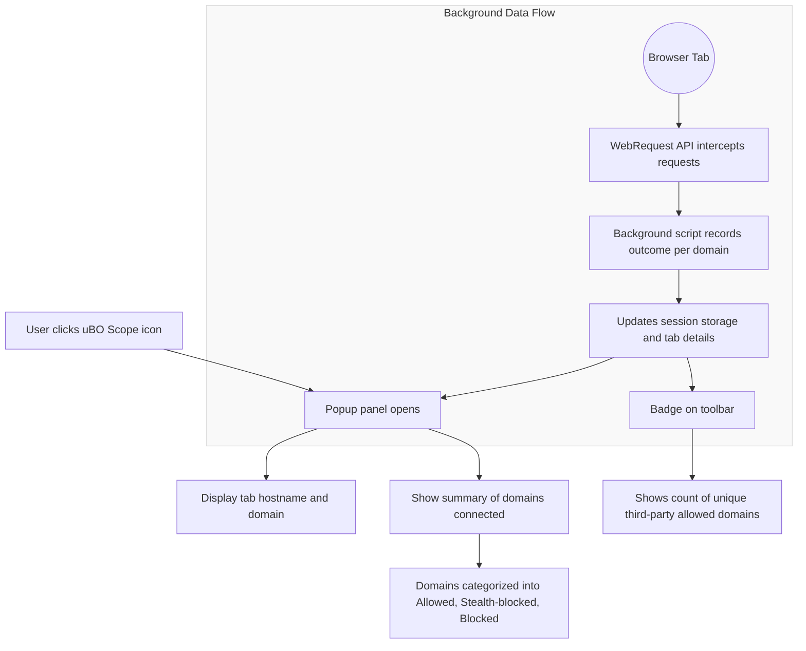

# Understanding the Popup & Badge

uBO Scope’s popup panel and toolbar badge provide a clear, immediate snapshot of the network connections your browser tab is making — categorized by whether requests were allowed, blocked, or stealth-blocked. This page explains how to interpret these visuals, what the different domain categories mean, and how the badge relates to your overall privacy exposure.

---

## 1. Popup Panel: Breakdown of Domain Outcomes

When you click the uBO Scope toolbar icon, the popup reveals detailed information about the current active tab’s network connections, organized into three key categories:

### a. Allowed Connections (`not blocked`)
- **What it shows:** Domains successfully connected to by the webpage.
- **Implications:** These represent remote servers from which resources were truly fetched, despite any content blocker.
- **Use case:** Evaluating which third-party services your current tab actually communicates with.

### b. Stealth-blocked Connections (`stealth-blocked`)
- **What it means:** Requests that were blocked silently or stealthily by content blockers, without alerting webpages.
- **Difference from blocked:** Unlike overtly blocked connections, stealth-blocked connections happen without detectable errors or failures to the webpage.
- **Privacy relevance:** These show the internal blocking mechanisms operating transparently to prevent tracking or unwanted content.

### c. Blocked Connections (`blocked`)
- **What it shows:** Domains whose network requests were explicitly blocked, resulting in errors or failed attempts.
- **Usage:** Helps identify servers completely denied by your content blockers or network policies.

### Domain List Details
- Each category lists domains sorted alphabetically.
- Beside each domain is a count representing the number of connections or requests observed for that domain.
- The domain shown is the "registrable domain" (public suffix + one label) for clarity — this condenses subdomains to their main ownership.

<Tip>
Clicking on the popup's domain entries lets you quickly see which third-party domains your browser interacts with and how those interactions were handled.
</Tip>

---

## 2. Toolbar Badge: What the Number Means

The badge number on uBO Scope’s toolbar icon shows **the count of distinct third-party domains allowed connections for the active tab**.

- This count reflects **only the third-party domains** — those different from the tab’s first-party domain.
- The badge excludes all blocked or stealth-blocked domains; it shows what your browser truly loaded.
- A lower badge count generally indicates fewer third-party remote servers contacted, which is often preferable for privacy.

<Note>
The badge count is **not** a block count nor an indicator of total network requests. It specifically counts unique third-party remote servers that your page connected with.
</Note>

### Why Focus on Third Parties?
Third-party servers represent external networks potentially tracking, profiling, or serving ads/content independent of the site you visit. Tracking these connections independently of content blockers helps you understand your true privacy footprint.

---

## 3. Mapping Visuals to Privacy Implications

### Your First-Party vs Third-Party Domains
- The popup header shows the tab’s current hostname and its domain.
- The badge count excludes this first-party domain from its tally.
- All popup categories report domains contacted, categorized by allowed, stealth-blocked, or blocked outcomes.

### What Each Category Tells You About Your Browsing
- **Allowed:** Actual external connections your browser made. These can include CDNs, analytics services, or embedded content providers.
- **Stealth-blocked:** Connections blocked invisibly to reduce webpage breakage or detection.
- **Blocked:** Overtly blocked connections denied network access.

Together, these provide a transparent view of your browser tab’s network activity in real time.

---

## 4. How uBO Scope Collects and Updates This Data

- The background process uses browser APIs to listen to all web requests made by each tab.
- Each request is categorized by outcome: success, error (blocked), or redirect (stealth-blocked).
- uBO Scope groups these per domain and per category, refreshing the popup and badge dynamically.

Because the popup summary is per active tab, switching tabs updates the reported info.

---

## 5. Practical Tips to Use the Popup & Badge

- **Monitor badge count:** Use it to assess how many third-party servers a site connects with — fewer unique third parties often means less tracking exposure.
- **Examine blocked vs stealth-blocked:** Knowing how requests are blocked helps evaluate your content blocker’s stealthiness and transparency.
- **Watch allowed domains:** Identify unexpected third-party connections that might require further privacy or security scrutiny.

If the badge shows a high number and you’re concerned, investigate the domains listed in the popup allowed category.

---

## 6. Troubleshooting Common Questions

<AccordionGroup title="Popup & Badge Troubleshooting">
<Accordion title="Why does the badge number sometimes jump unexpectedly?">
Network requests can be dynamic, changing as pages load or scripts execute. The badge updates live to reflect actual third-party connections. A jump often means new third parties loaded or resources fetched.
</Accordion>

<Accordion title="Why am I seeing domains in the allowed list even though I have content blockers?">
uBO Scope tracks actual network outcomes independent of your content blocker. Some allowed connections may be for essential resources, CDNs, or content your blocker does not block. This list shows reality, not assumptions.
</Accordion>

<Accordion title="What if the popup says ‘NO DATA’?">
This indicates no network request data was collected yet for the active tab. Try refreshing the webpage or switching tabs. If persistent, verify permissions and that webRequest API events are enabled.
</Accordion>

<Accordion title="Is the badge count a measure of how good my content blocker is?">
No. The badge count reflects allowed third-party domains, not a block count. Lower badge counts mean fewer third-party connections — which is better for privacy — but doesn’t directly measure blocking efficiency.
</Accordion>
</AccordionGroup>

---

## 7. Summary Diagram

---

## 8. Where to Go Next

- Learn about the [Badge and Popup UI interpretation in the FAQ](https://example.com/faq/core-usage/interpreting-badge-and-popup) for deeper conceptual understanding.
- Explore [Analyzing Network Connections](https://example.com/guides/using-insights/analyzing-connections) to use the data effectively for privacy insights.
- Review [Troubleshooting Setup Issues](https://example.com/getting-started/first-steps-usage/troubleshooting-setup) if the popup or badge does not update as expected.

This page complements the [First Run Overview](https://example.com/getting-started/first-steps-usage/first-run-overview) and the [Feature Summary](https://example.com/overview/system-architecture-overview/feature-summary) for holistic onboarding.

---