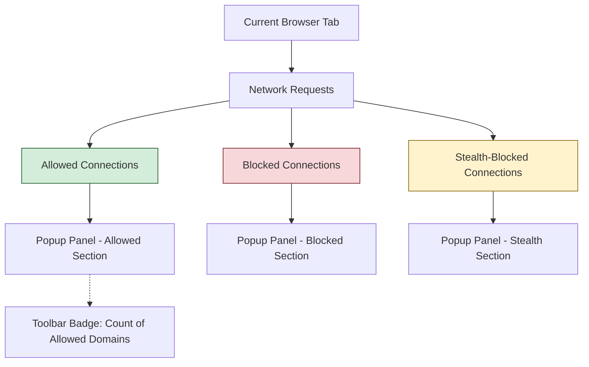

# Your First Look: Using the Popup Panel

Welcome to your initial walkthrough with **uBO Scope's Popup Panel**—the heart of your real-time insight into your browser's network connections. This guide will take you step-by-step through how to open the popup, understand the information it displays about allowed, blocked, and stealth-blocked connections, and navigate the core user interface elements effectively.

---

## 1. Opening the Extension Popup

The popup panel is your immediate window into what uBO Scope is monitoring on your current browser tab.

<Steps>
<Step title="Locate the uBO Scope Icon in Your Browser Toolbar">
Find the uBO Scope icon—depicted by its distinctive logo—in your browser's extension toolbar. It will be visible once the extension is installed and active.
</Step>
<Step title="Click the Icon to Open the Popup Panel">
Click on the toolbar icon to open the popup panel. This action triggers a real-time query to collect and display connection data for the active browser tab.
</Step>
<Step title="Wait for Data to Load">
The popup will show a brief loading state. Once data is retrieved, it populates the panel with connection details for the tab you are currently viewing.
</Step>
</Steps>

<Tip>
If the popup displays 'NO DATA' or appears empty, ensure that you have an active page loaded and that you have permissions enabled. Reloading the tab and reopening the popup often resolves this.
</Tip>

## 2. Understanding Connection Classifications

uBO Scope categorizes connections into three distinct groups within the popup panel. Understanding these is crucial to interpreting your network privacy.

### Allowed ("not blocked")
- This section lists **third-party remote servers** your browser successfully connected to for the current tab.
- These connections were neither blocked nor modified by content blockers or other network defenses.
- Typically, a smaller count here means fewer third-party networks accessed, indicating better privacy.

### Blocked
- Shows third-party domains to which connection attempts were **blocked**.
- These may correspond to requests halted by your content blocker or network settings.
- This list helps identify which domains are actively prevented from communicating with your browser.

### Stealth-blocked
- Represents connections that were **stealth-blocked**, meaning the extension detected redirected or obfuscated network activity that was silently blocked.
- This subtle category helps you spot attempts that might evade standard blocking visibility.
- Stealth blocking is often part of advanced content blocker tactics to avoid detection on web pages.

<Note>
These groupings reflect real-time network status per active tab, giving you a clear overview of your exposure to third-party servers while browsing.
</Note>

## 3. Exploring the Core UI Elements

The popup is designed intuitively to provide clear and concise information at a glance.

### Tab Hostname Display
- At the top, the popup shows the **current tab's hostname and domain**.
- The hostname is broken into the subdomain and the root domain to improve clarity.

### Summary Count
- Below the hostname, the **"domains connected"** count indicates how many unique domains were contacted and allowed for the tab.
- This count matches the badge number you may see on the toolbar icon.

### Domain Lists
- Each of the connection categories (allowed, stealth, blocked) displays a scrollable list of domains.
- Each domain entry shows:
  - The domain name (converted from punycode to Unicode for readability)
  - The number of connection attempts to that domain from the current tab

### Layout and Interaction Tips
- Domains are sorted alphabetically within each category for easy navigation.
- Hovering or selecting these domains does not currently trigger direct actions but visually assists in quick scanning.

## 4. Practical Example: Interpreting the Popup Panel

Imagine you are browsing an e-commerce site:
- You open the popup and see:
  - **Allowed:** Domains like `example.com`, `cdn.shopify.com` indicating successful content loading
  - **Blocked:** Domains such as `tracking.ads.com` indicating trackers blocked
  - **Stealth-blocked:** Domains like `analytics.stealthytracker.com` where stealth blocking occurred
- This helps you confirm that your privacy settings are actively blocking unwanted trackers while allowing necessary content.

## 5. Best Practices & Tips

- **Regularly Check the Popup:** Open the popup often while browsing new sites to monitor network activity.
- **Understand Domain Grouping:** uBO Scope groups domains using the Public Suffix List, ensuring accurate domain-level classification.
- **Interpret Badge Counts Carefully:** A high allowed domains count reflects increased third-party connections and potential privacy exposure.
- **Refresh Tabs When Needed:** If the popup data appears stale, reload the tab and reopen the popup to refresh data.

<Tip>
Keep in mind stealth-blocked connections are often hidden from normal blockers; the popup is your lens to reveal these subtle network events.
</Tip>

## 6. Troubleshooting Common Issues

<AccordionGroup title="Popup Panel Troubleshooting">
<Accordion title="Popup Shows ‘NO DATA’">
- Ensure you have an active tab loaded with a website.
- Reload the tab to trigger fresh network event logging.
- Confirm uBO Scope has permissions and is active in your browser's extension settings.
</Accordion>
<Accordion title="Domain Lists Are Empty Even When Browsing">
- Connectivity issues or restrictive network environments might block visibility.
- Try disabling conflicting extensions temporarily.
- Open the popup on a well-known site with multiple third-party connections like a news site.
</Accordion>
<Accordion title="Counts Don’t Match Expectations">
- The count reflects unique third-party domains allowed, not total requests.
- If you see unexpected results, review the related guide on <a href="/getting-started/introduction-overview/understanding-badge-and-reports">Understanding Badge Counts and Reports</a>.
</Accordion>
</AccordionGroup>

## 7. What’s Next?

- After familiarizing yourself with the popup panel, explore related documentation:
  - [Understanding Badge Counts and Reports](/getting-started/introduction-overview/understanding-badge-and-reports) to deepen your grasp of the badge and connection outcomes.
  - [Troubleshooting Installation Issues](/getting-started/first-steps-usage/troubleshooting-installation-issues) if the popup isn't displaying as expected.
  - [Quick Validation: Is It Working?](/getting-started/first-steps-usage/quick-validation-steps) for practical validation steps.

- For power users, the detailed view of connections enables nuanced privacy auditing and filter list maintenance.

---

## Additional Resources

For deeper understanding, please visit:

- [uBO Scope GitHub Repository](https://github.com/gorhill/uBO-Scope) — Source, updates, and advanced details.
- [Core Concepts & Terminology](/overview/architecture-core-concepts/core-terminology) — Essential terminology for correctly interpreting the UI.
- [Integration with Content Blockers & Browsers](/overview/integration-context/ecosystem-integration) — How uBO Scope complements blockers you may already use.

---

# Visual Diagram: Network Connection Flow

This diagram shows the flow of connection outcomes appearing in the popup panel for the current tab.

---