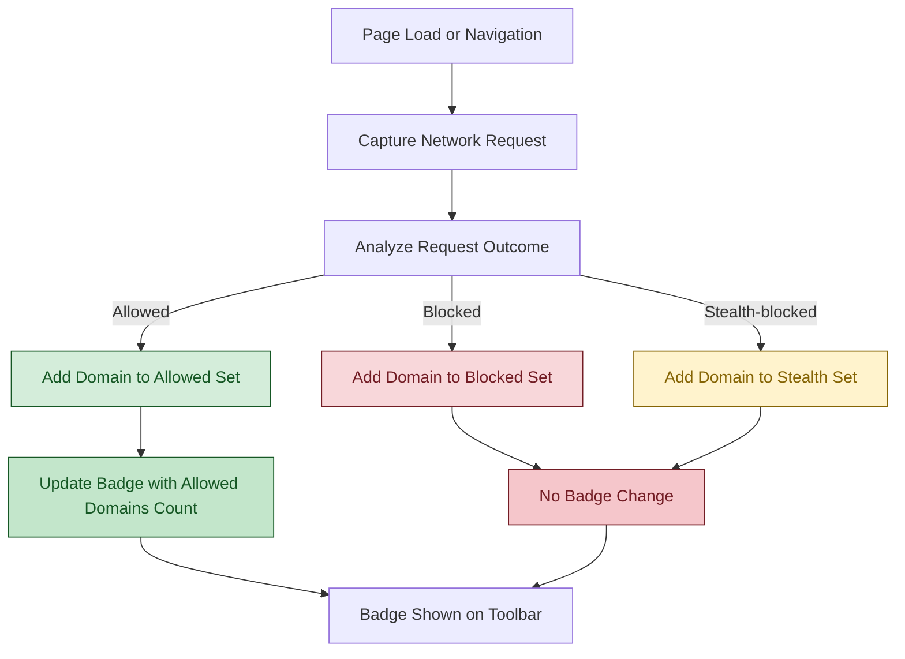

# Understanding the Extension Badge

The toolbar badge on the uBO Scope extension icon provides you with a real-time measure of your browser's network activity related to third-party servers. This guide demystifies what the badge represents, why keeping its count low benefits your privacy and browsing experience, and how to interpret changes as you navigate different websites.

---

## 1. What Does the Badge Count Represent?

The badge number shows **the count of distinct third-party remote servers your browser connected to from the active tab.**

### Key Points:
- **Third-party remote servers** are domains different from the main site you’re visiting.
- The count reflects network requests that were **allowed** (i.e., not blocked) by any content blocker or network filter.
- A **lower badge count means fewer third-party connections were made, which usually indicates better privacy protection or fewer external trackers loaded.**

<u>Example:</u>
- When visiting a news article, the badge might show '5', indicating the page fetched content or resources from 5 different third-party domains like ad networks or CDNs.
- On a minimal site with no third parties, the badge may show '0' or be blank.

<Tip>
Remember, not all third-party servers are harmful. CDNs and essential services often appear as third parties. The badge count alerts you to the volume of third-party connections but doesn’t imply they are all threats.
</Tip>

---

## 2. Why Is a Lower Badge Number Better?

The badge highlights the number of unique third-party domains that actually sent data to or received data from your browser. Reducing these connections:

- **Enhances your privacy** by limiting exposure to potential trackers.
- **Reduces page load times and bandwidth** usage by cutting unnecessary server communications.
- **Improves security** by restricting connections to only trusted parties.

<Note>
The extension counts domains, not individual requests. Many requests to the same domain still count as one.
</Note>

---

## 3. How the Badge Count Is Calculated

uBO Scope listens to your browser’s internal `webRequest` events and notes network request outcomes:

- **Allowed**: Requests that successfully connected without being blocked.
- **Blocked**: Requests that failed due to blocking (not counted on badge).
- **Stealth-blocked**: Requests redirected or suppressed invisibly by blockers; these do not increment the badge count.

Only allowed third-party domains are tallied for the badge.

---

## 4. Interpreting Badge Changes While Browsing

As you move between pages or interact with a site, the badge count dynamically updates:

- **Navigate to a new page**: Badge resets and shows the number of third-party domains contacted.
- **Loading dynamic content**: Badge may increase as more third-party domains get contacted.
- **Interaction with embedded content** (videos, ads, widgets): Often increases badge count.

<Tip>
If you notice unusually high counts on trusted sites, consider reviewing your content blockers or filter lists — uBO Scope can help identify unexpected third-party connections.
</Tip>

---

## 5. Real-World Scenario: Understanding the Badge

Imagine you visit `example.com`:

1. The main domain `example.com` loads (badge count is 0 because first party domains don't count).
2. The page loads images and scripts from `cdn.examplecdn.com` and `ads.adnetwork.com`.
3. The badge updates to '2' — two distinct third-party connections.
4. You scroll and trigger an embedded social media widget that connects to `social.media.com`.
5. The badge updates to '3'.

This workflow helps you visualize how content affects your web footprint.

---

## 6. Practical Tips and Best Practices

- **Monitor badge changes on frequently visited sites** to identify unexpected third-party connections.
- Use the **popup panel** (accessible by clicking the icon) to see detailed breakdowns of allowed, blocked, and stealthed domains.
- Regularly update your filter lists to keep blocking effective.
- Understand that some third-party services might be essential; use your discretion when assessing badge counts.

<Warning>
Browsers may limit visibility on some network requests. Some connections outside the webRequest API scope cannot be tracked by uBO Scope and thus won’t affect the badge count.
</Warning>

---

## 7. Troubleshooting Badge Behavior

| Issue                              | Cause                                        | Solution                                     |
|-----------------------------------|----------------------------------------------|----------------------------------------------|
| Badge count stays at 0 or empty   | No third-party connections detected           | Visit a site known to include third-party resources to verify badge updates.
| Badge count seems too high         | Many third-party domains contacted, possibly trackers or ads | Check detailed connections via popup to identify domains; adjust filter lists as needed.
| Badge not updating on navigation   | Extension or browser delayed event processing | Refresh the tab or restart the browser.

---

## 8. Additional Resources

- [Viewing & Interpreting Connection Data](/getting-started/first-steps-validation/viewing-and-interpreting-connection-data)
- [Quick Troubleshooting Scenarios](/getting-started/first-steps-validation/quick-troubleshooting)
- [Core Concepts and Terminology](/overview/core-concepts-architecture/core-terminology)
- [Understanding Visibility Limits and Browser API Constraints](/guides/troubleshooting-advanced/network-visibility-limits)

---

By mastering the insights behind the extension badge, you empower yourself to confidently assess your web exposure to third-party servers and make informed privacy decisions. The badge is your window into the underlying connections your browser makes — use it wisely to keep control over your online footprint.

---

<Check>
To fully experience the badge insights, ensure the extension is installed correctly as per the [Installing uBO Scope](../installation-basics/installing-ubo-scope) guide, and the extension pop-up opens to reveal detailed connection data.
</Check>

---

# Visual Diagram: How Badge Count Is Determined

---