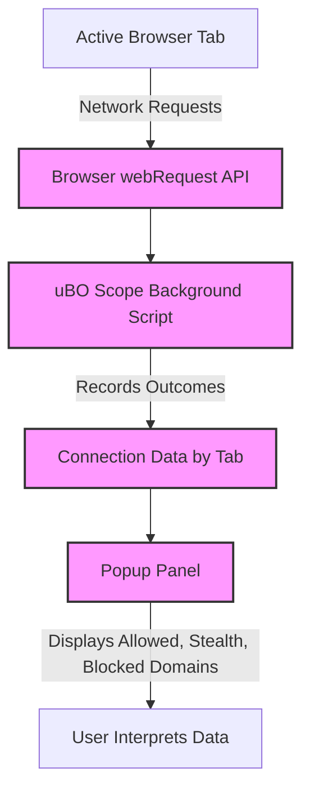

# Viewing & Interpreting Connection Data

Unlock the detailed insights uBO Scope provides about the network connections your active browser tab makes. This page guides you through opening the extension’s popup panel, understanding the live lists of connected domains, and interpreting the significance of distinct categories — allowed, blocked, and stealth connections — so you can effectively assess your browsing privacy.

---

## 1. Opening the uBO Scope Connection Data Panel

To view connection data for the active tab:

1. Click the uBO Scope toolbar icon in your browser. This opens the popup panel.
2. The panel automatically retrieves network connection data for the current webpage.
3. Wait a moment if the data is loading — the panel will transition from a loading state to displaying results.

If the panel shows “NO DATA” or no domains listed, it implies no connections have been recorded yet for the current tab or the page did not trigger any network requests monitored by uBO Scope.

<Tip>
Ensure the webpage has finished loading or is actively making network requests to see connections populate in the panel.
</Tip>

---

## 2. Understanding the Panel Layout

The uBO Scope popup panel divides connection data into several clear, user-friendly sections:

- ### Hostname Header
  Displays the current tab’s hostname and domain, decoded for readability. This contextualizes the data shown below.

- ### Summary
  Shows the total count of distinct domains connected by the current tab. This aligns directly with the toolbar badge number, reflecting your browsing footprint.

- ### Connection Categories
  Divided into three outcome types:

  - **Not Blocked (Allowed)**: Domains that successfully connected without interference.
  - **Stealth-Blocked (Stealth)**: Domains whose network requests were redirected or modified stealthily by content blockers.
  - **Blocked**: Domains where requests were explicitly blocked and failed to connect.

Each category lists domains alongside the count of connection attempts, letting you quickly gauge the volume and nature of your network connections.

---

## 3. How to Interpret Connection Categories

Each category provides critical insights into your browsing privacy:

| Category       | What It Means                                        | User Value                                           |
|----------------|-----------------------------------------------------|-----------------------------------------------------|
| Not Blocked    | Requests allowed through to third-party servers.   | Reveals which external servers your browsing loads resources from; fewer here usually suggests better privacy.
| Stealth-Blocked| Requests modified or redirected silently by blockers.| Indicates attempts intercepted stealthily, possibly to avoid webpage breakage or detection.
| Blocked        | Requests actively blocked, preventing connections. | Shows which connections were stopped, helping assess blocker effectiveness.

<Tip>
Remember, a lower overall number of distinct connected domains is typically better for privacy. uBO Scope focuses on unique third-party domains rather than raw counts of all requests.
</Tip>

---

## 4. Practical User Flow: Inspecting a Webpage’s Connections

Follow these steps to make the most of your connection data:

1. **Open the panel** by clicking the uBO Scope icon.
2. **Observe the hostname** at the top to confirm you’re viewing the correct tab data.
3. **Review the summary count** reflecting all connected domains.
4. **Scan through each category** to see which domains were allowed, stealth blocked, or blocked.
5. **Click on domains** (if supported in future versions) or note them down to cross-check with your filter lists or privacy policies.
6. **Reload the page** to see how connection data refreshes and if the blocking outcomes change.

---

## 5. Real-World Scenario Example

Imagine you visit a news website. Opening uBO Scope’s connection panel might show:

- **Not Blocked**: CDN domains delivering images and JavaScript, necessary for site functionality.
- **Stealth-Blocked**: Tracking servers previous blockers redirected away silently.
- **Blocked**: Ad servers that your blocker actively prevented from loading.

By analyzing this, you can assess quickly if your content blocker is effectively protecting your privacy without breaking the site.

---

## 6. Tips and Best Practices

- **Check regularly**: Webpages change their network behavior frequently; review the connection panel during real browsing sessions.
- **Watch the badge count**: The summary count in the panel corresponds to the toolbar badge count — use both to monitor privacy-related changes.
- **Combine with Core Terminology**: Review the [Core Concepts and Terminology documentation](/overview/core-concepts-architecture/core-terminology) for deeper understanding of allowed, blocked, and stealth distinctions.
- **Cross-reference with filter lists**: Use domain data to fine-tune your content blocking filters, supported by guides for filter list maintenance.

---

## 7. Troubleshooting Common Issues

<AccordionGroup title="Troubleshooting Viewing Connection Data">  
<Accordion title="The panel displays ‘NO DATA’ or is empty even after loading pages">  
This happens when no network requests have been recorded yet for the active tab or the site uses network mechanisms outside the browser’s `webRequest` API reach.

**What to do:**
- Reload the page and wait for network activity.
- Confirm uBO Scope is enabled and has necessary permissions.
- Ensure your browser supports the required APIs (modern versions of Chromium, Firefox, or Safari).
</Accordion>  
<Accordion title="The connection counts don’t update after navigation or tab change">  
The panel updates data only for the active tab and upon the extension receiving network events.

**What to do:**
- Close and reopen the popup after switching tabs.
- Verify your browser’s extension background process is running correctly.
</Accordion>  
<Accordion title="Domain names show encoded formats or unexpected characters">  
uBO Scope uses Unicode decoding (via Punycode) for internationalized domain names.

**What to do:**
- Check your browser language and encoding settings.
- Reload the panel to refresh domain name decoding.
</Accordion>  
</AccordionGroup>

---

## 8. Next Steps and Learning More

- Dive deeper into how the badge count relates to connection data in [Understanding the Extension Badge](/getting-started/first-steps-validation/understanding-the-extension-badge).
- Learn to analyze and interpret the significance of allowed, stealth, and blocked outcomes in [Interpreting Blocked, Stealth, and Allowed Outcomes](/guides/core-workflows/interpreting-blocked-stealth-allowed).
- Explore troubleshooting advanced scenarios where network visibility might be limited in [Understanding Visibility Limits and Browser API Constraints](/guides/troubleshooting-advanced/network-visibility-limits).

By mastering the connection data panel, you’ll unlock a transparent view into your web privacy, empowering informed decisions about content blocking.

---

## 9. Visual Overview Diagram

---

# Additional Resources

- [uBO Scope Overview & Installation Instructions](https://github.com/gorhill/uBO-Scope/blob/main/README.md)
- [Core Concepts and Terminology](./core-terminology)
- [Understanding the Extension Badge](./understanding-the-extension-badge)
- [Quick Troubleshooting Scenarios](./quick-troubleshooting)

---

For further assistance, visit the GitHub repository at [https://github.com/gorhill/uBO-Scope](https://github.com/gorhill/uBO-Scope).

---