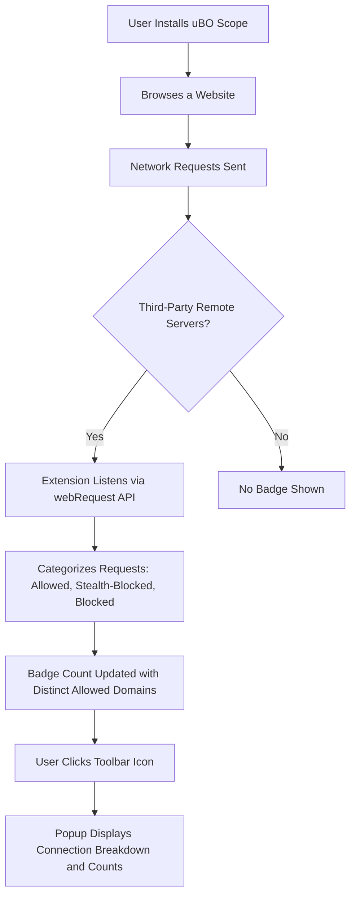

# Your First Run with uBO Scope

Welcome to your first experience launching uBO Scope — a powerful browser extension designed to immediately reveal the third-party connections your web browsing initiates. This guide will walk you through accessing the extension’s popup interface, understanding the badge count on the toolbar icon, and how to interpret the data about remote connections being tracked. You’ll begin seeing the immediate value of uBO Scope in just a few simple steps.

---

## 1. Accessing the uBO Scope Extension Popup

Once installed, uBO Scope integrates seamlessly with your browser toolbar:

1. Locate the uBO Scope icon in your browser’s toolbar. It looks like the uBO Scope logo.
2. Click the icon to open the extension popup, which provides a live breakdown of server connections.

> The popup is defined by the `popup.html` file, providing a user-friendly dashboard summarizing connection outcomes.

## 2. Understanding the Toolbar Badge Count

The number displayed as a badge on the toolbar icon is your quick indicator of activity:

- **What it represents:** The count shows the number of distinct third-party remote servers your current tab has connected with successfully.
- **Why it matters:** A lower number generally means fewer third-party servers were contacted, which often reflects a reduced privacy exposure.

> Keep in mind, not all third parties are bad. Some, like Content Delivery Networks (CDNs), are legitimate and beneficial.

## 3. What the Popup Shows

The popup divides connections into three clear categories, each with their own section:

- **Not Blocked:** Third-party domains where network requests were allowed.
- **Stealth-Blocked:** Requests that triggered redirects but were quietly blocked to avoid webpage breakage.
- **Blocked:** Requests that were explicitly blocked due to errors or failures.

Each section lists domains alongside the count of network requests observed.

### Real-Time Data Display

- The header displays the currently active tab’s hostname and domain.
- Counts next to each domain reflect how many requests were made to that server.
- The summary at the top shows the total number of connected domains.

## 4. What to Expect on First Use

On your first visit to any webpage after installing uBO Scope:

1. The toolbar badge immediately updates to show the number of third-party servers contacted by the page.
2. Clicking the extension icon opens the popup with detailed information on these connections.
3. You will see domains grouped by whether requests were allowed, stealth-blocked, or blocked.

This experience lets you see, at a glance, what connections your browser is making behind the scenes — an essential insight for privacy-conscious users.

## 5. Practical Tips for Using Your First Run

- **Refresh your web pages** after installing the extension to populate connection data quickly.
- When exploring the popup, focus on the **"not blocked"** section to see which external domains your browser connected to.
- Use the **badge count** as a quick privacy health indicator for each tab.

## 6. Common Pitfalls & Troubleshooting

### No Badge or Data Showing?
- Ensure the extension has proper permissions (it requires `webRequest` and host permissions for HTTP, HTTPS, and WebSocket schemes).
- Try refreshing the active tab to trigger fresh connection logging.
- Confirm your browser version meets the minimum required version (e.g., Chrome 122+, Firefox 128+, Safari 18.5+).

### Badge Count Seems Too High?
- Remember it counts distinct third-party domains contacted, not individual requests.
- Some domains are CDNs or required services and are legitimate.

### Data Missing for Some Sites?
- uBO Scope tracks network activity seen by the browser's `webRequest` API. Network requests bypassing this API (e.g., behind VPN tunnels or custom DNS) may not appear.

## 7. How uBO Scope Tracks Connections (For Context)

While this guide focuses on your first run and what you see, under the hood:

- uBO Scope listens to network requests across your browsing sessions, categorizing connections as allowed, stealth-blocked, or blocked.
- It tracks domains using the Public Suffix List to classify hosts accurately.
- Data is updated in near real-time, and each tab maintains its own connection session.

If you want an inside look, the core logic is implemented in the background service worker (`background.js`) and the popup UI (`popup.js`).

## 8. Next Steps After Your First Run

- Explore the **Quick Validation Steps** guide to verify your installation.
- Consult **Troubleshooting Common Issues** if you encounter unexpected behavior.
- Review the **Feature Overview** to fully understand all benefits uBO Scope provides.

---

## Additional Resources

- [Installation Instructions](https://github.com/gorhill/uBO-Scope/blob/main/README.md#installation)
- [System Requirements & Permissions](https://github.com/gorhill/uBO-Scope/blob/main/README.md#browser-requirements)
- [Core Concepts and Terminology](https://github.com/gorhill/uBO-Scope/blob/main/docs/overview/architecture-core-concepts/core-terms-and-concepts.mdx)

---

<Tip>
Remember, uBO Scope is designed as a zero-configuration extension. It works out of the box to provide you instant insights without setup hassle.
</Tip>

<Note>
The badge count reports **distinct third-party hosts connected, not the total number of blocked resources**. Use this for an accurate view on your browsing privacy surface.
</Note>

---

## Quick Visual Walkthrough

This represents the flow from installation through your first active monitoring experience.

---

## Summary
Your First Run experience with uBO Scope provides immediate visibility into the remote servers your browser contacts while browsing. The toolbar badge and extension popup are your gateway to understanding third-party connections, laying the foundation for better privacy awareness and content filtering.

---

## Where to Go From Here?
- Confirm you see meaningful badge counts for active tabs.
- Explore the connection lists in the popup for details.
- Dive deeper with related documentation links to master uBO Scope’s full capabilities.

---

Happy Monitoring!

---

## Source and Further Reading
- [GitHub Repository](https://github.com/gorhill/uBO-Scope)
- [Extension Manifest Overview (Chromium)](https://github.com/gorhill/uBO-Scope/blob/main/platform/chromium/manifest.json)
- [Popup Source Code](https://github.com/gorhill/uBO-Scope/blob/main/js/popup.js)
- [Background Worker Source Code](https://github.com/gorhill/uBO-Scope/blob/main/js/background.js)

---