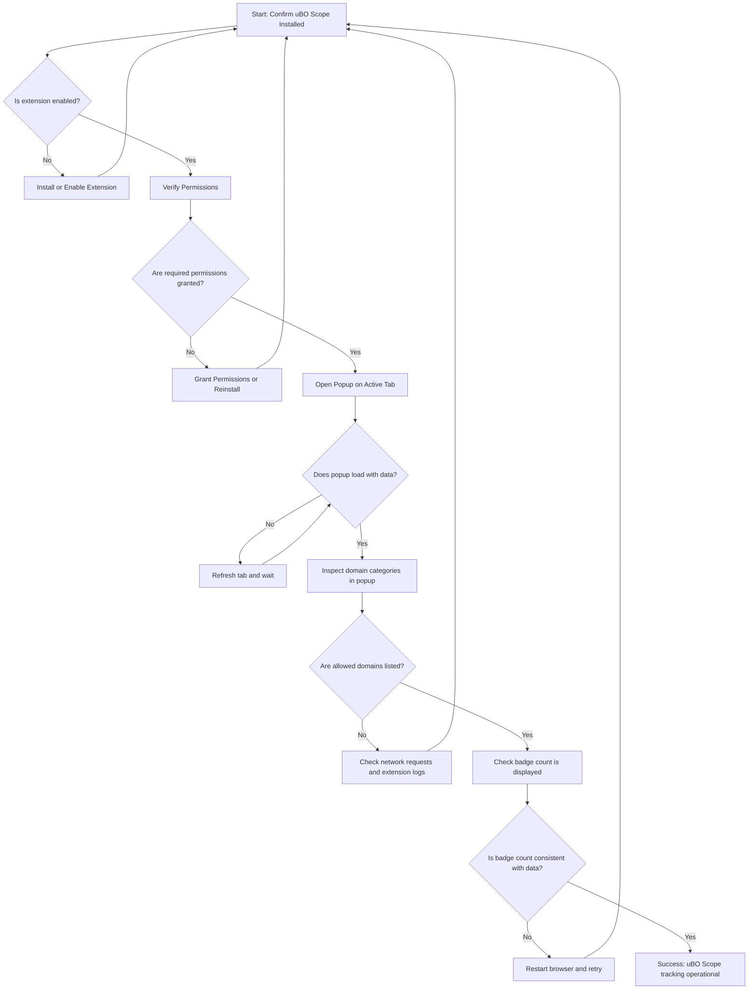

# Quick Validation Checklist

Ensure your uBO Scope extension is properly installed and actively capturing accurate network request data using this concise validation checklist. This script guides you through verifying the core components and confirms that the extension is revealing real-time insights for each tab you browse.

---

## 1. Confirm Extension Installation

1. Open your browser’s extension or add-ons page.
2. Verify that uBO Scope is installed and enabled.
3. Confirm the version matches the latest release as per the official source.

<Tip>
If uBO Scope does not appear on the extensions page, ensure you installed it from the official store or GitHub repository.
</Tip>

---

## 2. Verify Permissions and Background Service

uBO Scope relies on webRequest API permissions and a persistent background service to monitor network activity.

1. Ensure the extension has permissions to access `webRequest` and tab information.
2. Observe if uBO Scope's background service is running (typically invisible but essential).

<Note>
Permission issues can silently prevent network request tracking. Visit the installation instructions or troubleshooting pages if needed.
</Note>

---

## 3. Open uBO Scope Popup for the Active Tab

1. Navigate to any website in your browser.
2. Click the uBO Scope extension icon to open the popup dashboard.
3. Confirm the popup loads without errors and displays a hostname header.

<Check>
If the popup shows “NO DATA”, wait a few seconds and refresh the page to allow data capture.
</Check>

---

## 4. Inspect Domain Data Categories

Review the connection summary and the domain groups:

- **Not Blocked**: Domains your browser connected to successfully.
- **Stealth-Blocked**: Domains where connections were redirected or silently blocked.
- **Blocked**: Domains where connection attempts were explicitly blocked.

1. Ensure at least some domains appear under the _not blocked_ category.
2. Confirm blocked or stealth domains appear if you use content blockers or network filters.

<Tip>
This categorization reflects real traffic and is crucial for understanding third-party connection behavior.
</Tip>

---

## 5. Verify Toolbar Badge Reflects Domain Counts

1. Observe the extension icon badge number.
2. The badge should show a count corresponding to distinct allowed domains in the current tab.

<Warning>
A missing or stale badge may indicate background script errors or permission problems.
</Warning>

If the badge is blank even after network requests, restart the browser and test again.

---

## 6. Real-Time Request Capture Validation

1. Open developer network tools and observe requests while browsing.
2. Check that uBO Scope updates its counts and domain lists accordingly.

<Tip>
Visit different websites to see dynamic updates and confirm tracking accuracy.
</Tip>

---

## 7. Troubleshooting Quick Checks

If any validation step fails:

- Reinstall uBO Scope following the official [Installation Instructions](https://github.com/gorhill/uBO-Scope/blob/main/docs/guides/getting-started/installing-ubo-scope.md).
- Ensure no conflicting extensions block or interfere with network monitoring.
- Check browser console logs for extension errors.
- Consult the [Troubleshooting Installation & Setup](https://github.com/gorhill/uBO-Scope/blob/main/docs/getting-started/first-use-and-validation/troubleshooting-installation.md) guide.

---

## Summary

Once you complete these checks, you should confidently see:

- Active domain tracking per tab
- Accurate categorization of network requests
- Dynamic badge counts reflecting connections

If data appears consistent and responsive, uBO Scope is operational and transparent about your browser’s remote connections.

For next steps, refer to:
- [Getting Results: Your First Run](https://github.com/gorhill/uBO-Scope/blob/main/docs/getting-started/first-use-and-validation/first-run-experience.md)
- [Configuring for Your Environment](https://github.com/gorhill/uBO-Scope/blob/main/docs/getting-started/first-use-and-validation/basic-configuration.md)
- [Interpreting Blocked and Stealth-Blocked Domains](https://github.com/gorhill/uBO-Scope/blob/main/docs/guides/core-workflows/interpreting-blocked-stealth-counts.md)

---

## Additional Tips

- Refresh tabs after installing the extension to initialize data collection.
- Use multiple sites to test different domain interactions.
- Keep your browser updated to avoid compatibility issues.

---

## Visual Flow of Validation Process

---

*This checklist embodies pragmatic steps to confirm the real-time operation and data validity of your uBO Scope installation, enabling you to trust the insights it provides on your browsing privacy exposure.*

