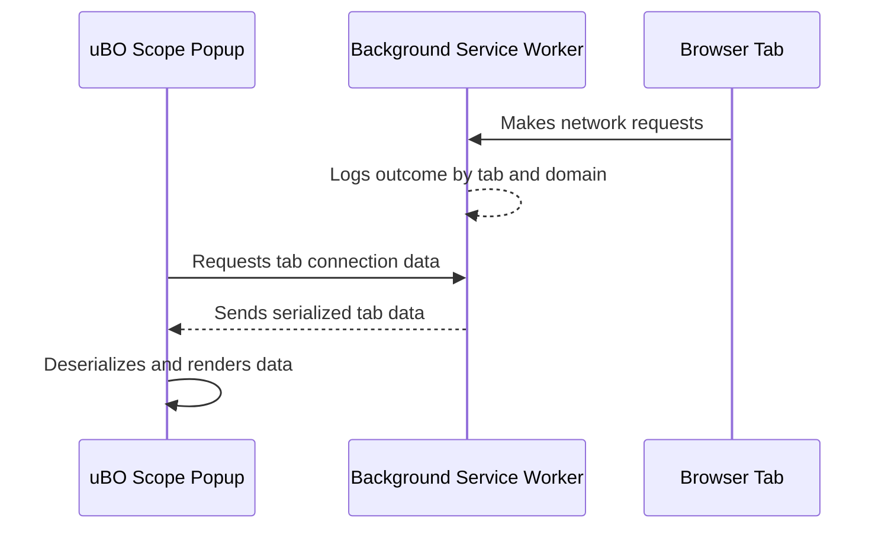

# Launching the Extension

Welcome to your first step with uBO Scope! This guide walks you through accessing the uBO Scope extension from your browser toolbar, opening the popup interface, and understanding what information you'll see when you launch it for the first time.

---

## 1. Prerequisites Before Launching

Before you launch the extension, ensure the following:

- **uBO Scope is installed** in your supported browser (Chromium ≥ 122.0, Firefox ≥ 128.0, Safari ≥ 18.5).
- The extension has necessary permissions, including `activeTab`, `storage`, and `webRequest`.
- There is at least one active browser tab open with an active web page to monitor connections.

If you haven’t installed the extension yet, please refer to the [Installation Instructions](/getting-started/installation-and-requirements/installation-instructions) guide.

---

## 2. Opening the uBO Scope Popup Interface

Follow these steps to open and view the uBO Scope extension popup:

<Steps>
<Step title="Locate the uBO Scope icon in your browser toolbar">
The extension icon resembles a shield with the uBO logo. It appears near the address bar after installation.
</Step>
<Step title="Click the uBO Scope icon">
Clicking the icon opens a popup window that displays connection insights specific to the current active tab.
</Step>
<Step title="Wait for data to load">
Upon first opening, the extension fetches data about active network connections related to the tab you are on. This may take a moment.
</Step>
</Steps>

<Tip>
If the popup displays 'NO DATA' or no domain counts, try switching to a tab with an active webpage or refreshing the current page to generate network requests.
</Tip>

---

## 3. Understanding the Popup Window Sections

The uBO Scope popup is divided into clearly labeled sections that aggregate network connection data by category.

### Overview of Main Sections:

| Section           | Description                                                  | What to Expect on First Visit                             |
|-------------------|--------------------------------------------------------------|----------------------------------------------------------|
| **Tab Hostname**  | Displays the hostname and domain of the active tab’s website | Initially shows ‘NO DATA’ until the extension collects info |
| **Domains Connected Summary** | Shows the total number of unique third-party domains contacted by the page | Usually ‘?’ until network activity is logged              |
| **Not Blocked**   | Lists domains for which connections were allowed successfully | Empty initially until requests occur                       |
| **Stealth-Blocked** | Shows domains for which attempted connections were stealthily blocked | Empty on first launch; populates as stealth blocking occurs |
| **Blocked**       | Lists domains for which connections were explicitly blocked | Empty initially, populates with blocking activity          |

These sections help you quickly grasp the network footprint of the current tab and highlight privacy exposure.

<AccordionGroup title="Example Content from Popup Sections">
<Accordion title="Tab Hostname">
Shows the main site hostname and domain (e.g., www.example.com with domain example.com).
</Accordion>
<Accordion title="Domains Connected Summary">
Displays a numeric count such as 'domains connected: 12' reflecting third-party domains.
</Accordion>
<Accordion title="Not Blocked Section">
Lists domains allowed by your content blockers or browser settings, with connection counts.
</Accordion>
<Accordion title="Stealth-Blocked Section">
Lists domains blocked stealthily to prevent detection or page breakage, alongside counts.
</Accordion>
<Accordion title="Blocked Section">
Lists domains explicitly blocked by your content blocker or network rules.
</Accordion>
</AccordionGroup>

---

## 4. What to Expect on Your First Visit

- The popup interface initially displays a loading state before displaying data.
- If visiting a new or empty tab, it might show ‘NO DATA’ since no network connections exist.
- As you browse, uBO Scope continuously updates data reflecting actual network requests per tab.
- Domains are shown using their Unicode representation for readability.

<Tip>
To trigger meaningful data, navigate to websites with third-party resources (e.g., sites using multiple CDNs or ad networks). The extension reflects these dynamic connections live.
</Tip>

---

## 5. Summary and Next Steps

Launching the extension unlocks visibility into your browser’s network connections, giving you immediate insight into allowed, stealth blocked, and blocked third-party domains on a per-tab basis.

To deepen your understanding and effectively interpret the data you see here, proceed to the [Interpreting Domain Statistics](/getting-started/first-use-and-verification/interpreting-domain-stats) guide.

For any initial difficulties launching or viewing data, consult the [Troubleshooting Setup Issues](/getting-started/first-use-and-verification/troubleshooting-setup) page.

---

## Troubleshooting Quick Tips

- **Popup shows ‘NO DATA’ continuously:**
  - Ensure you are on an active webpage with network activity.
  - Refresh the tab to generate new network requests.
  - Confirm the extension’s permissions are granted.

- **Counts remain at zero or empty lists:**
  - Visit sites with known third-party resources.
  - Disable conflicting extensions that might interfere with webRequest API.

- **Popup won’t open or icon missing:**
  - Verify the extension is enabled in your browser’s extensions manager.
  - Restart the browser if needed.

---

## Additional Technical Notes

The popup interface is implemented in `popup.html` and powered by `js/popup.js`. When launched, it sends a message to the service worker to retrieve tab-specific connection data, then renders it grouped by outcome category.

Below is a simplified data flow from tab to popup rendering:

This flow ensures the popup shows live, accurate connection statistics immediately upon launch.

---

For any further queries or advanced usage, you can explore the source directly via the [uBO-Scope GitHub repository](https://github.com/gorhill/uBO-Scope).

---

*You’re now ready to launch uBO Scope and gain instant insights into your web browsing connections.*