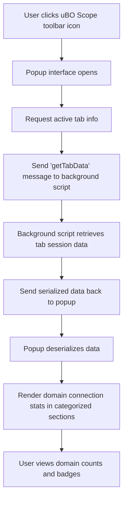

# First Run: What to Expect

Welcome to your first interaction with uBO Scope! This guide helps you launch uBO Scope's popup interface for the first time, orient yourself with its key UI elements, and understand what the domain connection statistics mean for your current browser tab. By the end of this walkthrough, you'll confidently interpret the badge count on the toolbar icon and the connection reports displayed.

---

## 1. Opening uBO Scope's Popup Interface

The moment you install uBO Scope and navigate to any webpage, the extension collects real-time data about network connections on that page. To view this data:

1. Locate the uBO Scope icon in your browser's toolbar. It appears with the extension's logo.
2. Click on the icon to open the popup interface.

<Tip>
If the icon doesn’t appear immediately, ensure the extension is enabled and visible in your toolbar or extension area.
</Tip>

When the popup opens, it dynamically displays network connection statistics relevant to the active tab.

## 2. Understanding the Popup Layout

The popup interface presents a clear, categorized summary of domains connecting or attempting connections from the webpage you are viewing.

### Key Sections in the Popup UI:

- **Header (Tab Hostname)**: Shows the hostname and domain of the current active tab.
  - The domain is primarily displayed in the last span, with any subdomains shown in the first span.
  - If no data exists yet for the current tab, you will see ‘NO DATA’.

- **Summary Section**:
  - Displays the total number of distinct domains connected to from this tab, under the label “domains connected”.
  - This total count reflects only the distinct third-party domains with successful network connections.

- **Outcome Sections** divide the connections into three categories:
  - **Not Blocked (Allowed)**
  - **Stealth-Blocked (Stealth)**
  - **Blocked**

Each category lists the relevant domains observed during your browsing session, accompanied by a badge count that indicates how many requests were made to each domain.

### Visual Example

```text
Tab Hostname:  www.example.subdomain.com

domains connected: 5

not blocked
examplecdn.com       8
apis.google.com      3

stealth-blocked
tracker.example.net  2

blocked
ads.adnetwork.com    4
```

The numbers next to each domain show how many network requests were registered.

## 3. What the Badge Count Means

The badge number on the uBO Scope toolbar icon always shows the count of unique third-party domains to which successful connections were allowed for the active browser tab.

- **A lower badge count is generally better**, indicating fewer third-party domains connected, which often means better privacy protection.
- This count excludes stealth-blocked and fully blocked domains but does include allowed network requests.

Remember, the badge does not count the number of blocked requests but the number of distinct domains that your current tab successfully connected to.

<Note>
The badge updates dynamically as you browse and network activity changes.
</Note>

## 4. Core Concepts Behind Connection Reporting

To interpret the counts and sections, it helps to understand these terms:

- **Allowed**: Domains that the web page successfully connected to — these connections were permitted.
- **Stealth-Blocked**: Domains where connections might have been redirected or intercepted by stealth filtering techniques; the connections didn't fully complete.
- **Blocked**: Domains where connection attempts were prevented outright, for example by content blockers or privacy settings.

Each domain entry shows a count badge representing how many individual requests were observed for that domain.

## 5. Practical First Steps

Follow this quick user flow to explore your first popup:

<Steps>
<Step title="Open the popup">
Click the uBO Scope icon in your browser toolbar on any active tab.
</Step>
<Step title="Review the header information">
Check the displayed hostname and domain name at the top to confirm you are viewing network activity for the intended tab.
</Step>
<Step title="Check the domains connected count">
Observe the number next to “domains connected” for an overview of third-party exposure.
</Step>
<Step title="Explore each Outcome section">
Expand your knowledge of connections by browsing allowed, stealth-blocked, and blocked domains.
</Step>
<Step title="Hover and note badge counts">
See how many requests each domain has received — this quantifies activity per domain.
</Step>
<Step title="Refresh your page and reopen popup">
Try refreshing the tab and opening the popup again to observe live updates.
</Step>
</Steps>

## 6. Tips and Best Practices

- Revisit the popup regularly while browsing to track changes in third-party connections.
- Use the 'blocked' and 'stealth' sections to identify domains affected by your content blockers.
- Notice spikes or unexpected domains in the 'allowed' list; these might warrant further investigation.

## 7. Troubleshooting Common Issues

<AccordionGroup title="Common First Run Questions">
<Accordion title="Why does the popup show ‘NO DATA’?">
If you see ‘NO DATA’ in the header, it means uBO Scope has not yet captured any network activity for this tab.

- Try refreshing the webpage for new network requests.
- Ensure uBO Scope has the required permissions and is enabled.
- If problems persist, review the [Validating and Troubleshooting guide](/getting-started/first-use-setup/validating-installation).
</Accordion>
<Accordion title="Badge count does not update as expected">
Ensure that you are viewing the popup on the active tab where network requests were made.

- The badge only updates after network requests are processed, which can have minimal delay.
- Switching tabs and revisiting may trigger a refresh.
- Restarting the browser or disabling then re-enabling the extension can resolve some edge cases.
</Accordion>
</AccordionGroup>

## 8. What’s Next?

After familiarizing yourself with the popup interface and how domain connection stats are reported, we recommend:

- Exploring [Exploring the Popup UI](/guides/getting-started/first-look-at-the-popup) to dive deeper into interactive features.
- Reading the [Key Concepts & Terminology](/overview/core-concepts-architecture/network-terminology) page to solidify your understanding.
- Proceeding to [Validating and Troubleshooting](/getting-started/first-use-setup/validating-installation) if you encounter issues.

---

By starting with this hands-on introduction, you build a strong foundation to leverage uBO Scope’s insights effectively in protecting your privacy and understanding web activity.

---

<Info>
For source code and further technical details about the popup interface and domain statistics, visit the [uBO Scope GitHub repository](https://github.com/gorhill/uBO-Scope).
</Info>

---

### Diagram: Simplified Flow of Popup Data Fetch & Rendering




