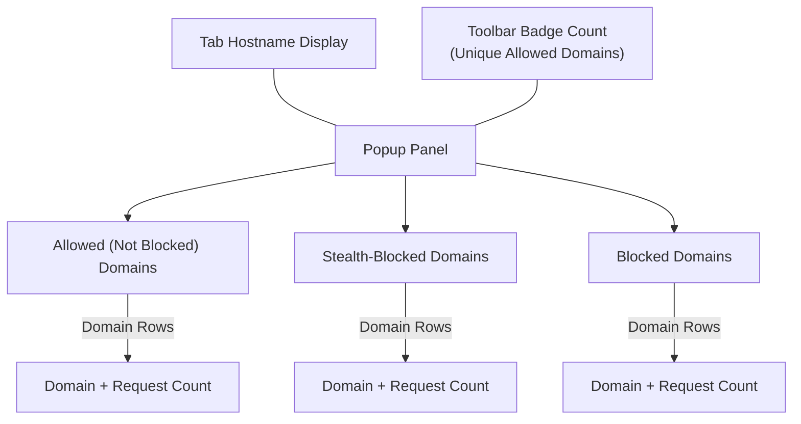

# Understanding the UI of uBO Scope

This guide introduces the popup interface of uBO Scope, helping you interpret the key display sections and understand the various connection outcomes it reveals. It explains how to make sense of the distinct domain categories—allowed, stealth-blocked, and fully blocked—as well as the significance of the badge count shown on the extension icon. By the end, you will be able to effectively contextualize uBO Scope’s reporting about your browsing activity.

---

## 1. Popup Interface Overview

When you click the uBO Scope extension icon in your browser toolbar, a popup panel appears. This panel provides a categorized snapshot of third-party remote servers that the active browser tab connected to or attempted to connect to.

### Key Display Sections

The popup presents connections divided into three distinct sections, each representing a different connection outcome:

- **Not Blocked** (`allowed`): Domains for which network requests were successful and allowed by the browser and content blockers.
- **Stealth-Blocked** (`stealth-blocked`): Domains where requests were intentionally hidden or redirected, typically by content blockers acting stealthily.
- **Blocked** (`blocked`): Domains where network requests failed due to explicit blocking by content blockers or network-level restrictions.

These sections visually separate domains so that you can quickly evaluate which connections are operating unhindered, which are stealthily blocked, and which are fully blocked.

<Tip>
The interface shows domains grouped by their "public suffix list"-recognized domain names, rather than individual hostnames, giving a clearer overview of unique third-party organizations contacted.
</Tip>

### Domain Rows

Within each section, domains are listed in rows showing:

- The **domain name** (converted to a readable Unicode format if necessary).
- The **count** of individual hostnames under that domain that were contacted.

This helps you gauge not only which domains are involved but also how broadly they were accessed.

### Tab Hostname Display

At the top of the popup, the domain of the current active browser tab is displayed. This contextualizes the domain activity, showing the "first party" site you are browsing.

---

## 2. Interpreting Connection Outcomes

Understanding what each outcome means helps you assess your browsing connections and the effectiveness of content blocking.

### Allowed (Not Blocked)

- These are connections where the browser successfully fetched resources.
- Typically, these include first-party domains and legitimate third-party domains (like CDNs).
- A higher count here means more unique domains connected to.

### Stealth-Blocked

- These connections were intercepted stealthily by content blockers to prevent resource loading without alerting the website.
- Domains show as present but requests are silently redirected or suppressed.
- This ensures less visibility of blocking activity to the website.

### Blocked

- These are domains where network requests were explicitly blocked and failed.
- May result in content not loading.
- Useful for identifying domains definitely prevented from loading data.

<Tip>
If you see unexpected domains in the blocked or stealth-blocked sections, this could indicate hidden tracking or unwanted connections that your content blockers are managing.
</Tip>

---

## 3. Understanding the Badge Count

The small numeric badge on the uBO Scope toolbar icon is a real-time indicator representing the **number of distinct allowed third-party domains** contacted by the active tab.

- **Lower badge numbers are generally better**, indicating fewer third-party connections.
- The badge count excludes stealth-blocked or fully blocked domains—they are not counted since their requests failed or were hidden.
- The count updates dynamically as you browse and connections are made or blocked.

<Note>
The badge reflects unique domain count, not total requests. This helps avoid confusion caused by multiple requests to the same third-party.
</Note>

---

## 4. Practical Usage Scenario

Imagine you are visiting a news website. Clicking the uBO Scope icon reveals:

- A moderate number of allowed domains representing how content is loaded.
- One or two stealth-blocked domains indicating stealthy blocking of trackers.
- Several blocked domains preventing known ad servers.

You can use this view to verify that your content blockers are effective and evaluate how many third-party connections the site attempts.

---

## 5. Best Practices and Tips

- **Always check the badge count alongside the popup panel**. The badge gives a quick numeric snapshot while the popup explains what’s behind the count.
- **Use the domain breakdown to identify unwanted third parties**.
- If the badge count seems unexpectedly high, open the popup to see which domains contribute most.
- Remember, some allowed domains may be essential services like CDNs or APIs.

---

## 6. Troubleshooting Common Confusions

- **Why do some domains appear in stealth-blocked, but not in blocked?**
  - Stealth blocking means requests were intercepted or redirected invisibly; these requests never fully completed but aren’t outright failures.

- **Why does the badge count not include blocked domains?**
  - The badge counts only successful connections to third parties, reflecting true resource loading.

- **What if the popup shows 'NO DATA'?**
  - This means no network request data is available for the current tab yet. Try refreshing the page or visiting a different site.

---

## 7. Summary of UI Elements

| Element                  | Description                                  |
|--------------------------|----------------------------------------------|
| Tab Hostname Header      | Shows current active tab’s full domain       |
| Domains Connected Summary| Displays total unique allowed third-party domains count |
| Allowed Domains Section  | Lists domains with successful network requests|
| Stealth-Blocked Section  | Lists domains for stealth-blocked connections |
| Blocked Domains Section  | Lists domains with explicitly blocked requests |
| Domain Rows              | Each row shows domain name and count of hostnames |

---

## 8. References and Next Steps

- For installation and initial setup, see [Installing uBO Scope](https://github.com/gorhill/uBO-Scope/blob/main/doc/getting-started/installation-setup/installing-ubo-scope.mdx).
- To run your first operation and interpret badge counts in practice, consult [Your First Run](https://github.com/gorhill/uBO-Scope/blob/main/doc/getting-started/first-use-validation/first-run.mdx).
- For deeper explanation of connection outcomes and terminology, read [Core Concepts & Terminology](https://github.com/gorhill/uBO-Scope/blob/main/doc/overview/introduction-and-concepts/core-concepts-and-terminology.mdx).
- Explore advanced diagnostics in [Analyzing Network Requests and Outcomes](https://github.com/gorhill/uBO-Scope/blob/main/doc/guides/diagnostics-and-advanced/analyzing-network-requests.mdx).

---

Understanding this popup interface empowers you to make informed decisions about your browsing privacy and content blocking efficiency.

<Accordion title="Popup Interface Diagram">

</Accordion>

---

<footer>
Documentation generated for the page: **Understanding the UI**
</footer>
