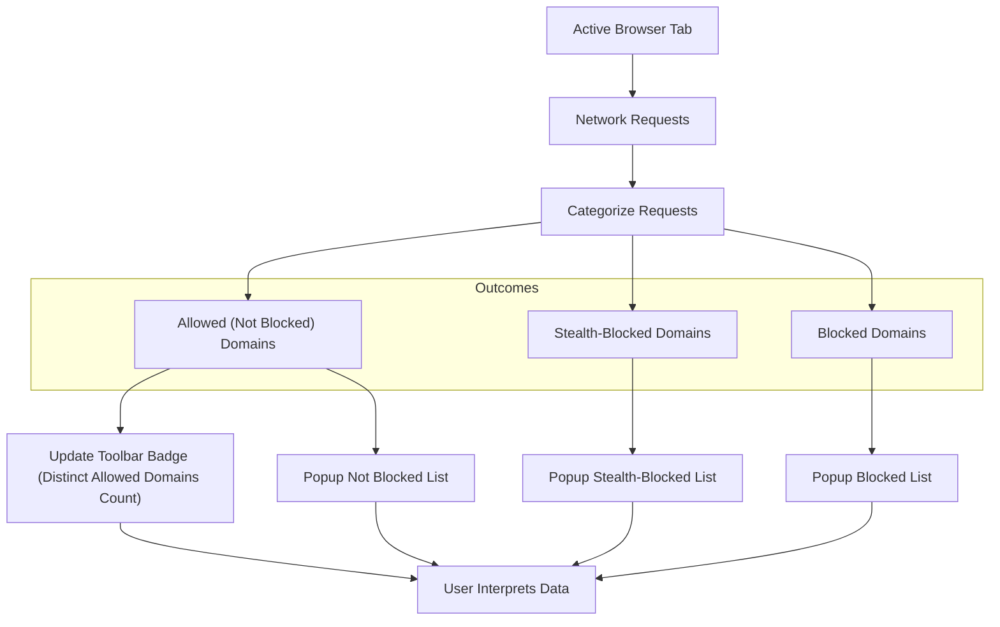

# Interpreting the Toolbar Badge & Popup

Understand at a glance what uBO Scope reveals about your browser’s network connections by interpreting the toolbar badge and detailed popup interface. This guide explains how to read the badge count, explore the categorized connection lists in the popup, and why these metrics matter for your browsing transparency and privacy.

---

## 1. Understanding the Toolbar Badge

The toolbar badge is your immediate summary indicator of third-party remote server activity on the active tab.

- **What It Shows:** 
  - The badge displays a number representing the **count of distinct third-party domains allowed** (i.e., successfully connected) during the page load.
  - If the count is zero or the extension lacks data for the tab, the badge shows no number.

- **What It Means:**
  - A **lower badge count indicates fewer third-party servers contacted, which generally means less external tracking and fewer resource fetches.**
  - A high count suggests your browser has actively connected to many third-party domains, which could impact privacy or performance.

### Practical Tip

> The badge **does not count blocked or stealth-blocked domains**—only those that were successfully connected and allowed.

### Common Pitfall

> Do not confuse this badge count with the number of blocked connections or requests. It is a count of **distinct allowed third-party domains only**, providing a clearer picture of actual network activity.

---

## 2. Exploring the Popup Interface

Clicking the toolbar icon opens the popup, revealing detailed connection data from the active tab. Here’s how to read and use it:

### 2.1 Tab Hostname Display

At the top, you see the hostname of the current tab, split into two parts:

- The **subdomain(s)** part (if any) on the left
- The **registered domain** on the right

This helps confirm exactly which site’s connections you are inspecting.

### 2.2 Domain Connections Summary

Below the hostname, the popup shows:

- **`domains connected:`** followed by a count representing the total number of distinct allowed third-party domains detected for this tab.

### 2.3 Categorized Connection Lists

The popup categorizes network connections into three distinct sections, each listing domains with their hit counts:

| Section          | Description                                                                                  | Color Indicator          |
|------------------|----------------------------------------------------------------------------------------------|-------------------------|
| **Not Blocked**  | Third-party domains to which connections successfully occurred.                              | Green background header  |
| **Stealth-Blocked** | Domains that were stealthily blocked, i.e., network requests redirected or hidden from detection. | Red background header    |
| **Blocked**      | Domains whose connections were actively blocked or failed due to an error.                   | Red background header    |

Each domain in these lists shows a count of how many times connections were made or attempted.

### 2.4 What the Count Means

- The **count next to each domain** is the number of requests made or affected for that third-party domain.
- Domains are sorted alphabetically for easy scanning.

### 2.5 Example Layout

```text
Hostname:   sub.example  example.com

 domains connected: 17

[not blocked]
cdn.example.net       8
media.tracker.com     3
...

[stealth-blocked]
ad.doubleclick.net     2
...

[blocked]
ad.example.org        4
```

---

## 3. Why These Metrics Matter

- **Transparency:** This extension reveals all network connections your browser makes, independent of any content blockers, showing a truthful connection count.
- **Privacy Insight:** A high number of connected third-party domains can indicate heavy tracking or content loading.
- **Myth Busting:** Some content blockers report block counts that don’t correlate directly with connections blocked; uBO Scope uniquely shows distinct connected domains to clarify actual network activity.

---

## 4. Step-by-Step Guide to Using the Badge & Popup

<Steps>
<Step title="View the Badge">
Look at the extension icon in your browser toolbar. The number indicates the count of distinct third-party domains connected in the current tab.
</Step>
<Step title="Open the Popup">
Click the extension icon to open the popup and get detailed information about each domain by category.
</Step>
<Step title="Confirm the Hostname">
Verify the hostname at the top to ensure you are reviewing data from the correct website.
</Step>
<Step title="Review the Connected Domains">
Check the 'not blocked' list to identify which third-party domains your browser contacted successfully.
</Step>
<Step title="Analyze Blocked and Stealth-blocked Domains">
Look at 'blocked' and 'stealth-blocked' sections to understand which domains were prevented or stealthily redirected.
</Step>
</Steps>

---

## 5. Troubleshooting Common Issues

<AccordionGroup title="Troubleshooting Badge and Popup Data">
<Accordion title="The Badge Shows No Number Even When I Expect It Should">
Check if the tab is fully loaded and active. Refresh the page if needed. Permissions or browser restrictions may block data collection.
</Accordion>
<Accordion title="The Popup Shows 'NO DATA' or Is Empty">
This means no connection data is available for the tab. Try refreshing the page or check the extension permissions under your browser’s extension management.
</Accordion>
<Accordion title="Counts Seem Too High or Too Low Compared to Expectations">
Remember the badge only counts unique third-party domains successfully connected, not the number of requests or blocked hosts. Page complexity and network behaviors affect these numbers.
</Accordion>
</AccordionGroup>

---

## 6. Best Practices for Effective Use

- Use the badge as a quick privacy audit tool when visiting new or suspect websites.
- Open the popup for deeper insight into which domains are contacted and their connection frequency.
- Keep uBO Scope updated to benefit from improvements and accurate data collection.
- Cross-reference the popup data with your content blocker’s reports for a fuller picture.

For advanced understanding, explore the related guides on [Interpreting Domain Outcomes](/guides/practical-workflows/understanding-domain-outcomes) and [Debunking Content Blocking Myths](/guides/practical-workflows/debunking-common-myths).

---

## 7. Additional Resources

- [Value Proposition & Use Cases](/overview/product-intro/value-proposition-use-cases)
- [System Architecture at a Glance](/overview/architecture-overview/system-architecture)
- [Installing on Chrome, Firefox, and Safari](/getting-started/installation-setup/installation-browser)
- [Launching the Extension for the First Time](/getting-started/first-use/using-extension-first-time)

---

## 8. Visual Diagram of Popup Data Flow



This flowchart shows how network requests on the active tab are categorized and reflected both in the toolbar badge and the popup UI, giving you complete transparency.

---

This guide empowers you to leverage the toolbar badge and popup interface of uBO Scope effectively, turning raw connection data into actionable insight for privacy and performance awareness.