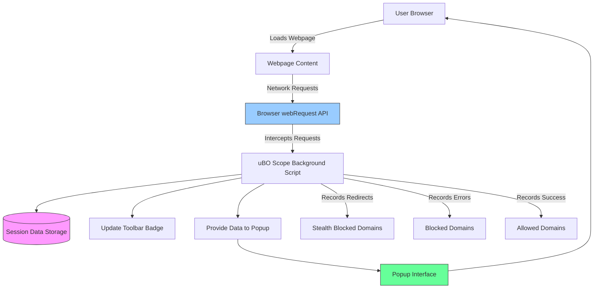

# Troubleshooting & Quick Checks

This guide helps you swiftly identify and resolve common setup and usage issues encountered during your first interactions with uBO Scope. If the extension icon does not appear, shows no data, or the data seems off, these practical steps will get you back on track with confidence.

---

## 1. Verifying Extension Installation and Visibility

### Step 1: Confirm Extension Installation
- Open your browser's extensions or add-ons page:
  - **Chrome**: Visit `chrome://extensions/`
  - **Firefox**: Visit `about:addons`
  - **Safari**: Open Safari Preferences → Extensions

- Look for **uBO Scope** or **uBlock Origin Scope** in the list.

### Step 2: Ensure the Toolbar Icon is Visible
- Confirm the uBO Scope icon is pinned or visible near the address bar.
- If hidden, pin or enable the icon:
  - **Chrome**: Click the puzzle piece icon and pin uBO Scope.
  - **Firefox**: Customize toolbar to drag uBO Scope icon.
  - **Safari**: Enable the toolbar icon in the Extensions preferences.

<Check>
A visible icon is essential to access the popup interface for connection details.
</Check>

### Step 3: Check Browser Version Compatibility
- Verify your browser version meets extension requirements:
  - Chrome 122.0 or later
  - Firefox 128.0 or later
  - Safari 18.5 or later

- Update your browser if needed.

---

## 2. Quick Validation of Extension Functionality

### Step 1: Open uBO Scope Popup
- Click the uBO Scope toolbar icon to bring up the popup interface.
- Confirm the popup loads without errors and displays:
  - A hostname at the top
  - Summary count of connected domains
  - Sections for _not blocked_, _stealth-blocked_, and _blocked_ domains

### Step 2: Confirm Data is Loaded
- If the popup shows “NO DATA” or question marks:
  - Reload the active tab.
  - Ensure the page is fully loaded.
  - Try visiting a known website with third-party content (e.g., https://example.com).

### Step 3: Observe Toolbar Badge Count
- The toolbar icon badge should display a number indicating distinct allowed third-party connections for the active tab.
- A blank badge means no such connections detected.

<Info>
The badge count reflects the number of distinct third-party domains connected, not the total requests.
</Info>

---

## 3. Common Issues and How to Resolve Them

### Issue: Extension Icon Does Not Appear
- **Cause:** Extension not installed or disabled.
- **Resolution:**
  1. Go to your browser’s extension page and confirm uBO Scope is installed and enabled.
  2. Restart the browser.
  3. Reinstall the extension if missing.

### Issue: Popup Shows No Data or ``NO DATA``
- **Cause:** Extension not receiving network events or tab data not yet recorded.
- **Resolution:**
  1. Reload the web page to trigger network events.
  2. Open uBO Scope popup **after** the page loads.
  3. Ensure you have granted all required permissions (see [Verifying Extension Permissions](../installation-setup/setup-permissions) for your browser).

### Issue: Badge Count Is Always Zero
- **Cause:** No third-party connections detected or extension blocked from monitoring.
- **Resolution:**
  1. Visit a site with known third-party content.
  2. Confirm extension permissions include `webRequest` and host access.
  3. Check if other extensions interfere with uBO Scope.

### Issue: Popup Fails to Load or Is Blank
- **Cause:** Extension background service worker or script crashed.
- **Resolution:**
  1. Restart the browser.
  2. Update to the latest version of uBO Scope.
  3. Disable other conflicting extensions.

### Issue: Unexpected or Missing Domains in the Report
- **Cause:**
  - Some network requests may not be visible due to browser limitations.
  - Stealth-blocked entries represent redirections or filters that prevent network request visibility.

- **Resolution:**
  1. Review domain lists in the popup (allowed, stealth-blocked, blocked) to understand connection states.
  2. See [Understanding Allowed, Blocked, and Stealth Domains](../../guides/practical-workflows/understanding-domain-outcomes) for interpretation guidance.

---

## 4. Quick Checks to Validate Operation

Use these fast checks after installing uBO Scope to verify proper setup:

### Check A: Confirm Permissions
Run this simple test:
1. Open the browser’s extension details page.
2. Look for permissions: `activeTab`, `storage`, `webRequest`, `host permissions` matching URLs like `https://*/*` and `http://*/*`.
3. Ensure none are missing or denied.

### Check B: Test on Popular Website
1. Navigate to a site known to load third-party content (e.g., https://news.ycombinator.com).
2. Click the uBO Scope icon.
3. Confirm a meaningful badge count and domain listing.

### Check C: Reload and Monitor
If no data appears:
1. Reload the page.
2. Wait a few seconds.
3. Open the popup again.

### Check D: Clear Extension Data
If unexpected behavior persists:
1. Remove uBO Scope extension.
2. Restart browser.
3. Reinstall uBO Scope.

---

## 5. Tips & Best Practices

- Always open the popup for the **active tab** where you expect network data.
- Network requests are processed asynchronously, so slight delays may occur before data shows.
- Lower badge counts usually mean fewer third-party connections, often desirable.
- Stealth-blocked domains indicate redirection or filtering — further investigation can clarify.

---

## 6. Getting Additional Help

- Review related troubleshooting content in [Troubleshooting and Frequently Asked Questions](../../guides/advanced-usage/troubleshooting-and-faq).
- Consult system requirements and permissions in [System Requirements & Prerequisites](../installation-setup/prerequisites-requirements) and [Verifying Extension Permissions](../installation-setup/setup-permissions).
- Report issues or ask questions on uBO Scope's GitHub repository: https://github.com/gorhill/uBO-Scope

---

## Appendix: Understanding Key Domains Categories

The popup categorizes domains into:

- **Not Blocked (Allowed):** Domains successfully connected.
- **Stealth-Blocked:** Domains blocked or redirected stealthily, possibly causing less detectable filtering.
- **Blocked:** Domains for which network requests failed or were explicitly blocked.

Knowing the category helps you evaluate which third-parties are reaching your browser and how content blockers might be behaving.

---

<u>With these checks and steps, you are empowered to troubleshoot initial issues efficiently and enjoy the clear transparency uBO Scope provides into your browsing network activity.</u>

---

# Diagram: uBO Scope Network Monitoring Flow

---

# References

- [Installation Setup & Permissions](../installation-setup/)
- [Interpreting Badge & Popup](../first-use/interpreting-badge-popup)
- [Understanding Domain Outcomes](../../guides/practical-workflows/understanding-domain-outcomes)
- [Troubleshooting & FAQ](../../guides/advanced-usage/troubleshooting-and-faq)
- [Official GitHub Repository](https://github.com/gorhill/uBO-Scope)

---