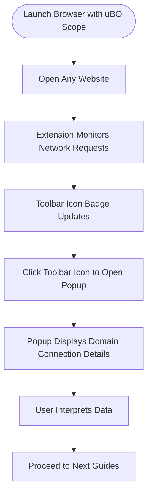

# Your First Run: Seeing uBO Scope in Action

Welcome to your first experience with **uBO Scope**. This guide walks you through launching your browser with uBO Scope enabled, opening any website, and observing the extension in action via the toolbar icon and the popup interface. You'll gain immediate insight into how uBO Scope reveals third-party connections made by webpages, helping you understand the real network activity on any site you visit.

---

## 1. Launch Your Browser with uBO Scope Enabled

Before you begin, ensure you have installed uBO Scope following the installation guide for your browser ([Chrome, Firefox, or Safari](../../installation-and-setup/installing-on-chrome-firefox-safari)).

**Steps to launch:**

1. Open your browser as usual.
2. Confirm uBO Scope is active by locating its icon on the toolbar (usually near the address bar).

<Tip>
If you do not see the uBO Scope icon, verify that the extension is enabled in your browser's extensions or add-ons manager.
</Tip>

---

## 2. Open Any Website to Observe Connections

uBO Scope operates passively by monitoring the network requests your browser makes as you navigate the web. To trigger its reporting:

1. Enter any website URL in your browser’s address bar and press Enter.
2. Wait for the page to finish loading.

<u>What happens behind the scenes?</u>

- uBO Scope monitors all outgoing connections initiated by the webpage.
- It categorizes these connections into allowed, blocked, or stealth-blocked.
- It updates its toolbar icon badge to reflect how many distinct third-party domains the page contacted.

---

## 3. Understanding the Toolbar Icon and Badge

The toolbar icon provides a quick overview:

- **Icon badge number**: Shows the count of distinct third-party remote servers the webpage successfully connected to.
- **No badge number (empty)**: Indicates no detected third-party connections or the page has not yet made network requests.

<Info>
The badge count focuses on _allowed_ third-party connections. A lower count generally signifies fewer remote connections and better privacy.
</Info>

---

## 4. Viewing Detailed Connection Data in the Popup

To dive deeper into the details:

1. Click the uBO Scope toolbar icon.
2. The popup window opens, displaying categorized domains:

   - **Not Blocked**: Domains from which resources successfully loaded.
   - **Stealth-Blocked**: Connections that were redirected stealthily.
   - **Blocked**: Domains where connections were blocked or failed.

3. Each domain listed shows how many requests were made to it during the current page load.

### Example Visual Elements

- The top header shows the current page’s hostname (site you visited).
- The summary section displays the total count of connected third-party domains.
- Separate sections group domains by connection outcomes with clear headings.

---

## 5. Quick Start Tips for Interpreting Your First Results

- **Focus on allowed connections**: These domains represent active third parties communicating with the webpage.
- **Blocked domains**: Help identify content blockers’ effectiveness.
- **Stealth blocking**: Indicates covert redirection or filtered connections, a nuanced status.

<Tip>
For best insights, visit well-known sites with varying content (blogs, news, video streaming) to observe patterns and differences in network connections.
</Tip>

---

## 6. What to Expect Visually

- The badge number updates dynamically as the page loads network resources.
- The popup refreshes data to show the real-time connection status per tab.
- Data includes Unicode domain names for internationalized domains, making them easy to recognize.

<Note>
If the popup shows "NO DATA" or zero domains for a frequently visited site, verify that the extension’s permissions and configuration are correct ([Initial Configuration guide](../../installation-and-setup/initial-configuration)).
</Note>

---

## 7. Troubleshooting Common Situations

- **Badge number not updating**:
  - Reload the webpage.
  - Confirm uBO Scope has required permissions (`webRequest`, `activeTab`, and others).
  - Check for browser-specific restrictions or privacy settings.

- **Popup shows no data after navigation**:
  - Try opening a new tab and visiting a different site.
  - Restart the browser and observe the extension’s behavior again.

- **Unexpected high badge count**:
  - Review the popup domains.
  - Remember some sites load legitimate third-party content (CDNs, analytics).

---

## 8. Next Steps

You have now successfully seen uBO Scope reveal third-party connections in real-time. To further enhance your understanding:

- Proceed to [Validating Functionality](../validating-extension-works) to confirm the extension works as expected.
- Explore [Interpreting the Badge Count and Results](../../../guides/getting-started-workflows/interpreting-badge-count) to deepen insight into connection outcomes.

---

## Additional Resources

- [What is uBO Scope?](../../../overview/foundation/what-is-ubo-scope) — Understand the purpose and value.
- [How uBO Scope Works](../../../overview/foundation/how-it-works) — Learn about the internal operation and network monitoring.
- [Key Benefits & Typical Use Cases](../../../overview/foundation/key-benefits) — Discover practical scenarios.

---

By following these steps, you engage directly with uBO Scope’s unique ability to expose the hidden network activity of webpages, empowering you to make informed privacy and security choices with confidence.

---

# Visual Flow of Your First Run

---