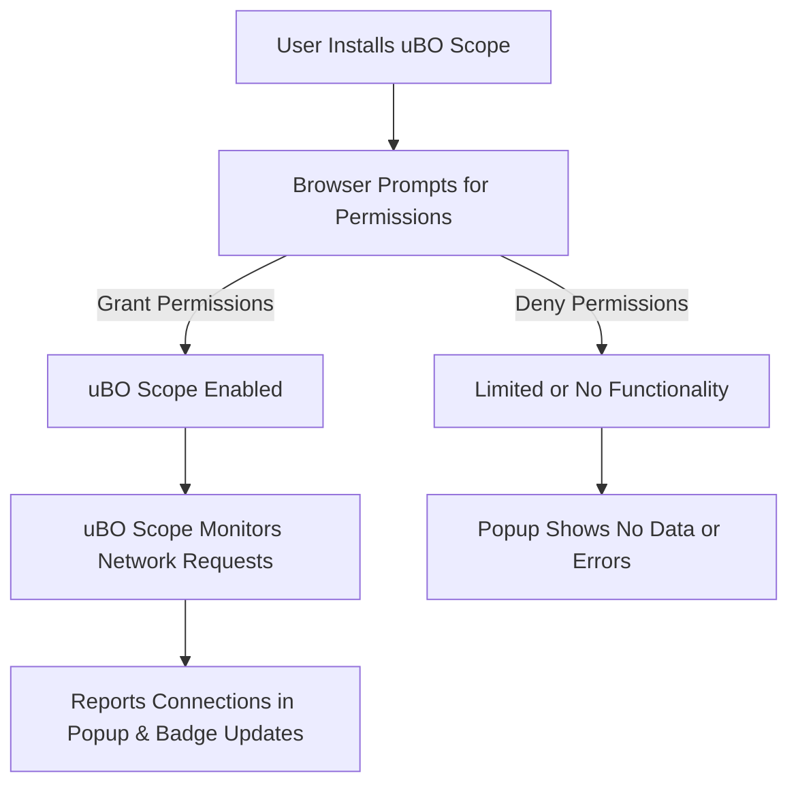

# Basic Configuration and Permissions

Welcome to the essential first step for getting uBO Scope up and running smoothly. This guide walks you through the initial configuration prompts you will encounter after installing uBO Scope, detailing the required permissions you must grant, what these permissions mean for your privacy, and how to adjust them if necessary.

Understanding this foundational setup ensures you get reliable network connection reporting without surprises.

---

## 1. Understanding Permissions: Why They Matter

uBO Scope is designed to track and report all network connections initiated by websites you visit. To do this effectively, it requires specific permissions in your browser. These permissions allow the extension to intercept and analyze requests, providing you an accurate picture of remote server connections.

### Key Permissions Explained

| Permission    | Purpose                                                                                  | Privacy Considerations                                          |
|---------------|------------------------------------------------------------------------------------------|----------------------------------------------------------------|
| `webRequest`  | Enables monitoring and classification of network requests (including redirects and errors). Essential for tracking all connection outcomes.| Sensitive — monitors your browsing activity at the network request level but does not modify requests.
| `activeTab`    | Grants temporary access to the currently active tab for data retrieval and interaction. | Limited scope — only the active tab is accessible when you interact with the extension.
| `storage`     | Allows the extension to save session data and settings locally.                           | Local to your browser, data is not shared externally by default.|
| Host Permissions (`http://*/*`, `https://*/*`, `ws://*/*`, `wss://*/*`) | Required to observe network requests to all HTTP and WebSocket URLs, so no connection escapes observation. | Necessary for comprehensive monitoring; you can review which hosts are in scope.

<Tip>
The combination of `webRequest` and broad host permissions is what enables uBO Scope to deliver complete visibility over background connections.
</Tip>

---

## 2. Initial Setup: Granting Permissions

When you install uBO Scope from your browser's official extension store, you will be prompted to approve the permissions outlined above. These prompts differ slightly depending on your browser:

### Step-by-Step Walkthrough

<Steps>
<Step title="Install the uBO Scope Extension">
Follow the installation steps for your browser (Chromium, Firefox, or Safari). Upon initial installation, the browser will present permission requests automatically.
</Step>
<Step title="Review Permission Requests">
Carefully read and approve all requested permissions:
- uBO Scope must have access to monitor web requests (`webRequest`) and active tab data.
- You will see requests to access all HTTP/S and WebSocket URLs.
</Step>
<Step title="Confirm Permission Granting">
Click 'Allow' or 'Add Extension' to finalize installation and grant permissions.
Fresh installs require all permissions to enable core functionality.
</Step>
</Steps>

<Tip>
Denying any of the required permissions will limit uBO Scope’s ability to monitor network activity effectively, resulting in incomplete or missing data.
</Tip>

---

## 3. What These Permissions Mean for Your Privacy

uBO Scope strictly operates in a passive, read-only manner:

- It **does not modify or block** any network requests.
- Data collected is about connection outcomes (allowed, blocked, stealth-blocked) at the domain level, not individual user data.
- All data processing happens locally in your browser.

<Note>
The extension’s primary purpose is transparency: revealing connections your browser makes or attempts, but it respects your privacy by never interfering with requests.
</Note>

---

## 4. Adjusting Permissions or Settings After Installation

Depending on your browser, you may revisit permissions after installation.

### Chromium and Firefox

1. Go to your browser's Extensions or Add-ons settings.
2. Locate uBO Scope from the list.
3. Click to view or manage permissions.
4. Adjust host access (where applicable): you can restrict if desired, but this will reduce coverage.

### Safari

1. Open Safari Preferences > Extensions.
2. Select uBO Scope.
3. Manage Site Access or Permission prompts as presented.

<Tip>
For comprehensive and accurate connection tracking, allowing uBO Scope access to all relevant webRequest permissions and hosts is highly recommended.
</Tip>

---

## 5. First-Run Experience and Prompts

The very first time you open uBO Scope's popup (click the toolbar icon), the extension reads and begins processing network requests.

- You may briefly see placeholders like “NO DATA” as uBO Scope builds connection data.
- Badge counts on the toolbar icon will start reflecting distinct third-party domains your current tab connects to.

<Check>
If no permission was granted or the extension is disabled, the popup panel will remain empty or show no data.
</Check>

---

## 6. Best Practices for Permissions and Configuration

- **Grant all requested permissions during installation** to avoid gaps in monitoring.
- **Regularly check extension permissions** after browser updates to ensure nothing was reset.
- **Reinstall or update** if permissions appear inconsistent or if uBO Scope is not reporting expected data.
- **Review browser and security settings** that may block or restrict extension network access.

<Tip>
Keeping permissions intact is crucial to maintain an accurate, privacy-respecting insight into third-party connections across your browsing sessions.
</Tip>

---

## 7. Troubleshooting Common Permission Issues

<AccordionGroup title="Common Permission & Setup Issues">
<Accordion title="The Extension Popup Shows NO DATA">
- Verify that you granted all required permissions during installation.
- Confirm the extension is enabled and running.
- Reload the page you want to monitor.
- Check browser console or extension logs for errors (advanced).
</Accordion>
<Accordion title="Toolbar Badge Does Not Appear or Update">
- Ensure `webRequest` permission is granted.
- Check that host permissions cover your browsing URLs.
- Restart your browser if needed.
- Update uBO Scope to the latest version.
</Accordion>
<Accordion title="Permission Prompts Don't Appear in Browser">
- Some browsers auto-grant on installation, check extension settings for permission overview.
- If missing, try reinstalling from the official web store.
</Accordion>
<Accordion title="Restricting Host Permissions Blocks Data Collection">
- If you narrow host access, uBO Scope cannot observe requests on excluded sites.
- Consider balancing privacy with functionality.
</Accordion>
</AccordionGroup>

---

## 8. Additional Resources

- [System Requirements & Prerequisites](https://your-docs-domain/getting-started/installation-and-setup/prerequisites) — Verify browser compatibility and necessary environment details.
- [Installing uBO Scope](https://your-docs-domain/getting-started/installation-and-setup/installing-extension) — Step-by-step install instructions for your browser.
- [First Use: Launching uBO Scope](https://your-docs-domain/getting-started/first-steps-and-validation/your-first-run) — Guide for running your first analysis.
- [Troubleshooting Initial Setup](https://your-docs-domain/getting-started/first-steps-and-validation/troubleshooting-setup) — Help resolving common setup hurdles.

Visit the [uBO Scope GitHub Repository](https://github.com/gorhill/uBO-Scope) for source code and issue reporting.

---

Congratulations! With your permissions granted and basic setup complete, uBO Scope is ready to provide you a transparent and trusted view of web connections in your browser.

Click the uBO Scope icon anytime to open the popup and begin exploring live connection data.

---

## Appendix: Permissions Defined per Browser

| Browser   | Permissions Required                             | Host Permissions                                    | Minimum Version          |
|-----------|------------------------------------------------|----------------------------------------------------|-------------------------|
| Chromium  | `activeTab`, `storage`, `webRequest`           | `http://*/*`, `https://*/*`, `ws://*/*`, `wss://*/*` | 122.0                   |
| Firefox   | `activeTab`, `storage`, `webRequest`           | `http://*/*`, `https://*/*`, `ws://*/*`, `wss://*/*` | 128.0                   |
| Safari    | `activeTab`, `storage`, `webRequest`           | `http://*/*`, `https://*/*`                         | 18.5                    |

<Tip>
Safari's host permissions currently do not include WebSocket URLs.
</Tip>

---

## Visual Summary of uBO Scope Permission Flow

