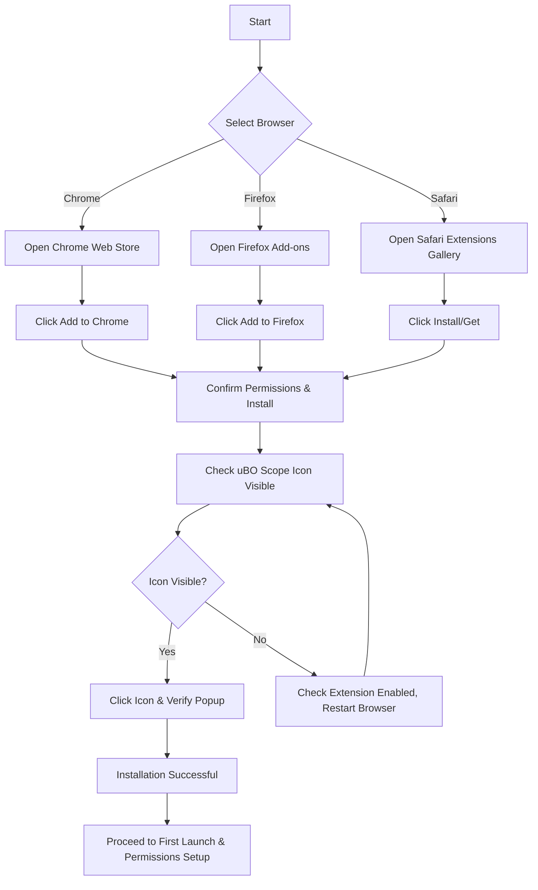

# Install uBO Scope on Your Browser

Easily install uBO Scope on your preferred browser — Chrome, Firefox, or Safari — by following these precise, browser-specific instructions. This guide provides official store links, verification tips to confirm proper installation, and highlights important platform-specific nuances that ensure a smooth setup experience.

---

## 1. Supported Browsers & Requirements

Before proceeding, confirm your system supports uBO Scope:

- **Chrome**: Version 122.0 or later.
- **Firefox**: Version 128.0 or later (including Firefox for Android).
- **Safari**: Version 18.5 or later.

<u>Note</u>: Installing uBO Scope on unsupported versions may cause errors or incomplete functionality.


## 2. Install from Official Browser Extension Stores

Installing uBO Scope through your browser’s official extension store guarantees you receive the latest secure release.

### Chrome Installation

1. Open your Chrome browser.
2. Navigate to the [Chrome Web Store uBO Scope page](https://chromewebstore.google.com/detail/ubo-scope/bbdpgcaljkaaigfcomhidmneffjjjfgp).
3. Click **Add to Chrome**.
4. Confirm by selecting **Add extension** in the prompt.

### Firefox Installation

1. Open your Firefox browser.
2. Visit the [Firefox Add-ons uBO Scope page](https://addons.mozilla.org/firefox/addon/ubo-scope/).
3. Click **Add to Firefox**.
4. Approve installation when prompted.

### Safari Installation

1. Open your Safari browser (macOS 13 Ventura or later).
2. Open the [Safari Extensions Gallery](https://apps.apple.com/app/ubo-scope/idyourapplestoreid) or the Mac App Store entry for uBO Scope (link will be published / updated).
3. Click **Install** or **Get** and authenticate if required.

> **Note**: Safari’s extension platform may require enabling uBO Scope under Safari → Settings → Extensions after installation.

## 3. Post-Installation Verification

Validating the successful installation of uBO Scope ensures the extension is active and functioning correctly.

### Visual Confirmation

- Look for the uBO Scope icon in the browser toolbar. It uses the characteristic uBlock Origin blue shield icon.

- In Chrome and Firefox, the icon may be hidden inside the extensions menu (puzzle piece icon).

- Safari shows installed extensions via its toolbar or menu bar icon.

### Badge and Popup Verification

1. Click the uBO Scope icon.
2. Confirm the popup displays “domains connected: ?” shortly after loading a web page.
3. The count updates dynamically to reflect third-party remote servers contacted by the page.

### Permissions Check

- uBO Scope requires permissions to monitor network requests (`webRequest`) and access active tabs.
- These permissions are granted automatically on install but can be verified in the browser’s extension management page.

## 4. Platform Nuances and Tips

### Permissions and Host Access

- uBO Scope requests permissions to monitor web traffic on all HTTP/HTTPS and WebSocket URLs.
- Because permissions involve sensitive data access, some browsers may require manual approval after install.

### Background Service Behavior

- In Chromium browsers, uBO Scope runs a background service worker for monitoring.
- Firefox and Safari use background scripts with specific API behaviors.

### Browser-Specific Notes

| Browser  | Notes |
|----------|-------|
| Chrome   | Minimum version is 122. Supports full webRequest API needed by uBO Scope.
| Firefox  | Supports full webRequest API from version 128. Android support included.
| Safari   | Limited to HTTP/HTTPS host permissions; WebSocket monitoring unavailable. Requires enabling in settings.

## 5. Troubleshooting Common Installation Issues

<AccordionGroup title="Troubleshooting Installation Issues">
<Accordion title="uBO Scope Icon Not Visible After Installation">
- Ensure the extension is enabled in your browser’s extension/add-ons page.
- Check if the icon is hidden inside the extensions menu or toolbar overflow area.
- Restart the browser to activate newly installed extensions.
</Accordion>
<Accordion title="Popup Does Not Load or Shows 'NO DATA'">
- Confirm you are on a valid webpage (not browser internal pages).
- Refresh the page to trigger network data collection.
- Verify that the extension has necessary permissions (see browser extension settings).
</Accordion>
<Accordion title="Browser Version Unsupported">
- Check your browser version; update to the required minimum version listed above.
- Some browsers require manual updates via system package managers or app stores.
</Accordion>
<Accordion title="Extension Fails to Install or Errors Occur">
- Confirm you are using the official store links to avoid corrupted or unauthorized versions.
- Disable conflicting extensions temporarily and retry.
- Consult the browser’s console or extension logs for errors.
</Accordion>
</AccordionGroup>

## 6. Getting Started After Installation

Once installed and verified, you can proceed to configure permissions and run your first analysis.

- Visit the [First Launch & Permission Setup](../first-launch-and-permissions) page for detailed guidance.
- Start browsing sites and click the uBO Scope icon to see real-time network connection insights.

---

## Summary

This guide enabled you to install uBO Scope securely on Chrome, Firefox, and Safari. Following the official store links, ensuring minimum browser versions, and verifying successful installation via icon presence and popup behavior are the keys to a smooth start.

Continue your journey with uBO Scope by setting up permissions and exploring live network connection data on your web pages.

---

# External Resources

- [Chrome Web Store uBO Scope](https://chromewebstore.google.com/detail/ubo-scope/bbdpgcaljkaaigfcomhidmneffjjjfgp)
- [Firefox Add-ons uBO Scope](https://addons.mozilla.org/firefox/addon/ubo-scope/)
- [uBO Scope GitHub Repository](https://github.com/gorhill/uBO-Scope)

---

# Related Documentation

- [System Requirements](../system-requirements) — Pre-installation environment checks.
- [First Launch & Permission Setup](../first-launch-and-permissions) — Configuring and giving required permissions after installation.
- [Troubleshooting Installation](../troubleshooting-installation) — Additional help resolving install issues.
- [Browser Integration & Compatibility](../../overview/how-it-works-and-architecture/integration-and-browser-support) — Technical background on browser API compatibility.


---

**Example Quick Verification:**

```steps
Step 1: Install uBO Scope from your browser’s official extension store.
Step 2: Locate the uBO Scope icon in the toolbar or extensions menu.
Step 3: Open any website; click the uBO Scope icon.
Step 4: Verify the popup displays domain connection data (a count of distinct third-party domains).
If all steps complete successfully, uBO Scope is installed and operational.
```

<Tip>
Always install extensions from official stores to ensure security and automatic updates.
</Tip>

<Warning>
Make sure your browser version meets the minimum requirements; older versions may block extension functionalities critical to uBO Scope.
</Warning>

<Info>
Remember that uBO Scope relies on the browser's `webRequest` API. Some network requests (e.g., outside the API’s scope) may not be reported.
</Info>

---

### Visual Diagram: Installation Flow



---

For a hands-on start, visit the next guide: [First Launch & Permission Setup](../first-launch-and-permissions).

---

# End of Installation Guide

---