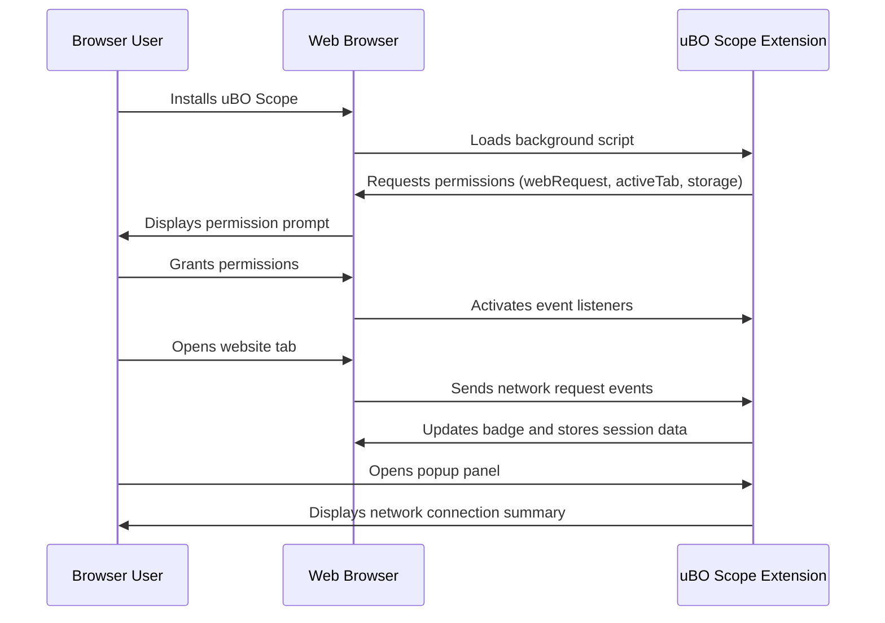

# First Launch & Permission Setup

Welcome to uBO Scope! This guide walks you through the crucial first steps after installing the extension, including handling permission prompts, enabling the extension, and verifying it is actively reporting remote server connections. Follow these clear, actionable instructions to ensure uBO Scope starts offering you its powerful network monitoring insights immediately.

---

## 1. Launching uBO Scope for the First Time

After you have installed uBO Scope through your browser’s official extension store, it is essential to complete the first launch to ensure all features activate properly.

### Step-by-Step Guide

1. **Locate the Extension Icon:**
   - Find the uBO Scope icon in your browser's toolbar. It typically appears as an orange shield with "uBO" or a similar logo.

2. **Click the Icon to Open the Popup Panel:**
   - Clicking opens the extension popup, which will try to display network connection data for the active browser tab.

3. **Wait for Initialization:**
   - The extension loads data from the background process. If the popup shows "NO DATA" or is empty initially, this is normal during the first launch.

### Outcome

- The extension background service and UI components are now initialized.
- The extension registers listeners to monitor network requests on active tabs.

## 2. Handling Permission Prompts

uBO Scope requires specific browser permissions to fully monitor and report network connections. Depending on your browser and security settings, you may be prompted to grant these permissions after installation or on first use.

### What Permissions Are Needed?

- **webRequest:** To observe network requests and their outcomes.
- **activeTab:** To access data related to the currently active browser tab.
- **storage:** To save session and configuration data persistently.

### Steps to Grant Permissions

1. **Permission Prompt Upon Installation or First Use:**
   - Your browser may display a permission prompt immediately or when you first interact with uBO Scope.

2. **Review the Permissions Request:**
   - Confirm that uBO Scope is requesting the above permissions.

3. **Click `Allow` or `Grant Access`:**
   - Approve the permissions to enable the extension to fully operate.

### Tips

- If you accidentally deny permissions, you must manually enable them through your browser’s extensions or add-ons settings.
- In some browsers, you may need to reload the active tab or restart the browser to finalize permission registration.

## 3. Verifying Extension Activation

Ensuring that uBO Scope is actively monitoring requires validating its badge and popup display.

### Step-by-Step Verification

1. **Open a Website in a Tab:**
   - Navigate to any website you wish to monitor.

2. **Check the Toolbar Badge:**
   - The uBO Scope icon badge updates with a number indicating the distinct third-party remote servers contacted by that tab.
   - A numeric badge (non-empty) confirms the extension is active and reporting.

3. **Open the Popup Panel:**
   - Click the uBO Scope icon.
   - You should see sections titled "not blocked," "stealth-blocked," and "blocked" showing domain counts and lists.

4. **Interpret the Data:**
   - The number under "domains connected" summarizes unique domains contacted.

### Troubleshooting Common Activation Issues

<AccordionGroup title="Troubleshooting Permission and Activation Issues">
<Accordion title="No Toolbar Icon or Badge Visible">
- Ensure the extension is enabled in your browser's extension manager.
- Pin the extension icon to your toolbar if it is hidden.
- Retry restarting your browser to force extension initialization.
</Accordion>

<Accordion title="Permission Prompts Do Not Appear or Were Denied">
- Go to your browser’s extension settings.
- Find uBO Scope and review its permissions.
- Manually enable required permissions (`webRequest`, `activeTab`, `storage`).
- Reload your open tabs or reboot the browser.
</Accordion>

<Accordion title="Popup Shows 'NO DATA' or Empty Information">
- Make sure you are on a website tab with network activity.
- Wait a moment; uBO Scope updates asynchronously as it observes traffic.
- Reload the tab and reopen the popup.
</Accordion>

<Accordion title="Badge Shows Zero Even on Active Sites">
- Confirm the browser version meets minimum requirements as per [System Requirements](./system-requirements).
- Verify that the extension has permission to access network requests.
- If content blockers are used, some network requests may not be visible depending on browser limits.
</Accordion>
</AccordionGroup>

## 4. Best Practices for Smooth First Use

- **Use Supported Browsers:**
  Confirm you installed uBO Scope on a supported browser and version (Chrome 122+, Firefox 128+, Safari 18.5+).

- **Grant All Requested Permissions:**
  Follow the browser prompts carefully to ensure the extension has full access for monitoring.

- **Refresh Tabs After Installation:**
  Open or reload web pages after installation to allow uBO Scope to start monitoring their network requests.

- **Close Tabs You No Longer Need:**
  uBO Scope manages session data per tab; closing tabs clears respective data.

## 5. What’s Next?

Once uBO Scope is activated and permissions granted, you can:

- Open the popup to explore domain connection summaries.
- Observe the toolbar badge counts as you browse.
- Learn to interpret connection outcomes through [Badge & Popup Overview](/overview/core-concepts/badge-and-popup-overview).
- Optimize your privacy by identifying unexpected third-party connections as detailed in [Common Use Scenarios](/overview/intended-users-and-scenarios/common-scenarios).

---

## Additional Resources

- [System Requirements & Supported Browsers](/getting-started/installation-and-setup/system-requirements)
- [Installing uBO Scope on Your Browser](/getting-started/installation-and-setup/browser-installation)
- [Understanding Badge Counts & Popup Details](/getting-started/getting-started-usage/understanding-badge-count)
- [Troubleshooting Installation Issues](/getting-started/installation-and-setup/troubleshooting-installation)

<Check>
Follow these first launch steps carefully to ensure that uBO Scope is fully enabled and delivering accurate monitoring insights. If you run into trouble, consult the troubleshooting resources or reach out via the project’s GitHub repository.
</Check>

---

# Appendix: Permission Setup Checklist

| Permission | Purpose | How to Confirm |
|---|---|---|
| `webRequest` | Monitor all network requests from webpages | Visible in browser extension's permissions list |
| `activeTab` | Access the active tab for accurate network reporting | Ensure popup shows data for active tab |
| `storage` | Save session data persistently | Confirm badge updates and popup data persist across browsing sessions |

---

# Appendix: Typical First Launch Activation Flow

This flow ensures uBO Scope is ready to monitor network traffic immediately after permissions are granted.
