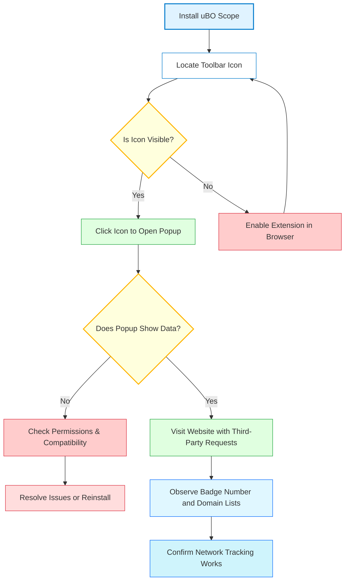

# First Launch & Verification

Welcome to uBO Scope! This guide will walk you through opening the extension for the first time, verifying that it is active in your browser, and confirming that its network tracking features work as intended. By following these steps, you will ensure that uBO Scope is correctly monitoring third-party connections on any webpage you visit.

---

## 1. Accessing uBO Scope for the First Time

Start your journey by opening uBO Scope after installation:

1. Locate the uBO Scope icon in your browser toolbar. It typically appears as a small badge or icon near the address bar.
2. Click the icon to open the popup panel.

> The popup panel displays real-time connectivity data for the active tab, revealing third-party domains your browser is communicating with.

<Info>
If you do not see the icon, ensure the extension is enabled in your browser’s extensions or add-ons manager.
</Info>

---

## 2. Verifying Extension Activation

Confirm that uBO Scope is running and ready to capture network data:

- **Check the Toolbar Badge:**
  - A numeric badge on the icon indicates the number of distinct third-party domains connected in the active tab.
  - If the badge is blank, this means no third-party connections have been detected yet.

- **Review the Popup Panel:**
  - When you open the popup, it should not show 'NO DATA'. Instead, it will list third-party domains categorized as 'not blocked', 'stealth-blocked', or 'blocked'.

<Note>
The number displayed is always the count of distinct third-party *remote servers* your current tab connects to, regardless of any content blocker. This is the core value of uBO Scope.
</Note>

---

## 3. Confirming Network Tracking Functionality

Ensure uBO Scope accurately tracks network requests as you browse:

<Steps>
<Step title="Open a familiar website">
Visit a website you browse frequently that loads content from multiple providers (e.g., news or retail sites).
</Step>
<Step title="Observe the Toolbar Badge">
Check the badge count on the uBO Scope icon; it should reflect the number of third-party domains contacted during page load.
</Step>
<Step title="Open the Popup and Inspect Details">
Click the toolbar icon to open the popup panel.

- The section headers 'not blocked', 'stealth-blocked', and 'blocked' categorize connection outcomes.
- Domains listed under these categories represent actual third-party network requests.
</Step>
<Step title="Interact with the Page">
Navigate links or refresh the page to see the badge count and domain lists update dynamically.
</Step>
</Steps>

<Warning>
Some webpages or network requests might be delayed or blocked by other extensions or browser settings, which can affect counts temporarily.
</Warning>

---

## 4. Understanding the Toolbar Badge and Popup Display

- **Badge Number:** Shows the number of unique third-party domains your current tab connected to.
- **Popup Sections:**
  - **Not Blocked:** Domains that successfully delivered content.
  - **Stealth-Blocked:** Domains where requests were silently redirected or hidden by content blockers.
  - **Blocked:** Domains explicitly blocked or requests that failed.

> This classification helps you get an unbiased, real-world view of actual network activity during browsing.

---

## 5. Troubleshooting Common Verification Issues

If uBO Scope does not appear active or is not showing connection data:

- **Extension Not Enabled:** Go to your browser's extension manager and enable uBO Scope.
- **Browser Compatibility:** Confirm your browser and version meet minimum requirements (Chromium 122+, Firefox 128+, Safari 18.5+).
- **Permissions:** Ensure the extension has permission to access webRequest APIs and active tabs.
- **Badge Not Updating:** Refresh the page or open a new tab. Network requests outside the `webRequest` API's reach may not be captured.
- **Conflicts with Other Extensions:** Some content blockers or privacy tools might interfere. Temporarily disable them to test.

<Tip>
After installation, allow an initial page load on a common website to let uBO Scope register and display data.
</Tip>

---

## 6. Next Steps

With successful verification:

- Explore the [Basic Configuration](/getting-started/usage-and-troubleshooting/basic-configuration) guide to customize uBO Scope.
- Learn to interpret connection data in the [Interpreting the Popup and Domain Connections](/guides/getting-started/first-insights) page.
- Review the [Quick Validation Steps](/getting-started/usage-and-troubleshooting/quick-validation-steps) for ongoing confidence.

---

## Additional Resources

- [Installing uBO Scope](/getting-started/installation-and-setup/installation-instructions)
- [Prerequisites & System Requirements](/getting-started/installation-and-setup/prerequisites-system-requirements)
- [Troubleshooting Common Issues](/getting-started/usage-and-troubleshooting/troubleshooting-common-issues)

---

## Summary Diagram: Verification Workflow

---

Congratulations on successfully confirming that uBO Scope is installed and actively monitoring your web traffic! Continue to the configuration and usage guides to deepen your understanding and control of your browsing privacy.
