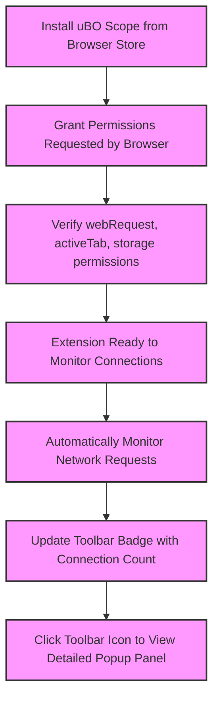

# Initial Configuration & Permissions

Welcome to the initial configuration guide for uBO Scope. After installing the extension, this guide will walk you through the minimal but essential setup steps required to enable uBO Scope to begin monitoring all remote server connections effectively. You will also get acquainted with the extension's toolbar icon and understand the meaning of its initial badge count.

---

## 1. Understanding Required Permissions

uBO Scope relies on specific browser permissions to monitor network requests and report connections to various remote servers. These permissions are declared in the extension’s manifest files for different browsers and are essential for its operation.

### Key Permissions Overview

- **webRequest**: Enables the extension to listen to and analyze network requests made by your browser.
- **activeTab**: Allows the extension to interact with the currently active browser tab.
- **storage**: Provides local and session storage to save connection data and session states.
- **host_permissions**: Grants access to all HTTP and HTTPS URLs (`http://*/*` and `https://*/*`), and also WebSocket protocols (`ws://*/*` and `wss://*/*`) on Chromium and Firefox.

> These permissions empower uBO Scope to precisely capture all connection attempts and status for third-party remote servers, independent of content blockers. 

<Tip>
If any of these permissions are missing, uBO Scope will not function correctly. The browser typically prompts you to accept these during installation or first-time use.
</Tip>

---

## 2. Granting WebRequest Permissions After Installation

### Step 1: Complete Installation via Your Browser's Extension Store

- Install uBO Scope from your browser's official extension marketplace (Chrome Web Store, Firefox Add-ons, or Safari Extensions gallery).
- Once installed, the browser will prompt you to grant the necessary permissions as part of enabling the extension.
- Accept and confirm these permission requests to allow uBO Scope full access.

### Step 2: Verify Permissions

- Depending on your browser, navigate to the extension management page.
  - **Chrome/Chromium**: `chrome://extensions/` → Find uBO Scope → Click 'Details'.
  - **Firefox**: `about:addons` → Find uBO Scope → Click 'Preferences' or 'Permissions'.
  - **Safari**: Safari menu → Preferences → Extensions → uBO Scope.

- Confirm that uBO Scope has permissions for “Access your data on all websites” or equivalent, corresponding to the `webRequest` and `host_permissions`.

<Tip>
If you deny these permissions at installation, the extension will not capture network requests. You can re-enable by removing and reinstalling the extension or adjusting permissions via browser settings.
</Tip>

---

## 3. Accessing and Understanding the Toolbar Icon

After granting permissions, uBO Scope will be ready to monitor network activity. This section helps you get oriented with its browser toolbar icon.

### Toolbar Icon Appearance

- The icon uses the uBO Scope logo in multiple resolutions (16x16 up to 128x128 pixels) and appears at your browser’s extension toolbar.
- Hovering over the icon shows the default tooltip titled 'uBO Scope'.

### Badge Count Meaning

- The number displayed on the icon badge represents the count of **distinct third-party remote servers** your active browser tab has connected to.
- A **lower badge count** indicates fewer distinct third-party connections, which is usually more desirable for privacy and minimal tracking.
- The badge count updates in real-time as new connections are detected or as connections are blocked.

<Info>
Remember, uBO Scope measures distinct third-party domains contacted, not the number of blocked requests. This offers transparent insight beyond traditional block count metrics.
</Info>

---

## 4. Initial Badge Count and What to Expect

- Upon the first load of any website, the badge may show **0** or remain blank if no third-party connections have occurred yet.
- As the page loads resources from third-party servers, the badge number increases reflecting those unique domains.
- If you open uBO Scope's popup panel (click the icon), you see detailed breakdowns of "allowed", "stealth-blocked", and "blocked" connections.

---

## 5. Verifying that uBO Scope Is Monitoring Connections

Follow these steps to confirm that uBO Scope has been properly configured and is actively monitoring:

<Steps>
<Step title="Open uBO Scope Popup Panel">
Click the uBO Scope icon in your browser toolbar to open the popup panel. This panel displays network connection summaries for the active tab.
</Step>
<Step title="Browse a Website with Multiple Resources">
Navigate to a common website, such as a news or social media site, that loads content from several domains.
</Step>
<Step title="Observe Badge Count and Popup Data">
You should see the toolbar badge update to reflect the number of distinct third-party domains.

In the popup panel, review the domains listed under "not blocked", "stealth-blocked", and "blocked" sections.
</Step>
</Steps>

<Check>
If you see real-time updates in the badge count and domain lists, uBO Scope is correctly monitoring your network connections.
</Check>

---

## 6. Best Practices and Common Pitfalls

### Best Practices

- Ensure your browser is updated to the minimum required version to support manifest v3 and the `webRequest` permission properly:

  - **Chrome**: Version 122 or higher
  - **Firefox**: Version 128 or higher
  - **Safari**: Version 18.5 or higher

- Always install uBO Scope from official trusted extension marketplaces.

- Keep your browser security settings at default or stricter levels to avoid inadvertently limiting extension permissions.

### Common Pitfalls

- **Delayed Permission Prompts:** Sometimes browsers delay showing permission requests. Check extension settings if monitoring seems inactive.

- **Disabled Extensions:** If you disable the extension or remove necessary permissions, uBO Scope will stop capturing data.

- **Conflicting Extensions:** Other extensions with overlapping permissions might interfere with webRequest listeners. Try disabling others for testing.

<Warning>
Do not manually disable the webRequest permission post-installation; this will prevent uBO Scope from functioning.
</Warning>

---

## 7. Troubleshooting Tips

- If the toolbar badge does not update after visiting websites:

  - Refresh the page to trigger new network requests.
  - Confirm the extension has full permissions (see Section 2).
  - Restart your browser.
  - Disable other content blocking extensions that might interfere.

- If the popup shows "NO DATA" or no domains listed:

  - Make sure the current tab is a valid webpage with network activity.
  - Reload the tab and check the badge count.

- For Safari, verify your Safari is at least version 18.5 due to specific browser permission and manifest requirements.

---

## 8. Additional Resources

To deepen your understanding and continue your setup journey, review these related guides:

- [Installation on Supported Browsers](../installation-and-setup/installation-on-supported-browsers) — covers installation steps per browser with verification details.
- [Making Your First Run](../first-steps-and-validation/making-your-first-run) — how to perform an initial use case and validate monitored connections.
- [Interpreting the Badge and Popup Panel](../../guides/getting-started-usage/interpreting-badge-popup) — detailed explanation of visual indicators.
- [Troubleshooting Common Setup Issues](../first-steps-and-validation/troubleshooting-setup-issues) — more help if you run into unexpected behavior.

---

## 9. Summary

Once you have completed this initial configuration and permission setup, uBO Scope will be fully empowered to independently monitor every network request in your browser. The badge on the toolbar and the popup panel will provide real-time visibility of all third-party connections, supporting your goals for transparency and privacy.

<Note>
This configuration is minimal yet foundational—there are no complex settings needed post-installation except maintaining these granted permissions.
</Note>

---

# Visual Overview of Initial Flow



---

## Code and Permission Reference

To provide transparency on how permissions enable uBO Scope’s monitoring capabilities, here is an excerpt from the manifest files (common to Firefox, Chrome, and Safari):

```json
{
  "permissions": ["activeTab", "storage", "webRequest"],
  "host_permissions": [
    "https://*/*",
    "http://*/*",
    "wss://*/*",        // Chromium and Firefox only
    "ws://*/*"          // Chromium and Firefox only
  ]
}
```

These entries explicitly grant access for the extension to observe all HTTP/S and WebSocket requests, vital for capturing all relevant network events.


---

## Closing Notes

Your proactive permission granting and understanding of the badge and popup will unlock the true power of uBO Scope. Enjoy enhanced visibility of your browsing connections, independent from content blockers and other extensions.

If you need further assistance, proceed to the [Troubleshooting Common Setup Issues](../first-steps-and-validation/troubleshooting-setup-issues) page or access support via the GitHub repository homepage.


---