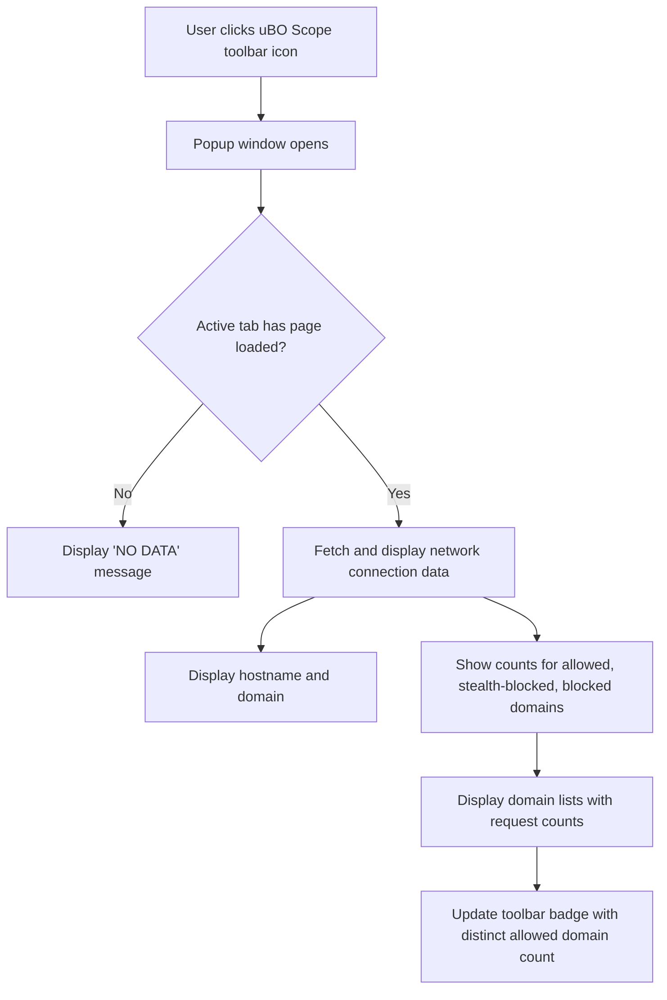

# Initial Launch and Configuration

Welcome to uBO Scope! This guide walks you through what to expect the first time you open the extension, how to interact with its popup interface, confirm that reporting is active, and perform basic configuration steps. You'll learn to verify that uBO Scope is actively capturing and reporting the distinct remote server connections your browser makes.

---

## 1. Opening uBO Scope's Popup Interface

**uBO Scope** primarily interacts with you through its popup panel accessible from the toolbar.

### Steps to Open the Popup:

1. Locate the uBO Scope icon in your browser's toolbar. It uses the extension’s logo and may display a badge showing a count of connected domains.
2. Click the icon once. This opens the popup panel.

**Expected Outcome:**
- The popup window titled `uBO-Scope` opens.
- You see a header showing the hostname of the current active tab in your browser.
- Below the header, three main sections appear, listing domain connection statuses:
  - **Not Blocked**
  - **Stealth-Blocked**
  - **Blocked**
- At the top, a summary displays the count of distinct connected domains.

<Tip>
If the popup shows 'NO DATA' or remains blank, switch to a tab with an active webpage loaded, then reopen the popup.
</Tip>

## 2. Understanding the Popup Interface

The popup provides a clear, categorized snapshot of network connections initiated by the current tab:

- **Hostname Header**: Shows the exact hostname and domain of the current page.
  - The domain is the base registrable domain, e.g., `example.com`.
  - Any subdomain prefix is separated and shown distinctly.

- **Summary Count**: Displays the number of distinct domains your browser connected to during this session.

- **Three Outcome Sections:**
  - **Not Blocked**: Domains your browser successfully connected to.
  - **Stealth-Blocked**: Domains where connections were silently blocked or redirected.
  - **Blocked**: Domains where requests were explicitly blocked and failed.

- Each section lists domains alongside the number of requests seen.

<Tip>
Hover over or consult the interface to differentiate between legitimate third-party connections (like CDNs) and potentially unwanted calls.
</Tip>

## 3. Confirming Permissions and Reporting Activation

uBO Scope relies on browser permissions to monitor network requests.

### What Permissions Are Required?

- `webRequest`: To observe requests and their outcomes.
- `storage`: To save session data and state.
- `activeTab`: To identify and track the current tab’s domain requests.

These are requested automatically upon installation.

### How to Verify Reporting is Working:

1. Open uBO Scope popup on an active tab.
2. Confirm that domains appear in the allowed or blocked lists.
3. Check that the toolbar icon badge displays a numeric count when you navigate or reload pages.

<Tip>
If the badge remains empty and the popup shows no data after browsing to various pages, verify that you have allowed permissions and that no other browser settings (e.g., strict privacy mode) block webRequest events.
</Tip>

## 4. Basic Configuration and Setup

uBO Scope is designed to work with minimal setup and does not require a dedicated configuration UI at initial launch.

### Recommended Best Practices:

- After installation, browse to different websites and open the popup to observe collected network data.
- Understand that the badge count reflects distinct third-party domains your browser connected to, informing you of your network exposure.
- No manual configuration is required to start using uBO Scope effectively.

## 5. Verifying Network Connections Capture

Confirm uBO Scope is effectively capturing domain connections with this simple test:

<Steps>
<Step title="Navigate to a Known Website">
Open a common website such as https://example.com or your favorite news site.
</Step>
<Step title="Open uBO Scope Popup">
Click the toolbar icon to open the popup and wait a moment for data to populate.
</Step>
<Step title="Check Domain Counts and Lists">
Verify that domains under 'Not Blocked' show up, representing successful connections initiated by the page.
</Step>
<Step title="Reload the Page and Re-check">
Reload the page to trigger a fresh connection set and confirm the badge count updates and the popup shows updated domain connection data.
</Step>
</Steps>

<Check>
If no domains appear or the popup shows "NO DATA" across multiple active tabs, please consult the [Troubleshooting Common Issues](https://example.com/getting-started/first-steps-and-troubleshooting/troubleshooting-common-issues) guide.
</Check>

## 6. Common Initial Pitfalls and Tips

- **Popup showing no data:** Ensure you are on a tab with a webpage loaded. uBO Scope does not show data for empty or internal browser pages.
- **Badge count not showing:** Some browsers restrict background webRequest APIs — verify your browser version complies with the [System and Browser Requirements](https://example.com/getting-started/introduction-and-requirements/system-and-browser-requirements).
- **Permissions denied:** Reinstalling or adjusting extension permissions in browser settings may be necessary if permissions were declined.

<Warning>
Ensure you installed uBO Scope from official sources only, following guidance in the [Install from Official Sources](https://example.com/getting-started/installation-and-setup/install-from-official-sources) documentation to avoid tampered versions.
</Warning>

## 7. Next Steps

- After confirming initial launch and reporting, explore advanced interpretations by reading the [Understanding the Popup Panel and Toolbar Badge](https://example.com/guides/getting-started/understanding-popup-and-badge) guide.
- If you encounter issues, consult the [Troubleshooting Common Issues](https://example.com/getting-started/first-steps-and-troubleshooting/troubleshooting-common-issues).
- Begin analyzing your browsing privacy exposure using uBO Scope’s unique insights.

---

## Appendix: UI Overview Diagram

---

For detailed background on how uBO Scope tracks these connections behind the scenes, see the [System Architecture Diagram](https://example.com/overview/understanding-architecture-concepts/system-architecture-diagram).

You are now ready to confidently use uBO Scope to reveal your browser's network connections and make informed privacy decisions.

---

*All contents of this guide pertain exclusively to the initial launch and configuration experience of uBO Scope.*

---