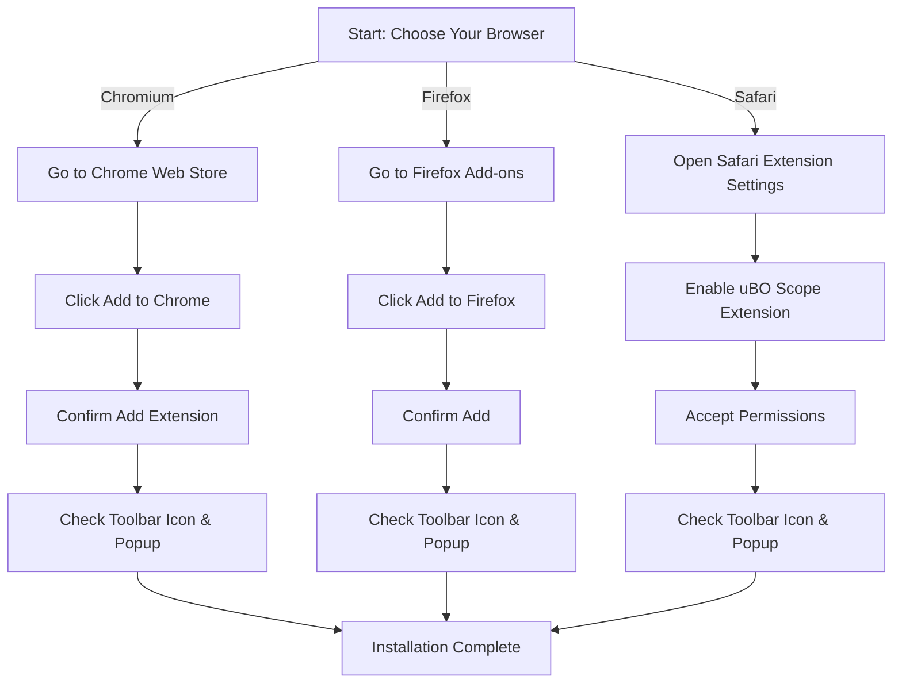

# Installing uBO Scope

Get started quickly by installing the uBO Scope extension on your preferred browser. This guide provides detailed, step-by-step instructions for Chrome (Chromium-based browsers), Firefox, and Safari, along with important tips to confirm successful installation and activation.

---

## 1. Installation Overview

uBO Scope is available through official browser extension stores for Chromium-based browsers, Firefox, and Safari. Installing via these stores ensures you get authentic, secure, and up-to-date versions. Follow the instructions specific to your browser below.

---

## 2. Installing on Chromium-Based Browsers (Chrome, Edge, Brave, etc.)

### Step 1: Open the Chrome Web Store

- Visit the [uBO Scope Chrome Web Store page](https://chrome.google.com/webstore/detail/ubo-scope/bbdpgcaljkaaigfcomhidmneffjjjfgp).

### Step 2: Add uBO Scope to Your Browser

- Click **Add to Chrome** (or respective button for your Chromium browser).
- Confirm the addition by clicking **Add extension** in the prompt.

### Step 3: Confirm Extension Installation

- After installation, you should see the uBO Scope icon appear in your browser toolbar, featuring the uBO Scope logo.
- The icon acts as your access point to the extension’s popup UI.

### Tips to Verify Successful Installation

- Click the uBO Scope icon, and the popup should open showing "domains connected" and three sections labeled “not blocked,” “stealth-blocked,” and "blocked".
- If the popup shows "NO DATA," refresh your current tab or navigate to a new webpage.

<Check>
Make sure your Chromium browser version is 122 or higher; earlier versions may not support uBO Scope's functionality.
</Check>

---

## 3. Installing on Mozilla Firefox

### Step 1: Visit Firefox Add-ons

- Go to the official uBO Scope page on Firefox Add-ons: [https://addons.mozilla.org/firefox/addon/ubo-scope/](https://addons.mozilla.org/firefox/addon/ubo-scope/)

### Step 2: Add to Firefox

- Click **Add to Firefox**.
- Confirm any permission prompts by clicking **Add**.

### Step 3: Check Extension Activation

- Confirm that the uBO Scope icon appears in the Firefox toolbar.
- Click the icon to open the popup interface, which displays connection data.

### Verification Tips

- Firefox version must be 128 or higher for compatibility.
- If you don't see the extension icon, check the hamburger menu (three lines), go to **Add-ons and themes > Extensions**, and enable uBO Scope manually.

<Warning>
Firefox's strict privacy settings or custom security configurations might block extension functionality. Ensure permissions are granted during installation.
</Warning>

---

## 4. Installing on Safari (macOS)

### Step 1: Confirm Safari Version

- Ensure your macOS is running Safari 18.5 or later; earlier versions do not support uBO Scope.

### Step 2: Install via Safari Extensions

- Open Safari, then go to **Safari > Settings > Extensions**.
- Search for "uBO Scope" in the Extensions list or visit the official extension page if available.
- Click **Install** or **Enable**.

### Step 3: Enable Permissions

- After enabling, verify any permission dialogs and accept access requests for full functionality.

### Step 4: Confirm Extension Activation

- The uBO Scope icon should appear in Safari's toolbar.
- Click the icon to open the popup and view connection reports.

<Note>
Safari restricts webRequest API capabilities compared to Chromium and Firefox, but uBO Scope fully supports necessary permissions starting with Safari 18.5.
</Note>

---

## 5. Recognizing Successful Installation

After adding uBO Scope to your browser, ensure it is correctly installed and running:

- The extension icon (featuring the uBO Scope logo) appears in your browser toolbar.
- Click the icon to open the popup interface.
- The popup displays connection statuses under three categories: **not blocked**, **stealth-blocked**, and **blocked** with corresponding domain counts.
- The badge number on the toolbar icon indicates the count of distinct third-party remote servers successfully connected.

If these elements appear and update while browsing, your installation succeeded.

---

## 6. Common Installation Tips

- **Extension Permissions:** Make sure to allow all requested permissions for uBO Scope, especially access to webRequest and active tab permissions.
- **Browser Version:** Keep your browser updated to meet minimum version requirements (Chrome 122+, Firefox 128+, Safari 18.5+).
- **Toolbar Icon Missing:** Check your browser's extension or add-on management menu to enable the icon display.
- **Private or Incognito Mode:** Manually enable uBO Scope to run in private or incognito browsing if needed.

---

## 7. Troubleshooting Installation Issues

<AccordionGroup title="Troubleshooting Installation Issues">
<Accordion title="Extension Icon Does Not Appear">
- Check your browser's extension settings to confirm uBO Scope is enabled.
- Pin the extension to the toolbar if it is hidden.
- Restart your browser and try again.
</Accordion>
<Accordion title="Installation Button is Disabled">
- Verify you are using a supported browser version.
- Check network connectivity.
- Clear browsing cache and reload the extension store page.
</Accordion>
<Accordion title="Extension Fails to Load or Shows Errors">
- Disable conflicting extensions temporarily.
- Ensure no restrictive policies or security software blocks extension installation.
- Refer to the [Troubleshooting Common Issues](../../getting-started/configuration-and-troubleshooting/common-issues-troubleshooting) guide for detailed help.
</Accordion>
</AccordionGroup>

---

## 8. Next Steps After Installation

- Visit the [First Run & Extension Verification](../installation-and-setup/first-run-and-verification) guide to verify your installation by running uBO Scope on live webpages.
- Explore the [Understanding the Popup](../../guides/core-workflows/understanding-the-popup) guide to learn how to interpret the connection data shown.
- Review the [Prerequisites & System Requirements](../installation-and-setup/prerequisites-and-requirements) if you encounter compatibility issues.

---

## 9. Summary

Installing uBO Scope is straightforward and quick on supported browsers through official extension stores. Confirm installation by validating the presence of the toolbar icon and the functioning popup interface. Proper permissions and browser updates ensure optimal performance.

For ongoing use, familiarize yourself with the popup UI and connection reporting to harness uBO Scope’s full value as a network connections visibility tool.

---

## References

- [Chrome Web Store: uBO Scope](https://chrome.google.com/webstore/detail/ubo-scope/bbdpgcaljkaaigfcomhidmneffjjjfgp)
- [Firefox Add-ons: uBO Scope](https://addons.mozilla.org/firefox/addon/ubo-scope/)
- [Safari Extensions and Permissions Guide](https://support.apple.com/en-us/HT209222)
- Related Docs:
  - [Prerequisites & System Requirements](../installation-and-setup/prerequisites-and-requirements)
  - [First Run & Extension Verification](../installation-and-setup/first-run-and-verification)
  - [Understanding the Popup](../../guides/core-workflows/understanding-the-popup)
  - [Troubleshooting Common Issues](../configuration-and-troubleshooting/common-issues-troubleshooting)

---

## Visual Aid: Quick Browser Install Flow

