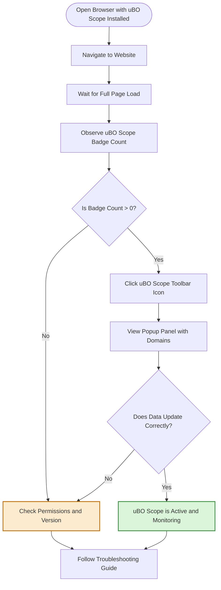

# Quick Validation Steps

Ensure your uBO Scope extension is properly installed and actively monitoring your browser's network connections with these quick validation steps. This guide will walk you through opening a webpage, checking the badge count, and interpreting the popup interface to confirm everything is functioning as expected.

---

## 1. Open a Website to Trigger Network Monitoring

- Launch your browser where uBO Scope is installed.
- Navigate to a commonly visited website, such as your favorite news site or any content-rich page.
- Allow the page to fully load to ensure network activity is complete.

<Tip>
Choosing a popular website with diverse third-party content like CDNs or analytics providers typically triggers several network requests, providing a meaningful badge count.
</Tip>

## 2. Observe the uBO Scope Badge Counter

- Look for the uBO Scope icon in your browser's toolbar.
- The badge will display a number indicating the count of **distinct third-party remote servers** your page connected to.

### What the Badge Means:
- A **non-zero number** means uBO Scope is actively tracking network connections.
- A **lower count** generally reflects fewer third-party connections, often indicating tighter privacy controls.
- An **empty badge** suggests no relevant third-party connections were detected or the extension may not be running correctly.

<Warning>
If the badge remains empty after visiting various websites, confirm that uBO Scope has the necessary permissions and that the browser version meets minimum requirements.
</Warning>

## 3. Open the uBO Scope Popup Panel

- Click the uBO Scope toolbar icon to open the popup.
- The popup displays a summary and details of network connection outcomes for the active tab.

### Popup Interface Overview:
- **Hostname Header:** Shows the current tab's hostname and domain.
- **Domains Connected:** Displays the count of unique domains connected.
- **Allowed:** Lists third-party domains that the browser connected to successfully.
- **Stealth-Blocked:** Lists domains where connections were stealth-blocked (requests redirected or modified in a way making connection unclear).
- **Blocked:** Lists domains where connections were actively blocked.

### Example:
```
domains connected: 5

not blocked
cdn.example.com – 12
analytics.tracker.com – 3

stealth-blocked
ads.network.com – 1

blocked
malicious.site.com – 0
```

<Tip>
The badge count corresponds primarily to the number of unique domains in the "not blocked" category.
</Tip>

## 4. Verify Connection Data Matches Expectations

- Confirm the domain list in the popup updates as you browse different websites.
- When visiting highly dynamic pages, expect the allowed list to grow and the badge count to reflect new connections.
- If the popup shows no data or seems stale, try refreshing the page or restarting the browser.

## 5. Troubleshooting Quick Validation

If validation steps fail or results seem inconsistent, consider:

- Ensuring your browser version meets the extension's minimum version requirements (Chrome ≥ 122, Firefox ≥ 128, Safari ≥ 18.5).
- Checking that uBO Scope is enabled and granted permissions to access web requests for the visited URLs.
- Verifying there are no conflicting extensions that block or interfere with uBO Scope's monitoring.
- Confirming network activity in developer tools or other browser monitoring tools to rule out network issues.

Refer to the [Troubleshooting Installation & Setup guide](/getting-started/installation-and-setup/troubleshooting) if problems persist.

---

## Summary

Following these steps helps you confidently verify that uBO Scope is active and correctly capturing network connection data in your browser. This quick validation ensures you can proceed with meaningful analysis and benefit from the extension's insights.

---

## Next Steps

- Explore how to interpret the popup data in detail with the [Understanding the Popup and Badge guide](/guides/getting-started-essentials/understanding-the-popup).
- Learn installation details and completion steps in [Installing uBO Scope](/getting-started/installation-and-setup/installation).
- For common issues, see [Troubleshooting Installation & Setup](/getting-started/installation-and-setup/troubleshooting).

---

## Additional Resources

- [What is uBO Scope?](/getting-started/introduction-and-prerequisites/product-overview)
- [Browser Integration & Compatibility](/overview/core-concepts-architecture/browser-integration)
- [Debunking Adblock Test Myths](/guides/practical-analysis-workflows/debunk-adblock-test-myths)


---

# Example User Flow for Quick Validation



---

This quick and actionable approach empowers you to verify your installation and begin leveraging uBO Scope's valuable insights into your browser's third-party network activity immediately.
