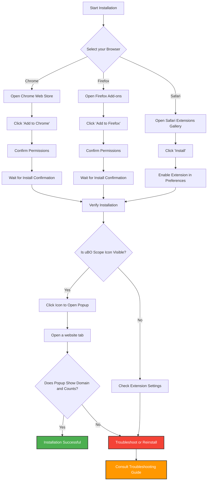

# Install uBO Scope

This guide walks you through the installation of uBO Scope, a privacy-focused browser extension that reveals all outgoing network connections initiated by webpages. You'll learn how to install uBO Scope quickly and securely from official browser stores across Chrome, Firefox, and Safari, and verify the installation was successful.

---

## 1. Before You Begin

Before installing uBO Scope, ensure your browser and system meet the necessary requirements:

- **Supported Browsers:**
  - **Google Chrome** (version 122.0 or newer)
  - **Mozilla Firefox** (version 128.0 or newer)
  - **Apple Safari** (version 18.5 or newer)

- **Permissions Needed:**
  - The extension requires permission to monitor web requests (`webRequest`), access active tabs, and use local storage. These permissions will be requested during install.

- **Source:** Install only from the official browser extension stores to guarantee security and authenticity.

For detailed prerequisites, see the [Prerequisites & Supported Browsers](/getting-started/installation-basics/prerequisites-supported-platforms) page.

---

## 2. Installing uBO Scope

Follow the steps appropriate for your browser to install the extension safely.

### A. Google Chrome

1. Open the Chrome Web Store page for uBO Scope:
   
   [uBO Scope on Chrome Web Store](https://chromewebstore.google.com/detail/ubo-scope/bbdpgcaljkaaigfcomhidmneffjjjfgp)

2. Click the **Add to Chrome** button.
3. Review the requested permissions and click **Add extension**.
4. Wait for confirmation that uBO Scope has been installed.

### B. Mozilla Firefox

1. Open the Firefox Add-ons page for uBO Scope:

   [uBO Scope on Firefox Add-ons](https://addons.mozilla.org/firefox/addon/ubo-scope/)

2. Click **Add to Firefox**.
3. When prompted, review the permissions and click **Add**.
4. Confirm the extension is installed after Firefox displays a success message.

### C. Apple Safari

> **Important:** Safari requires at least version 18.5 to support uBO Scope.

1. Visit the Safari Extensions Gallery or Apple's App Store and search for **uBO Scope**.
2. Click **Get** or **Install** to add the extension.
3. Open **Safari Preferences > Extensions** and enable uBO Scope.
4. Confirm via Safari that the extension is active.

---

## 3. Verifying Successful Installation

Once installed, confirm uBO Scope is active and monitoring your browser connections:

1. Look for the **uBO Scope icon** in your browser’s toolbar. It typically looks like a magnifying glass over a network icon.

2. Click the icon to open the uBO Scope popup panel.

3. Open any website in a browser tab. The uBO Scope popup panel should:
   - Display the domain of the active tab.
   - Show a count of connected third-party domains.
   - List domains categorized as "not blocked," "stealth-blocked," and "blocked."

4. The toolbar badge should show a numeric count representing distinct third-party domains connected by the tab.

<Tip>
If after installation the popup shows "NO DATA" or remains empty, try refreshing the current tab or opening a new tab and revisiting a website.
</Tip>

---

## 4. Troubleshooting Installation Issues

If you encounter problems during the installation or verification steps, consider the following:

- **Extension Icon Not Visible:**
  - Check your browser’s extension toolbar or overflow menu.
  - In Chrome and Firefox, right-click the toolbar and select "Pin" or "Show" uBO Scope.
  - In Safari, ensure the extension is enabled in Preferences.

- **Permissions Denied:**
  - You may have declined essential permissions; reinstall the extension and accept permissions.

- **Unsupported Browser Version:**
  - Confirm your browser's version meets minimums. Update your browser if needed.

- **Conflicts with Other Extensions:**
  - Temporarily disable other privacy or security extensions to identify conflicts.

See [Troubleshooting Setup Issues](/getting-started/setup-support/troubleshooting-setup) for detailed problem resolution guidance.

---

## 5. What’s Next?

After installing uBO Scope, you can:

- Learn how to **launch and open the popup panel** for your first analysis by visiting [Launching uBO Scope](/getting-started/first-run-and-configuration/starting-extension).
- Try a quick validation of uBO Scope’s data collection using the guide [Performing a Quick Validation](/getting-started/first-run-and-configuration/quick-usage-validation).
- Explore advanced use cases and interpret the data displayed by reading [Popup Panel and Badge Explained](/overview/feature-overview-usage/popover-and-badge).

By installing uBO Scope, you empower yourself with transparency on third-party connections that typical content blockers do not reveal, giving you deeper insight into your online privacy.

---

## References

- Official uBO Scope repository for updates and source code: [https://github.com/gorhill/uBO-Scope](https://github.com/gorhill/uBO-Scope)
- Related Documentation:
  - [Prerequisites & Supported Browsers](/getting-started/installation-basics/prerequisites-supported-platforms)
  - [Launching uBO Scope](/getting-started/first-run-and-configuration/starting-extension)
  - [Troubleshooting Setup Issues](/getting-started/setup-support/troubleshooting-setup)

---

## Visual Overview of Installation Flow

---

Thank you for choosing uBO Scope. Your journey towards greater browsing transparency starts here.
