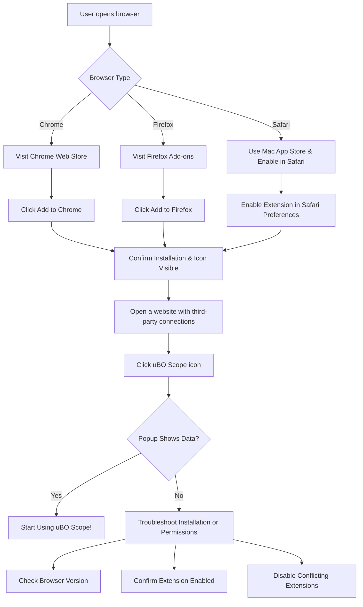

# Installing uBO Scope

Get uBO Scope up and running quickly by following these precise instructions for Chrome, Firefox, and Safari browsers. This guide walks you through installing the extension from official stores, verifying successful installation, and troubleshooting common issues.

---

## 1. Before You Begin: Quick Checklist

- **Supported Browsers:**
  - Google Chrome (version 122 or later)
  - Mozilla Firefox (version 128 or later)
  - Safari (version 18.5 or later)
- **Permissions Required:** The extension requires permissions to access active tabs, storage, and the `webRequest` API.
- **Stable Internet Connection:** Needed to download the extension from browser stores.

<Tip>
Make sure your browser is up to date to avoid compatibility issues during installation.
</Tip>

---

## 2. Installing uBO Scope in Chrome

### Step 1: Navigate to the Chrome Web Store

Open Google Chrome and visit the official uBO Scope page at the [Chrome Web Store](https://chrome.google.com/webstore/detail/ubo-scope/bbdpgcaljkaaigfcomhidmneffjjjfgp).

### Step 2: Add the Extension

- Click **Add to Chrome**.
- In the confirmation prompt, click **Add extension**.

### Step 3: Wait for Installation

Chrome will download and install the uBO Scope extension automatically.

### Step 4: Confirm Installation

- A uBO Scope icon will appear in the browser toolbar.
- Hovering over the icon shows the tooltip 'uBO Scope'.

### Step 5: Verify Functionality

- Click the icon to open the popup panel.
- The panel should display your current tab hostname and connected third-party domains.

<Tip>
If the toolbar icon is not visible, click the puzzle piece Extensions icon and pin 'uBO Scope' for easier access.
</Tip>

---

## 3. Installing uBO Scope in Firefox

### Step 1: Open Firefox Add-ons Store

Go to the [Firefox Add-ons page for uBO Scope](https://addons.mozilla.org/firefox/addon/ubo-scope/).

### Step 2: Install the Add-on

- Click **Add to Firefox**.
- Approve the requested permissions by clicking **Add** in the prompt.

### Step 3: Installation Complete

Firefox will install uBO Scope and display its icon in the toolbar.

### Step 4: Confirm Installation

- The uBO Scope icon should appear on your toolbar with its distinctive design.
- Clicking the icon opens the popup showing connection data.

<Tip>
If you don’t see the icon, open the menu bar, select **Customize Toolbar**, and drag uBO Scope to your toolbar.
</Tip>

---

## 4. Installing uBO Scope in Safari

### Step 1: Open the Mac App Store

In Safari, navigate to the official uBO Scope extension or check availability through the Mac App Store.

### Step 2: Install Extension

- Follow the prompts to download and install uBO Scope.

### Step 3: Enable the Extension

- Open **Safari > Preferences > Extensions**.
- Enable 'uBO Scope' by checking its box.

### Step 4: Verify Installation

- Look for the uBO Scope icon near the address bar.
- Click the icon to open the popup and view connection information.

<Warning>
Safari requires extension permissions to be manually enabled after installation. The extension won’t function unless explicitly enabled.
</Warning>

---

## 5. Post-Installation Verification

After installing uBO Scope in any browser:

1. Open any website that loads third-party content (e.g., a news or shopping site).
2. Click the uBO Scope toolbar icon.
3. Ensure the popup displays the number of connected third-party domains under **domains connected**.

<Tip>
A lower count is generally better, indicating fewer distinct third-party connections.
</Tip>

If you see **NO DATA** or an empty popup, proceed to troubleshooting.

---

## 6. Common Installation Issues & Troubleshooting

<AccordionGroup title="Troubleshooting Installation Issues">
<Accordion title="Issue: Extension Icon Does Not Appear">
- Confirm the extension is installed in the browser's extension manager.
- Restart the browser after installation.
- Check toolbar customization to ensure the icon is visible.
- In Firefox, use 'Customize Toolbar' to add the icon manually.
</Accordion>
<Accordion title="Issue: Popup Shows No Data or NO DATA Message">
- Reload the active tab to allow uBO Scope to capture network requests.
- Verify that you are on a page that makes third-party network connections.
- Ensure other content blockers do not interfere with webRequest API reporting.

If the problem persists, disable conflicting extensions and test again.
</Accordion>
<Accordion title="Issue: Installation Fails or Extension is Disabled"
>
- Check if your browser meets the minimum version requirements (Chrome 122+, Firefox 128+, Safari 18.5+).
- Ensure your system's policies or antivirus software do not block extension installation.
- Try reinstalling the extension after restarting the browser.
- For Safari, always manually enable the extension in Safari Preferences.
</Accordion>
</AccordionGroup>

---

## 7. Advanced: Building uBO Scope Locally for Firefox

For technical users who want to compile and package uBO Scope manually for Firefox:

1. Ensure you have a Linux environment with `bash`, `zip`, and `jq` installed.
2. Clone the repository and navigate to its root directory.
3. Run:

```bash
./tools/make-firefox.sh
```

This script builds the Firefox XPI package in `build/uBO-Scope.firefox.xpi`.

4. Load the generated `.xpi` file into Firefox via **about:debugging** > **Load Temporary Add-on**.

<Tip>
This is useful for developers or users requiring a custom version or the latest updates not yet published in stores.
</Tip>

---

## 8. What’s Next?

After installation:

- Refer to [Understanding the Extension Badge](/getting-started/first-steps-validation/understanding-the-extension-badge) to learn how to interpret the badge count.
- Explore [Viewing & Interpreting Connection Data](/getting-started/first-steps-validation/viewing-and-interpreting-connection-data) to understand detailed network request outcomes.
- If problems arise, consult [Quick Troubleshooting Scenarios](/getting-started/first-steps-validation/quick-troubleshooting) for immediate help.

---

## Additional Resources

- [Prerequisites & System Requirements](/getting-started/installation-basics/prerequisites-system-requirements) 
- [Architecture Overview](/overview/core-concepts-architecture/architecture-overview) to understand how uBO Scope works internally
- [Integration & Compatibility](/overview/core-concepts-architecture/integration-ecosystem) for browser support details


---

## Summary Diagram: Installation Flow Overview



---