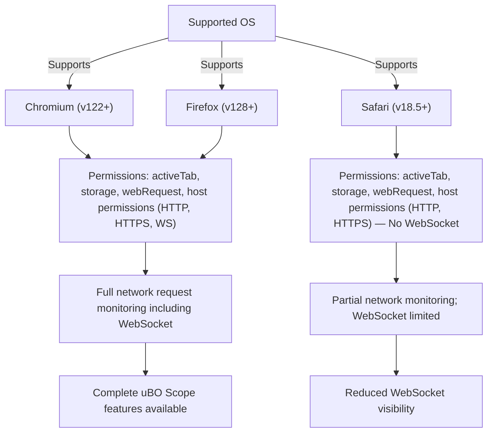

# System Requirements & Supported Browsers

Ensure you have the right environment to use **uBO Scope** effectively. This page details the essential system prerequisites, supported browsers with their minimum versions, required permissions, and known platform-specific considerations to guarantee a smooth and reliable user experience.

---

## 1. Supported Operating Systems

uBO Scope runs on any desktop operating system supported by the compatible browsers. This includes:
- **Windows** (10 and later recommended)
- **macOS** (Catalina 10.15 and later recommended)
- **Linux** distributions supported by Chromium or Firefox browsers

There is no dedicated mobile OS support beyond Firefox for Android, which is incompatible due to API limitations.

## 2. Supported Browsers & Minimum Versions

| Browser   | Minimum Version | Notes                            |
|-----------|-----------------|---------------------------------|
| Chromium  | 122.0           | Includes Google Chrome, Edge, Brave, and others based on Chromium
| Firefox   | 128.0           | Desktop and Firefox for Android  |
| Safari    | 18.5            | Latest versions on macOS only    |

These minimum versions are critical because **uBO Scope** depends on WebExtension APIs and features introduced or stabilized in these or later browser versions.

## 3. Required Browser Permissions

uBO Scope uses explicit WebExtension permissions to function. Ensure the extension is allowed these permissions:

- `activeTab`: Access to the currently active tab for contextual data gathering
- `storage`: To save session and configuration data
- `webRequest`: To observe and intercept network requests, core for connection visibility

Additionally, **host permissions** permit monitoring requests to HTTP, HTTPS, and WebSocket URLs:

- `http://*/*`, `https://*/*` — to cover the vast majority of web content
- `ws://*/*`, `wss://*/*` — for WebSocket connections, included in Chromium and Firefox

> **Note:** Safari currently supports only HTTP and HTTPS host permissions; WebSocket monitoring is limited due to browser API constraints.

## 4. Support for `webRequest` API

uBO Scope relies heavily on the browser's **`webRequest` API** to track network connections.

- **Chromium and Firefox:** Full support including HTTP, HTTPS, and WebSocket protocols
- **Safari:** Supports `webRequest` for HTTP and HTTPS, but WebSocket interception is limited

Requests initiated outside the scope of this API—such as those from some native integrations or sandboxed environments—will not be captured.

## 5. Known Browser-Specific Limitations

### Chromium
- Requires version 122 or above to support Manifest V3 and proper `webRequest` functionality.
- WebSocket support for host permissions is fully included.

### Firefox
- Minimum version 128 ensures compatibility with Manifest V3 and WebRequest permissions.
- WebSocket monitoring supported on desktop and Android Firefox.

### Safari
- Version 18.5+ supports uBO Scope with HTTP/HTTPS but lacks WebSocket monitoring.
- Due to WebExtension API differences, some network events may be unavailable.

## 6. Installation Preparation Checklist

Before installation or upgrade, verify:

- Your browser version meets or exceeds the minimum requirement.
- You have permissions to install browser extensions.
- Any previous versions of uBO Scope or conflicting network monitoring tools are disabled to avoid data interference.

## 7. Troubleshooting Common Compatibility Issues

- **Extension Fails to Show Data:** Confirm the browser version supports Manifest V3 and WebRequest API. Older versions will block extension functionality.
- **No WebSocket Connections Listed on Safari:** This is expected due to API limitations; WebSocket events are not exposed.
- **Permissions Not Granted:** Check browser extension settings to ensure all required permissions are allowed.

If issues persist, consult the [Troubleshooting Installation & Startup Issues](../getting-started/first-use-and-setup/troubleshooting-startup) page.

---

## Summary

uBO Scope is designed for modern browsers supporting Manifest V3 and the `webRequest` API. Using browsers that meet the minimum version ensures full tracking capabilities, especially across varied connection types including WebSockets. Safari support is partial due to WebExtension API constraints. Proper permissions and host access are mandatory for accurate connection visibility.

---

## Additional Resources

- [How to Install uBO Scope](../getting-started/installation-basics/install-instructions)
- [Troubleshooting Installation & Startup Issues](../getting-started/first-use-and-setup/troubleshooting-startup)
- [Browser and System Integration](../../overview/core-concepts-and-architecture/cross-platform-browser-support)
- [Product Introduction](../../overview/getting-started-with-uboscope/product-introduction)

---

## Example: Checking Your Browser Version

### Chromium-Based Browsers
1. Open the browser.
2. Navigate to `chrome://settings/help` or equivalent.
3. Confirm the version is 122 or higher.

### Firefox
1. Open Firefox.
2. Navigate to `about:support`.
3. Find the **Application Basics > Version** field; confirm it’s 128 or higher.

### Safari
1. Open Safari.
2. Click **Safari > About Safari** from the menu.
3. Verify version is 18.5 or newer.

<Check>
Always keep your browser up to date to avoid compatibility issues and security vulnerabilities.
</Check>

---

## Summary Diagram of Support

