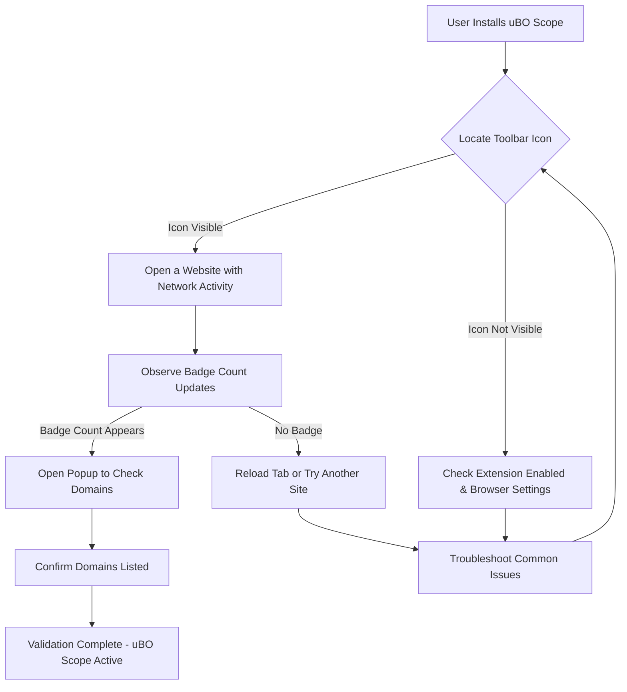

# Validating Your Installation of uBO Scope

Ensure that your uBO Scope extension is correctly installed, enabled, and actively monitoring network connections in your browser. This guide walks you through identifying the extension’s icon, understanding its initial status, and verifying that it functions as expected on any website.

---

## 1. Locate the uBO Scope Extension Icon

After installation, uBO Scope adds an icon to your browser toolbar.

- **Icon Appearance:** Look for a badge-style icon displaying the uBO Scope logo (a shield-like symbol).
- **Browser Differences:**
  - In Chromium-based browsers (Google Chrome, Microsoft Edge), it may appear alongside other extension icons on the right side of the address bar.
  - In Firefox, it should appear in the toolbar; if not visible, check under the overflow menu (`>>`).
  - In Safari, it appears in the toolbar area, typically near the address bar.

If you cannot see the icon:

- Verify your installation (see [Installing uBO Scope](https://github.com/gorhill/uBO-Scope#getting-started-installing-extension))
- Check the browser’s extension management page to confirm uBO Scope is enabled.

---

## 2. Understand the Initial State

When first installed, uBO Scope is enabled and begins monitoring network requests by default.

### What You See Initially

- **No Badge Number:** Immediately after installation or on new tabs/sites, the icon badge may be blank or show no number.
- **Popup Shows “No Data”:** Clicking the icon opens the popup panel. Initially, it may display “NO DATA” as it hasn’t collected network information yet.

### Why This Happens

- The extension tracks connections per tab once network activity begins.
- It counts distinct third-party domains to which your browser connects, showing the count as a badge overlays the icon.

---

## 3. Verify uBO Scope is Active on a Website

Follow these steps to confirm the extension is working correctly:

<Steps>
<Step title="Open a Website">
Navigate to a website you want to monitor with uBO Scope. For an informative test, choose a site you know makes multiple third-party requests, such as news sites or social media.
</Step>
<Step title="Watch the Badge Count Update">
Observe the uBO Scope icon:
- As the page loads, you should see a number appear on the badge. This number represents the count of distinct third-party domains with successful connections.
- If the number updates as you navigate or reload, uBO Scope is actively monitoring.
</Step>
<Step title="Open the uBO Scope Popup">
Click the extension icon to open the popup panel. It will show three categorized sections:

- **Not Blocked:** Domains the browser successfully connected to.
- **Stealth-Blocked:** Domains that were stealth-blocked.
- **Blocked:** Domains that were blocked.

Each section lists domains and the count of associated requests.
</Step>
<Step title="Check Domain Listings">
Verify that domains are populated under each category. Seeing domains listed means uBO Scope is capturing and reporting network requests effectively.
</Step>
</Steps>

---

## 4. Troubleshooting

If the badge count does not appear or the popup shows no data after visiting active sites, try the following:

<AccordionGroup title="Common Issues & Solutions">
<Accordion title="Extension Icon Not Visible">
- Check the browser’s Extensions or Add-ons page.
- Ensure uBO Scope is enabled.
- In Firefox, enable toolbar icon visibility or drag the icon to the toolbar.
- Restart the browser after installation.
</Accordion>
<Accordion title="Badge Count Does Not Appear">
- Reload the website tab to trigger network requests.
- Visit a different site known to load numerous third-party resources.
- Check if other content blockers may interfere. uBO Scope is designed to report regardless, but browser quirks may occur.
- Verify that your browser supports the `webRequest` API with necessary permissions (Chrome 122+, Firefox 128+, Safari 18.5+).
</Accordion>
<Accordion title="Popup Shows No Data or 'NO DATA'">
- Network activity might not be present yet. Try reloading or navigating to a new website.
- Clear browsing data and reload the site.
- Disable and re-enable the extension.
- Check browser’s extension permissions and privacy settings.
</Accordion>
<Accordion title="Other Issues">
- Consult the [Troubleshooting Common Setup Issues](https://github.com/gorhill/uBO-Scope#getting-started-troubleshooting-common-setup-issues) guide.
- Report issues on the uBO Scope GitHub repository for assistance.
</Accordion>
</AccordionGroup>

---

## 5. Additional Validation Tips

- **Test with Various Sites:** Visit diverse sites to see different badge count behaviors.
- **Record Badge Counts Over Time:** A lower badge number typically indicates fewer third-party connections, a sign of efficient content blocking.
- **Use with Other Tools:** Combine with network analysis tools for deeper insights.

---

## Summary

Validating uBO Scope installation focuses on confirming the toolbar icon presence, observing the badge count update as you browse, and checking the detailed popup for domain connection data. This ensures you’re receiving accurate and actionable visibility into your browser’s remote connections.

For next steps, refer to the [Getting Started: Your First Use](https://github.com/gorhill/uBO-Scope#getting-started-using) guide to understand connection reports in detail.

---

## References

- [Installing uBO Scope](https://github.com/gorhill/uBO-Scope#getting-started-installing-extension)
- [Your First Use: Understanding Connections](https://github.com/gorhill/uBO-Scope#getting-started-using)
- [Troubleshooting Setup Issues](https://github.com/gorhill/uBO-Scope#getting-started-troubleshooting-setup)
- [uBO Scope GitHub Repository](https://github.com/gorhill/uBO-Scope)
- [Public Suffix List](https://publicsuffix.org/)

---

## Visual Overview of Validation Workflow

This simple flow guides you through verifying the presence and active status of uBO Scope after installation.
