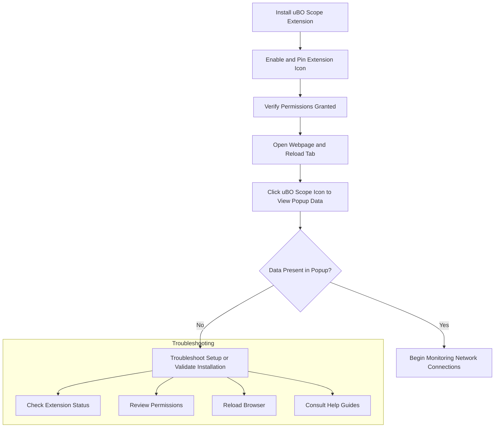

# Initial Extension Setup

After installing uBO Scope, it's essential to verify that the extension is active and properly configured before you begin monitoring your browser's remote server connections. This guide walks you through straightforward steps for managing the extension, ensuring it's visible, and preparing it for your first use.

---

## 1. Verify Installation and Enable the Extension

### Step 1: Confirm uBO Scope is Installed

- Open your browser's extensions or add-ons page:
  - **Chrome**: Navigate to `chrome://extensions/`
  - **Firefox**: Navigate to `about:addons`
  - **Safari**: From the Safari menu, select Preferences > Extensions

- Look for **uBO Scope** or **uBlock Origin Scope** in the list.

- Verify the extension's status is set to **Enabled** or **On**.


### Step 2: Pin the Extension Icon (Recommended)

Pinning uBO Scope's icon to the toolbar ensures quick access and visibility to its network monitoring badge.

- In **Chrome** or **Firefox**:
  1. Click the extensions icon (puzzle piece).
  2. Find uBO Scope in the dropdown.
  3. Click the pin icon to keep it visible on the toolbar.

- In **Safari**:
  - The extension icon should appear automatically if enabled.


<Tip>
Pinning the icon allows you to see the live count of connected remote servers directly on the toolbar, helping you stay aware of your browsing network footprint.
</Tip>

---

## 2. Check Extension Permissions

uBO Scope requires certain permissions to function correctly. Confirm these to avoid unexpected monitoring gaps.

- Navigate back to your browser's extension management page.
- Under uBO Scope, review permissions to verify that the following are granted:
  - **Access to all URLs** (`http://*/*` and `https://*/*`)
  - **Active Tab Access**
  - **Storage Access**
  - **Web Request Access**


<Warning>
If permissions are restricted or missing, uBO Scope will not capture network requests comprehensively and may underreport connections.
</Warning>

---

## 3. Confirm Initial Preferences

uBO Scope is designed to require minimal user configuration out of the box. The default settings grant immediate functionality.

- There are no additional initial preferences to set manually.
- The extension automatically begins monitoring network requests on page loads.


<Info>
Future versions may include customizable preferences; for now, your setup is complete once installed and enabled.
</Info>

---

## 4. Understanding uBO Scope's User Interface Access

Once installed and enabled, uBO Scope presents data through its popup panel.

### Opening the Popup Panel

- Click the uBO Scope icon on your browser's toolbar.
- The popup displays:
  - The current tab's hostname.
  - Counts of domains connected, categorized by **Allowed (not blocked), Stealth-blocked**, and **Blocked**.

### What You See on First Open

- Initially, the popup may show `NO DATA` if no network activity has been captured yet.
- Allow a page to load or reload the tab to initiate data collection.


<Tip>
Reload any webpage after setup to start seeing domain connection data populate the popup interface.
</Tip>

---

## 5. Preparing for First Use

Before you begin actively monitoring your browsing activity:

- Ensure the current tab has finished loading to collect accurate network request data.
- Verify the badge count on the extension icon reflects the number of distinct third-party domains connected.
- Click the icon to review the detailed domains, separated by their status (allowed, stealth-blocked, blocked).


<Check>
If the badge count remains blank or zero despite web activity, consult the [Validate uBO Scope Is Working](../first-use-validation/validate-extension-operation) page.
</Check>

---

## 6. Common Next Steps

- Proceed to the **Validate uBO Scope Is Working** guide to confirm proper data collection and understand normal network behavior.
- Explore the **Troubleshooting Your Setup** page if you encounter issues in visibility or unexpected data.
- Learn how to interpret the popup data in the **Understanding the Popup: Reading Domain Data** guide for practical insights.

---

## Troubleshooting Tips

| Issue                            | Solution                                                                                           |
|---------------------------------|--------------------------------------------------------------------------------------------------|
| Extension icon not visible       | Pin the extension via browser toolbar settings.                                                   |
| Permissions missing or denied    | Revisit extension permissions page and enable all required permissions.                          |
| No data shown in popup           | Reload the active tab and ensure it has finished loading.                                        |
| Badge count not updating         | Wait a few seconds after page load; network requests are processed asynchronously.                |

<Tip>
Always keep your browser and extension updated to ensure compatibility and security.
</Tip>

---

## Summary

| Action                     | Reference Guide                                             |
|----------------------------|-------------------------------------------------------------|
| Verify extension installed  | This page                                                   |
| Validate extension data     | [Validate uBO Scope Is Working](../first-use-validation/validate-extension-operation)             |
| Troubleshoot issues         | [Troubleshooting Your Setup](../first-use-validation/troubleshooting-setup)                        |
| Read domain data in popup   | [Understanding the Popup: Reading Domain Data](../../guides/getting-started-guides/first-look-at-popup) |


---

For detailed technical background, consider reviewing the [Extension Architecture Overview](../../overview/core-concepts-and-architecture/arch-overview) and [Core Concepts & Terminology](../../overview/core-concepts-and-architecture/fundamental-concepts) pages.


---

## References

- Official uBO Scope Repository: [https://github.com/gorhill/uBO-Scope](https://github.com/gorhill/uBO-Scope)
- Browser Extension Permissions Documentation
- Public Suffix List: foundational to domain parsing used by uBO Scope


---

Thank you for choosing uBO Scope to gain visibility into your browser's remote server connections. Your next step is to validate your setup and start exploring your network exposure in real-time.


---

### Visual Flow of Setup and Use



This flow guides you from installation through initial use to troubleshooting, ensuring a smooth start with uBO Scope.

---

### Code Snippet: Manual Permission Check Example (Chromium-based browsers)

```javascript
// Type in the browser console to check if uBO Scope has permission to access activeTab
chrome.permissions.contains({ permissions: ["activeTab"] }, function(result) {
    if (result) {
        console.log("uBO Scope has permission for activeTab");
    } else {
        console.error("uBO Scope lacks activeTab permission");
    }
});
```

Use this snippet only if you're troubleshooting unusual permission issues.

---

Documentation complete for "Initial Extension Setup" page.