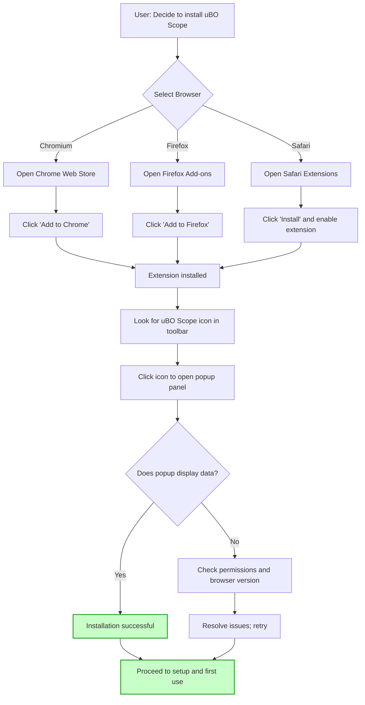

# Installing uBO Scope

Get started with uBO Scope by installing the extension for your preferred browser following the official marketplace instructions. This guide provides clear, step-by-step instructions tailored to each supported platform, ensuring a safe and smooth installation experience.

---

## Supported Browsers & Requirements

Before installation, ensure your environment meets the minimum requirements:

- **Chromium-based browsers (e.g., Chrome, Edge):** Version 122 or later
- **Firefox:** Version 128 or later
- **Safari:** Version 18.5 or later

The extension requires permissions to monitor web requests and access the active tab to provide accurate connection reporting.

See [Requirements & Supported Browsers](../getting-started/installation-essentials/requirements-and-supported-browsers) for detailed system specs.

---

## Installation Steps

### For Chromium-based Browsers (Chrome, Edge, etc.)

1. Open the Chrome Web Store page for uBO Scope:

   [Install uBO Scope for Chromium](https://chromewebstore.google.com/detail/ubo-scope/bbdpgcaljkaaigfcomhidmneffjjjfgp)

2. Click the **Add to Chrome** (or equivalent) button.

3. Confirm the permissions dialog by clicking **Add extension**.

4. After installation, a uBO Scope icon will appear in your browser toolbar.

<Tip>
If the icon does not appear, click the puzzle piece icon (Extensions) -> pin uBO Scope for quick access.
</Tip>

### For Firefox

1. Open the Firefox Add-ons page for uBO Scope:

   [Install uBO Scope for Firefox](https://addons.mozilla.org/firefox/addon/ubo-scope/)

2. Click **Add to Firefox**.

3. Review and accept the permissions prompt by clicking **Add**.

4. Once installed, pin the uBO Scope icon to your toolbar for easy access.

<Note>
uBO Scope supports Firefox on desktop and Android devices version 128 or higher.
</Note>

### For Safari

1. Open the Safari Extensions Gallery or relevant Apple App Store page for uBO Scope.

2. Ensure your Safari version is at least 18.5.

3. Click **Install** or **Get** to add uBO Scope.

4. Open Safari Preferences → Extensions and enable uBO Scope.

<Warning>
Safari requires manual enabling of new extensions after installation; ensure you activate uBO Scope before use.
</Warning>

---

## Post-Installation Verification

1. Look for the uBO Scope icon in your browser’s toolbar.

2. Click the icon; the popup panel should open showing connection data or a "NO DATA" message if you just installed.

3. Open any website and observe the badge count increasing, indicating distinct third-party remote servers connected.

<Check>
If the badge count never updates, ensure the extension has the necessary permissions and your browser is compatible.
</Check>

---

## Tips for a Successful Installation

- Install uBO Scope directly from trusted official marketplaces only.
- Do not sideload or install unofficial versions to avoid security risks.
- Ensure your browser is fully updated to meet minimum version requirements.
- Restart the browser after installation if the icon doesn’t appear immediately.
- Pin the extension icon for easy access and visibility.

---

## Where to Go Next?

- After installing, proceed to [Set Up & Open the Extension](../getting-started/configuration-first-use/initial-setup-and-access) to learn how to access and configure uBO Scope.
- Run your first network analysis by following [Run Your First Network Analysis](../getting-started/configuration-first-use/running-your-first-check).
- Troubleshoot common setup issues at [Troubleshooting & Validation](../getting-started/configuration-first-use/quick-troubleshooting).

---

## Additional Resources

- Official GitHub Repository for source code and advanced usage: [uBO-Scope on GitHub](https://github.com/gorhill/uBO-Scope)
- Understanding the extension’s concepts can improve your experience:
  - [What is uBO Scope?](../../overview/about-ubo-scope/what-is-ubo-scope)
  - [How Does uBO Scope Work?](../../overview/core-concepts-architecture/how-ubo-scope-works)

---

By following these instructions, you will have uBO Scope correctly installed and ready to help you monitor your browser’s connections to remote servers with transparency and precision.

---

# Visual Overview

