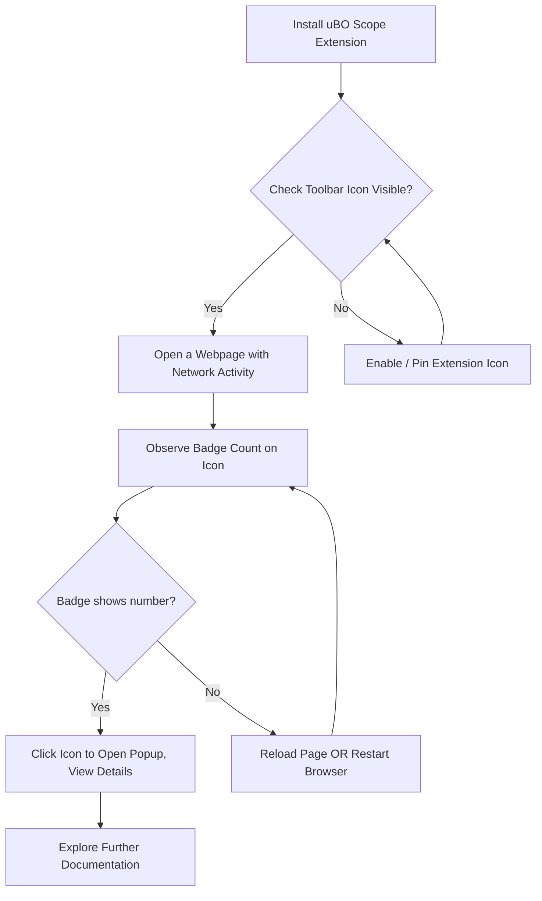

# First Launch & Verifying Installation

Welcome to your first launch of uBO Scope! This guide will help you confirm that uBO Scope installed correctly, understand what the toolbar icon and badge count mean, and perform your initial test to observe network connections directly from your browser.

---

## 1. Confirm the Extension Icon is Visible

After installing uBO Scope, check your browser's toolbar for the uBO Scope icon. It looks like a small shield with the letters 'uBO'.

### Steps:

- Look near the address bar or extensions menu in your browser.
- The icon must be visible and accessible; sometimes browsers hide extensions behind a puzzle or extensions menu — pin the icon if needed.

<Tip>
If you don’t see the icon:
- Ensure the extension is enabled.
- Check your browser’s extension management page.
- On some browsers, you may need to allow the extension to show on the toolbar.
</Tip>

## 2. Understand the Toolbar Badge Count

The number displayed on the uBO Scope icon’s badge represents the count of **distinct third-party domains to which your browser successfully connected during the current tab session**. This is a key transparency metric.

### What the badge indicates:

- A **higher number** means you are connecting to more third-party domains.
- A **lower number** means better third-party exposure control (fewer third-party connections).
- If the badge is blank (no number), no third-party connections have been detected yet.

<Info>
The badge count only reflects connections in the active browser tab. Different tabs have their own counts.
</Info>

## 3. Perform a Basic Test to Observe Connections

To verify uBO Scope is capturing network activity correctly, open a well-known website that makes network requests to multiple domains (Wikipedia, for example).

<Steps>
<Step title="Open a Webpage">
Navigate to a website such as https://en.wikipedia.org in your active tab.
</Step>
<Step title="Wait a Few Seconds">
Allow the page to load completely, and wait a few moments for all network requests.
</Step>
<Step title="Observe the Badge Count">
Look at the uBO Scope toolbar icon—it should display a number.
</Step>
<Step title="Open the Popup Panel">
Click the uBO Scope icon to open the popup showing detailed information about allowed, stealth-blocked, and blocked third-party domains.
</Step>
</Steps>

<Note>
You may see multiple sections in the popup:

- **Not Blocked:** Domains where connections were successful.
- **Stealth-Blocked:** Domains where content-blocking occurred silently.
- **Blocked:** Domains explicitly blocked by other content blockers.

This classification helps you understand the network behavior per tab.
</Note>

## 4. What To Do If the Badge Does Not Update

If the badge remains blank or does not update:

- Confirm uBO Scope has the necessary permissions (activeTab, storage, webRequest).
- Refresh the test webpage after installation.
- Restart your browser to activate the extension fully.
- Ensure your browser version meets minimum requirements (Chrome 122+, Firefox 128+, Safari 18.5+).

<Tip>
Browsers may require a restart after installation, especially with permission prompts. If problems persist after restarting, see the Troubleshooting section.
</Tip>

## 5. Troubleshooting Common First Launch Issues

<AccordionGroup title="Troubleshooting & Quick Fixes">
<Accordion title="uBO Scope Icon Missing">
- Verify extension is installed and enabled.
- Pin the extension icon to the toolbar if hidden.
- On Firefox, ensure the extension ID matches (uBO-Scope@raymondhill.net).
- Check for browser restrictions on extensions.
</Accordion>
<Accordion title="No Badge Count or No Data">
- Reload the current tab to reset data collection.
- Visit a website known for multiple third-party requests (like Wikipedia).
- Verify your browser supports `webRequest` permissions.
- Confirm uBO Scope permissions have not been disabled or revoked.
- Restart the browser.
</Accordion>
<Accordion title="Popup Fails to Show Data">
- Make sure network activity has occurred in the active tab.
- Switch to another tab with network activity and click the icon.
- If the popup shows 'NO DATA', try refreshing the page.
</Accordion>
</AccordionGroup>

## 6. What Next?

After confirming the extension is installed and operating correctly:

- Explore the **Understanding the Badge & Popup** guide to learn how to read connection data.
- Adjust permissions and settings as needed using the **Initial Setup & Permissions** documentation.
- Consult the **Troubleshooting & Quick Validation Steps** guide if you encounter issues.

---

## Reference Links

- [Installation & Quickstart](https://github.com/gorhill/uBO-Scope/blob/main/getting-started/installation-quickstart/installation-multiplatform.mdx)
- [Understanding the Badge & Popup](https://github.com/gorhill/uBO-Scope/blob/main/getting-started/setup-usage/interpreting-results.mdx)
- [Troubleshooting & Quick Validation Steps](https://github.com/gorhill/uBO-Scope/blob/main/getting-started/setup-usage/troubleshooting-quick-validation.mdx)

---

## Summary
This guide ensures your first uBO Scope launch is smooth by verifying installation success through the toolbar icon and badge, and guiding you to observe network connections with a basic test. It anticipates common first-use issues and directs you to essential next steps for deeper insight into your browsing privacy footprint.

---

## Visual Workflow

