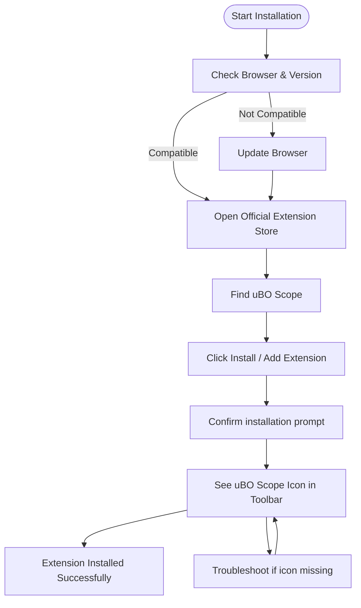

# Installing uBO Scope

This guide walks you through installing uBO Scope, the browser extension that transparently reports all remote server connections that web pages make. By following these steps, you will quickly get the extension up and running on your preferred browser with minimal effort.

---

## Supported Browsers and Versions

uBO Scope supports the following browsers and minimum versions:

- **Chrome / Chromium-based browsers:** version 122 or later
- **Firefox:** version 128 or later
- **Safari:** version 18.5 or later

Ensure your browser version matches these requirements before proceeding with installation to avoid compatibility issues.

<Note>
If you are uncertain about your browser version, check your browser’s "About" page usually found in the menu under Help or Settings.
</Note>

## Official Installation Sources

To guarantee security and automatic updates, always install uBO Scope via your browser’s official extension or add-on store. Click the links below relevant to your browser to go directly to the official uBO Scope page:

- **[Chrome Web Store](https://chrome.google.com/webstore/detail/ubo-scope/bbdpgcaljkaaigfcomhidmneffjjjfgp)**
- **[Firefox Add-ons](https://addons.mozilla.org/firefox/addon/ubo-scope/)**
- **Safari Extension Store** (Search for "uBO Scope" in Safari Extensions)

<Warning>
Avoid installing the extension from third-party websites or unknown sources to protect your privacy and security.
</Warning>

## Step-by-Step Installation Instructions

### For Chrome and Chromium-Based Browsers

1. Navigate to the [Chrome Web Store uBO Scope page](https://chrome.google.com/webstore/detail/ubo-scope/bbdpgcaljkaaigfcomhidmneffjjjfgp).
2. Click **Add to Chrome**.
3. In the confirmation dialog, click **Add extension**.
4. Once installed, look for the uBO Scope icon (a badge icon similar to uBlock Origin) to appear in your browser toolbar.

### For Firefox

1. Go to the [Firefox Add-ons uBO Scope page](https://addons.mozilla.org/firefox/addon/ubo-scope/).
2. Click **Add to Firefox**.
3. Confirm by clicking **Add** in the permission prompt.
4. Confirm that the uBO Scope icon appears in your Firefox toolbar.

### For Safari

1. Open Safari and go to **Safari** > **Settings** > **Extensions**.
2. Click **More Extensions** to open the Safari Extension Store.
3. Search for **uBO Scope**.
4. Click **Get** and install the extension.
5. After installation, ensure uBO Scope is enabled under the Safari Extensions settings.

<Info>
Safari extensions require Safari 18.5 or later and macOS Ventura or newer.
</Info>

## Verifying Installation Success

Once installed, follow these steps to confirm uBO Scope is working correctly:

- Look for the uBO Scope icon in your browser toolbar.
- Visit any website, and click the uBO Scope icon to open its popup panel.
- The popup should display a domain name and a count of connected third-party domains.

If the badge count increases as you navigate different websites, the installation and basic functionality are confirmed.

<Tip>
If you do not see the icon:

- Ensure the extension is enabled in your browser’s extension management page.
- Try restarting your browser.
- In some browsers, manually pin the extension to the toolbar.
</Tip>

## Quick Tips for a Smooth Installation

- **Confirm browser compatibility** before installing.
- **Use official extension stores** exclusively.
- **Restart your browser after install** if the extension does not appear.
- **Pin the extension icon** for quick access.

## Troubleshooting Common Installation Issues

<AccordionGroup title="Installation Troubleshooting">
<Accordion title="Extension Icon Missing After Install">
- Verify the extension is enabled in your browser’s extensions page.
- Restart your browser.
- Pin the extension icon if your browser supports pinning.
</Accordion>
<Accordion title="Browser Version Is Not Supported">
- Check your browser version and update it to the latest release.
- For Safari, verify macOS is updated to support Safari 18.5+.
</Accordion>
<Accordion title="Unable to Find uBO Scope in Extension Store">
- Confirm you are browsing the official extension stores.
- Check if regional restrictions might apply.
- Refer to the GitHub repository to download source if needed (advanced users).
</Accordion>
</AccordionGroup>

## Next Steps

After installation:

- Proceed to [First Run & Basic Configuration](/getting-started/installation-setup/first-run-setup) to understand initial setup steps.
- Open the extension popup and explore connection data as you browse.
- Visit [Quick Validation & First Use](/getting-started/getting-going/validate-installation) for tips on verifying the extension’s behavior.

## Additional Resources

- [What is uBO Scope?](/overview/product-intro/what-is-ubo-scope) — Overview and purpose
- [System Requirements](/getting-started/installation-setup/system-requirements) — Browser and OS prerequisites
- [How uBO Scope Works](/overview/architecture-concepts/how-it-works) — Deeper insight into operation

---

Congratulations! With uBO Scope installed, you now have a powerful privacy transparency tool to monitor every remote connection initiated by the websites you visit. Explore further guides to unlock the full potential of this extension.

---

## Visual Overview of Installation Flow

